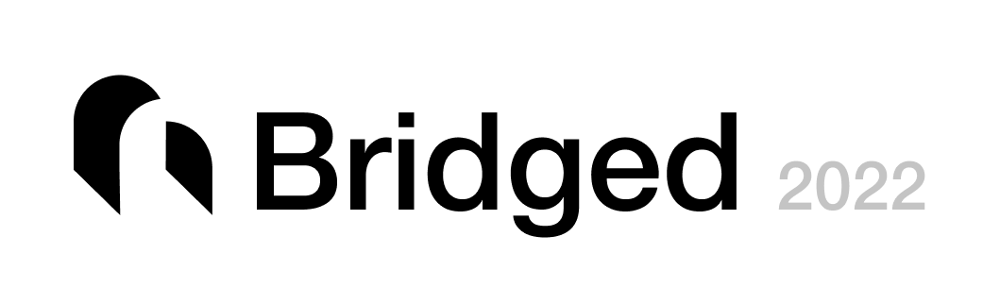

<div style="text-align:center"></div>

# Opensource Design Tool for the world.

_For whom eager to create, design, develop and share with the world._

> **Bridged (Bridged 2022 - opensource collaborative realtime ui editor)**
>
> an opensource wasm application explicitly designed for service application design/development

- developer first
- plugin sdk and core engine api is mapped 1:1
- right on to production code

## This application is under development and will be available on stable channel on early 2022

This project, A.K.A `Bridged Studiio` is under development with foundation technologies. We are looking forward that Bridged will change the industry design/development standard by this piece of OSS Project. For updates, please subscribe our news letter on [bridged.xyz](https://bridged.xyz)

- [Assistant](https://github.com/bridgedxyz/assistant) - A plugin fro figma that allows to import designs to bridged.
- [Console](https://github.com/bridgedxyz/console.bridged.xyz) - A Bridged console for content management used for both design & development

## Engine & Foundation

- studio is built uppon skia graphics library
- the core component used is followed by _[reflect design system](https://github.com/bridgedxyz/reflect.bridged.xyz)_
- studio's surface is built on react

## Docs

Read the bridged usage docs [here](./docs)

## Workspace

artboard workspace

## Scriptable

scripting built in with js/ts sdk and add-on plugin

## Backend

[Bridged Design Server](https://github.com/bridgedxyz/design-server)

## Structure - Packages & Modules


**GRAPHICS ENGINE**

- **nothing** - nothing but drawing. everything drawable graphics engine.
  - [github](https://github.com/bridgedxyz/nothing)
  - [website](https://nothing.app/)
  - **@nothing.app/react** - React SDK - Fully built, all-in-one graphics tools for drawing, editing and sharing

**UI LIBRARY**

- **reflect-ui**
  - **reflect-editor-ui** - Editor UI Framework for React - used by enterprise level applications - such as Bridged, Nothing, Design to code, Code.surf
    - [gitHub](https://github.com/bridgedxyz/reflect-editor-ui)
  - **reflect-ui-react** - 🌊 reflect components for react
    - [github](github.com/bridgedxyz/reflect-ui-react)
  - [github](https://github.com/reflect-ui)
  - [website](https://reflect-ui.com)

**DESIGN DATA STRUCTURE & HANDLING**

- **reflect-core-ts** - reflect core definitions on typescript (nodejs)
  - [github](https://github.com/bridgedxyz/reflect-core-ts)
- **design-sdk** - 🎨 A mid wrapper for building consistant figma & sketch & studio plugin, with single api reference
  - [github](github.com/bridgedxyz/design-sdk)
- **design-file-converter** - ➡️🎨➡️🎨 Convert your design from sketch figma xd bridged - to - sketch figma xd bridged.
  - [github](https://github.com/bridgedxyz/design-file-converter)
  - [website](https://bridged.xyz/convert-design)
- **.bridged** - .bridged configuration specs for Bridged App and Code extensions
  - [github](https://github.com/bridgedxyz/.bridged)

**BACKEND - LIVE COLLABORATION / DATA MANAGEMENT**

- **design-server** - Structure & SDK for building realtime collaboration backend service
  - [github](https://github.com/bridgedxyz/design-server)
- **bridged-app-services** - BASE: Bridged App SErvices
  - [github](https://github.com/bridgedxyz/bridged-app-services)
  - [website](https://bridged.cc)
  - **base-sdk-ts** - Bridged App SErvices SDK for nodejs / browser
    - [github](https://github.com/bridgedxyz/base-sdk-ts)

**WYSIWYG**

- **boring** - 😶 A very boring text editor engine like notion. yet free and open to use
  - [github](https://github.com/bridgedxyz/boring)
  - [website](https://boring.so/)

**DESIGN TO CODE**

- **design-to-code** - Design to code engine. A design ✌️ code standard.
  - [github](https://github.com/bridgedxyz/design-to-code/)
  - [website](https://designto.codes/)

**BUILT-IN SERVICES**

- **accounts.bridged.xyz** - (PRIVATE) accounts & payments web / server
  - [website](https://accounts.bridged.xyz) (source is closed due to security reasons)
- **console.bridged.xyz** - Bridged console for managing your designs, asset, translations with collaboration.
  - [github](https://github.com/bridgedxyz/console.bridged.xyz)
  - [website](https://console.bridged.xyz)

## The design

design of bridged editor on [figma](https://www.figma.com/file/Y0Gh77AqBoHH7dG1GtK3xF/bridged?node-id=0%3A1)

## Bridging the gap between design and development

Here are some concepts that do not exist on current design tools, but only at implementation.

- Theme support
- Responsive layout
- Linting
- Grid
- List
- Slots (Not swapping components)
- States
- Git
- Variables
- Data layer
- Logic layer
- Design to code
- Built in base design system (Reflect - a universal design system built for design systems)

## Key features / modes

- presentation mode
- muggle mode
- developer mode
- graphics mode
- designer mode
- product mode
- prototype mode
- documentation mode
- diagram mode (EDR)
- live collaborative editing
- version control in-the-box
- responsive mode (responsive components)
- visual engine in-the-box
- context engine in-the-box

## Contributing

We'de love to have you change the industry together. _Read below documentations before submitting a PR._

- [contributing.md](./CONTRIBUTING.md)
- [working with submodule packages](https://github.com/bridgedxyz/.github/blob/main/contributing/working-with-submodules.md)
- [how Bridged repo `/packages` are structured](./packages)

### Building

```sh
git clone --recurse-submodules https://github.com/bridgedxyz/bridged.git
cd bridged

yarn
yarn desktop
```

update pulling - `git submodule update --init --recursive`

## References

- **skia 2d graphics library**
  - [npm](https://www.npmjs.com/package/canvaskit-wasm)
  - [github](https://github.com/google/skia/tree/master/modules/canvaskit)
  - [website](https://skia.org/user/modules/canvaskit)
