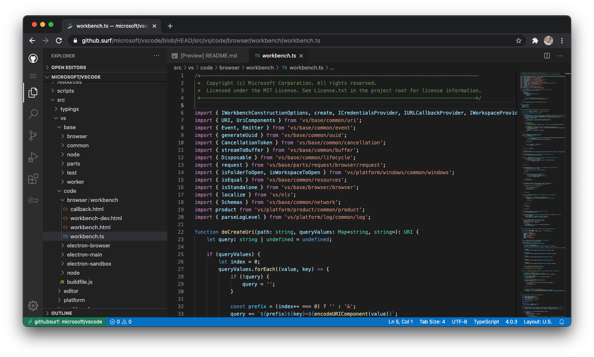
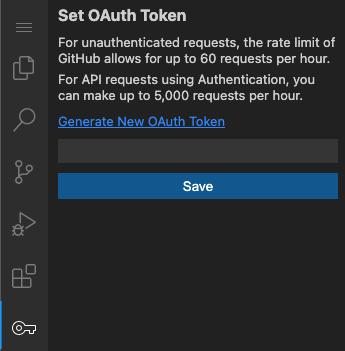
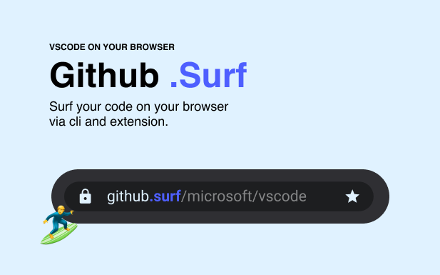

# github.🏄‍♂️


<p align="center"><image src="branding/logo.png"/></p>

<p align="center"><a href="https://github.surf"><image src="branding/url-example.png"/></a></p>

> 🏄‍♂️ Surf your repository like a pro

<p align="center">
  <a href="https://www.npmjs.com/package/@bridged.xyz/surf" style="border-right: 1px solid #4D4D4D">
    <image alt="surf cli on npm" src="https://img.shields.io/badge/cli-latest-brightgreen"/>
  </a>
  <a href="https://vercel.com/new/git/external?repository-url=https://github.com/bridgedxyz/github.surf&project-name=github.surf&repo-name=github.surf" style="border-right: 1px solid #4D4D4D">
    <image alt="Deploy github.surf with Vercel" src="https://vercel.com/button"/>
  </a>
  <a href="https://twitter.com/intent/tweet?text=Wow:&url=https%3A%2F%2Fgithub.com%2Fbridgedxyz%2Fgithub.surf" style="border-right: 1px solid #4D4D4D">
    <image alt="Twitter" src="https://img.shields.io/twitter/url?style=social&url=https%3A%2F%2Fgithub.com%2Fbridgedxyz%2Fgithub.surf">
  </a>
  <a href="https://github.com/bridgedxyz/github.surf/blob/main/LICENSE">
    <image alt="GitHub license" src="https://img.shields.io/github/license/bridgedxyz/github.surf">
 </a>
</p>

## Features



[**TL;DR Jump to demo**](https://github.surf)

- ✅ Github support - Surf GitHub repository on browser with vscode environment
- ✅ Gist support - Surf Gist repository on browser with vscode environment
- ✅ Official Chrome extension - Launch surf with extension button
- ✅ Official CLI - `surf .` command for opening surf on terminal
- Gitlab support ([gitlab.surf](https://gitlab.surf)) (enhance)
- Bitbucket support ([bitbucket.surf](https://bitbucket.surf)) (enhance)
- [surf.codes](https://surf.codes) for private, custom scm (enhance)
- Remote compile & terminal support in browser (comming soon)


## Chrome extension

Download our official chrome [here](chrome_link) (It's currently under review)


[Building and installing chrome extension on your own](./chrome-extension/README.md)


## 🏄‍♂️ `surf` CLI

<p align="center"><image src="./docs/gifs/cli-demo.gif"/></p>

Like vscode's `code .`, we support our command `surf`

```shell
# === install the cli ===
npm -g install @bridged.xyz/surf
		# or with yarn
		yarn global add @bridged.xyz/surf

# and surf 🏄 !
surf .
```

You can use this as you sub editor, which can be useful when you're exploring your master/main repository when you are at your own branch on your local machine

```sh
# different branch
surf -b <branch-name>
```


Learn more at [surf-cli](https://github.com/bridgedxyz/surf-cli)


## Notes

For unlimited usage, you must provide github token in `key` icon tab

You can generate new token for github.surf on [here](https://github.com/settings/tokens/new?scopes=repo&description=githubsurf)




## Limitations

**Max requests per hour**

- [github](https://docs.github.com/en/rest/reference/rate-limit) - 60 requests per hour if no token provided (5000 when provided)
- [gitlab](https://docs.gitlab.com/ee/security/rate_limits.html#:~:text=Introduced%20in%20GitLab%2012.9.,requests%20per%20minute%20per%20user.) - 5 reqests per **minute**
- [bitbucket](https://support.atlassian.com/bitbucket-cloud/docs/api-request-limits/) - 60 requests per hour

[Learn more about providing a token for unlimited usage](./docs/guide.md)


**Github Enterprise usage**

You have to modify [api.ts](https://github.com/bridgedxyz/github.surf/blob/main/extensions/githubsurf/src/api.ts) and deploy as-your-own via Deploy on vercel button on the top of this document. api.guthub.com shall point to your-server.example.com


## Supported languages / frameworks extensions (themes)

[As listed here](./extensions) and [surf-code-extensions](https://github.com/bridgedxyz/surf-code-extensions) here, we support below extensions in-the-box

- Vue
- JS/TS/JSX/TSX (React, Svelete, and other js based frrameworks)
- Dart & Flutter
- Elm
- Kotlin
- Scala
- Ocaml
- Vetur
- Jupyter Notebook - [deepmind/deepmind-research demo](https://github.surf/deepmind/deepmind-research)
- Material theme


## What's Next?

- PWA Support
- Enterprise account support (github enterprise)
- Cusom extensions support
- Mobile screen support
- Remote cli & build support
- More powerful Private repository experience


## Remote compile / App preview (for ui applications) & CLI Capabilities.

For repositories containing project such like flutter, react and other main ui frameworks we are planning to suport live-compile-preview feature of the application. the main issue with this will be the pricing and performance limitation. since we are going to keep this project free / fast for everyone

The technology behind this is under development in [appbox](https://github.com/bridgedyxz/appbox) and [console](https://github.com/bridgedxyz/console.bridged.xyz). you can see the remote-compile demo on [assistant](https://github.com/bridgedxyz/assistant)


## Contribution

### Join the community

- join slack - [here on notion](https://www.notion.so/bridgedxyz/Bridged-OSS-Community-c6983f668e3e4204aed8856da0e73483)
- view design - [here on figma](https://www.figma.com/file/R3U3OHaoPVd4D7Z9mcaqIE/github.surf?node-id=14%3A0)
- view the project board - [here on github](https://github.com/bridgedxyz/github.surf/projects)

Learn more about contribution at [CONTRIBUTING.md](./CONTRIBUTING.md)


## Disclamer

this project is inspired from [cdr/code-server](https://github.com/cdr/code-server) and [conwnet/github1s](https://github.com/conwnet/github1s). the base code was forked from github1s (MIT License at the point of fork), which we are replacing it with our own implementations and approaches.


## See Also

- [surf.codes](https://surf.codes)
- [surf-code-extensions](https://github.com/bridgedxyz/surf-code-extensions)


## References & Blogs / Translations

**References**

- [cdr/code-server](https://github.com/cdr/code-server)
- [microsoft/vscode](https://github.com/microsoft/vscode)
- [conwnet/github1s](https://github.com/conwnet/github1s)
- [bridgedxyz/node-services](https://github.com/bridgedxyz/node-services)
- [bridgedxyz/assistant](https://github.com/bridgedxyz/assistant)
- [bridgedxyz/console.bridged.xyz](https://github.com/bridgedxyz/console.bridged.xyz)
- [bridgedxyz/appbox](https://github.com/bridgedxyz/appbox)

**Blogs / Translations**



- 🌍 - [🏄‍♂️ Introducing github.surf Fastest and most elegant way to surf your code (CLI, Extension included)](https://medium.com/bridgedxyz/%EF%B8%8F-introducing-github-surf-bcc8ef9bf594)
- 🇰🇷 - [(ko) 🏄‍♂️ Github.surf 를 소개합니다! — 코드를 서핑하기 가장 빠르고 쿨한 방법 (CLI, Extension 지원)](https://medium.com/bridgedxyz/ko-%EF%B8%8F-github-surf%EB%A5%BC-%EC%86%8C%EA%B0%9C%ED%95%A9%EB%8B%88%EB%8B%A4-%EC%BD%94%EB%93%9C%EB%A5%BC-%EC%84%9C%ED%95%91%ED%95%98%EA%B8%B0-%EA%B0%80%EC%9E%A5-%EB%B9%A0%EB%A5%B4%EA%B3%A0-%EC%BF%A8%ED%95%9C-%EB%B0%A9%EB%B2%95-cli-extension-%EC%A7%80%EC%9B%90-65e6a9a07bd5)
- 🇩🇪 - WIP
- 🇨🇳 - WIP


[![get-chrome-ext][chrome_badge]][chrome_link]
[![get-firefox-addon][firefox_badge]][firefox_link]


[chrome_link]: https://chrome.google.com/webstore/detail/aipkghikndfblkikafmbahbekkhmppia
[chrome_badge]: ./branding/badges/chrome-badge.png
[firefox_link]: https://addons.mozilla.org/firefox/addon/
[firefox_badge]: ./branding/badges/firefox-badge.png