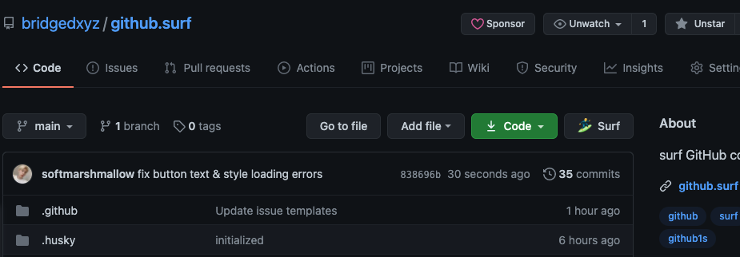

# github.surf


> 🏄‍♂️ Surf your repository like a pro


## Chrome extension

Download our official chrome [here](https://chrome.google.com/webstore/detail/aipkghikndfblkikafmbahbekkhmppia) (It's currently under review)




## 🏄‍♂️ `surf` CLI

Like vscode's `code .`, we support our command `surf`

```shell
# === install the cli ===
npm -g install @bridged.xyz/surf
		# or with yarn
		yarn global add @bridged.xyz/surf

# and surf 🏄 !
surf .
```


## Supported languages / frameworks

- Vue
- JS/TS/JSX/TSX (React, Svelete, and other js based frrameworks)
- Dart & Flutter


## Remote compile / App preview (for ui applications) & CLI Capabilities.

For repositories containing project such like flutter, react and other main ui frameworks we are planning to suport live-compile-preview feature of the application. the main issue with this will be the pricing and performance limitation. since we are going to keep this project free / fast for everyone


## Contribution

### Join the community

Learn more about contribution at [CONTRIBUTING.md](./CONTRIBUTING.md)


## Disclamer

this project is inspired from [cdr/code-server](https://github.com/cdr/code-server) and [conwnet/github1s](https://github.com/conwnet/github1s). the base code was forked from github1s (MIT License at the point of fork), which we are replacing it with our own implementations and approaches.