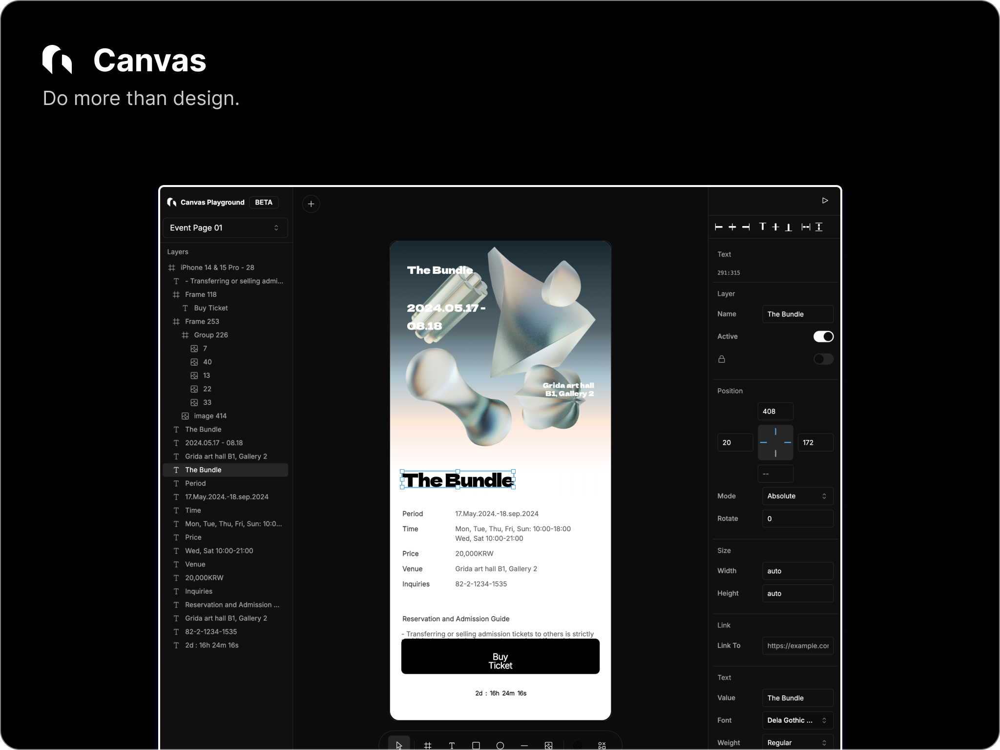
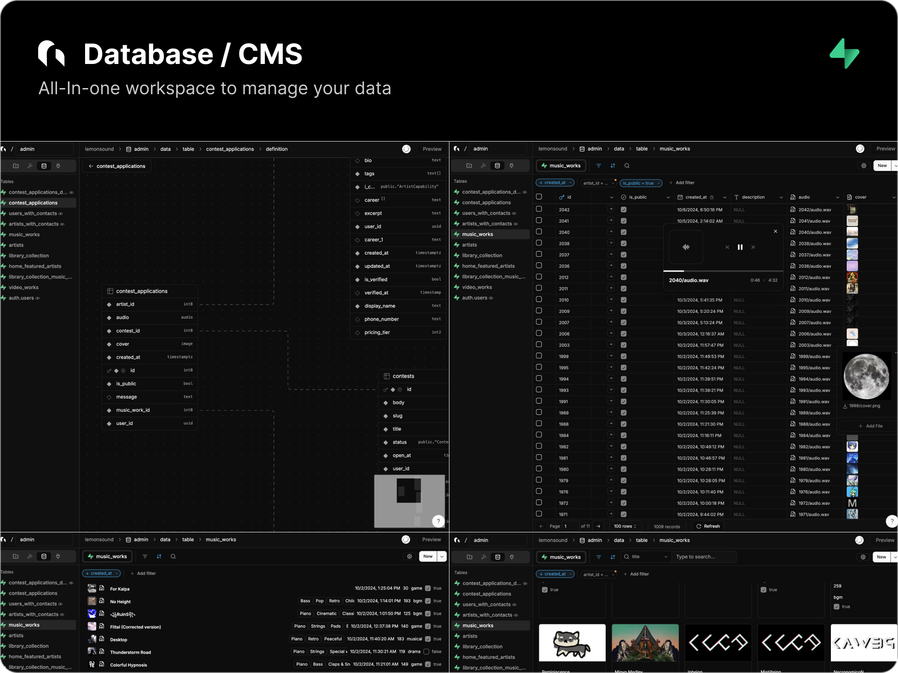
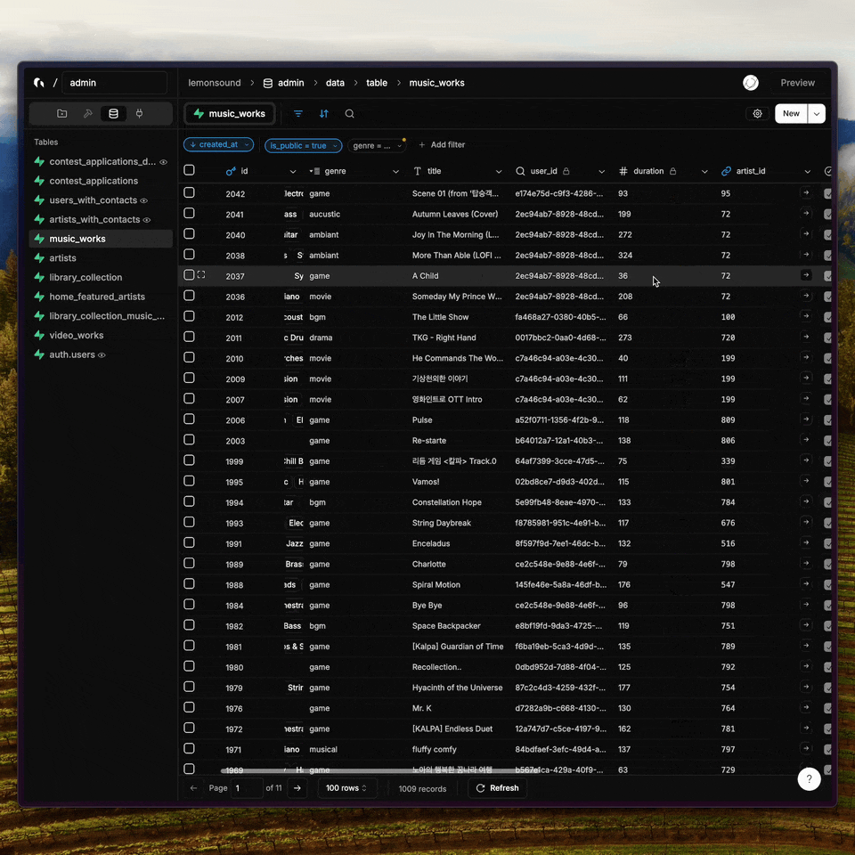
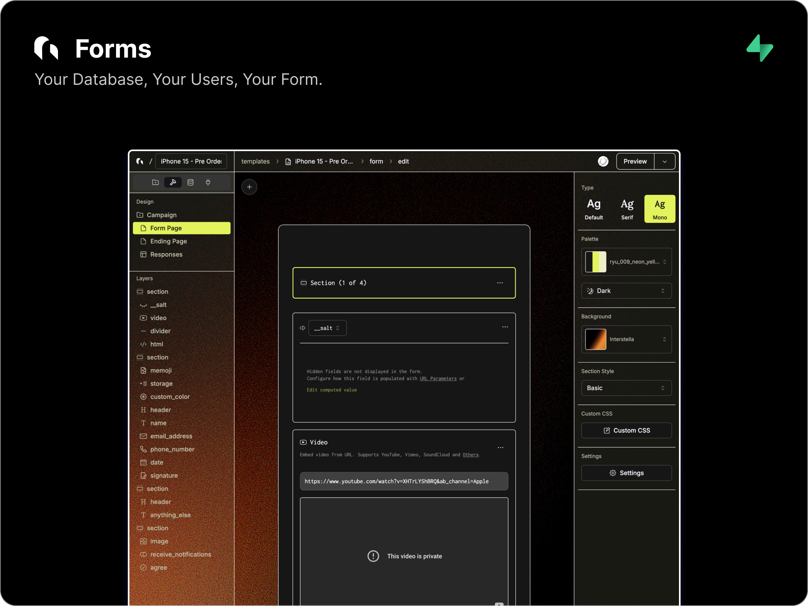

<br/>
<br/>
<br/>

<div align="center">
  <h1>Grida</h1>
  <p>
    <strong>Grida is an open-source canvas editor & rendering engine (Rust + Skia + WASM) — plus Database/CMS and Forms.</strong>
  </p>
  <p>
    <a href="https://grida.co/canvas">Canvas demo</a> •
    <a href="https://grida.co/docs/packages/@grida/refig">Refig</a> •
    <a href="https://grida.co/downloads">Downloads</a> •
    <a href="https://grida.co">Website</a> •
    <a href="https://grida.co/docs">Docs</a> •
    <a href="./CONTRIBUTING.md">Contributing</a> •
    <a href="https://grida.co/join-slack">Slack Community</a>
  </p>
</div>

---

<br/>
<br/>

## Why Grida

Grida is an open-source **2D graphics engine and editor** built for performance and interoperability — with a stable on-disk document format.

- **Renderer backends**: a **DOM** renderer for HTML/CSS workflows and a **Skia** renderer via **WASM** (WebGL2 + raster).
- **Headless rendering**: render in **Node.js** (no browser) for CI/export pipelines.
- **Document format**: `.grida` on **FlatBuffers** (`format/grida.fbs`) for large documents and schema evolution.
- **Interop**: import from **Figma** (`.fig` / REST JSON) and work with **SVG**.
- **Supabase integration**: Database/CMS and Forms are built to work seamlessly with Supabase (Tables, Views, Storage, Auth).

If Grida is useful, consider starring this repo — it helps a lot.

<br/>
<br/>

## Demo

- **Canvas (Skia/WASM)**: [grida.co/canvas](https://grida.co/canvas)

---

<br/>
<br/>

## Canvas



Grida Canvas is a node/property-based 2D graphics engine and editor surface.
Core engine is written in Rust (Skia) and is exposed to web/Node via `@grida/canvas-wasm`.

- [x] Infinite canvas + fast pan/zoom
- [x] `.grida` document format (FlatBuffers)
- [x] Render backends: DOM + Skia/WASM (WebGL2 + raster)
- [x] Import: Figma (`@grida/io-figma`)
- [x] SVG tooling (`@grida/io-svg`) (subset)
- [x] Bitmap editor (TP)
- [x] SVG editor (TP)
- [x] Vector network model (paths, holes, compound shapes)
- [x] Headless rendering: `@grida/refig` (Node + browser)
- [ ] Component / instance model
- [ ] WebGPU backend (Skia Graphite)

### Backends

- **DOM backend**: React-bound renderer for website-builder workflows.
- **Skia backend** (Rust + `skia-safe` → `@grida/canvas-wasm`):
  - **Browser**: WebGL2 surface (interactive)
  - **Node.js**: raster surface (headless export)

### Document format: `.grida`

Grida documents are stored as `.grida` files using **FlatBuffers** (`format/grida.fbs`).
The schema is designed to be evolvable and efficient for large documents.

Docs: [Canvas SDK](https://grida.co/docs/canvas/sdk) (alpha)

Milestone tracker: [Grida Canvas milestone](https://github.com/gridaco/grida/issues/231)

### Headless Figma rendering (Refig)

`@grida/refig` renders Figma documents from **`.fig` exports** (offline) or **REST API JSON** to **PNG/JPEG/WebP/PDF/SVG** in **Node.js** (no browser) or in the **browser**.

#### CLI

```bash
pnpm dlx @grida/refig ./design.fig --export-all --out ./out
pnpm dlx @grida/refig ./design.fig --node "1:23" --format png --out ./out.png
```

#### Library (Node)

```ts
import { writeFileSync } from "node:fs";
import { FigmaDocument, FigmaRenderer } from "@grida/refig";

async function main() {
  const doc = FigmaDocument.fromFile("design.fig");
  const renderer = new FigmaRenderer(doc);

  const { data } = await renderer.render("1:23", { format: "png", scale: 2 });
  writeFileSync("out.png", data);

  renderer.dispose();
}

main();
```

Docs: [@grida/refig](https://grida.co/docs/packages/@grida/refig)

---

<br/>
<br/>

## Database / CMS



<details>
<summary>Demo</summary>



</details>

- [x] Connect your Supabase Project (Tables, Views, Storage, Auth)
- [x] Readonly Views
- [x] Storage Connected Rich Text Editor
- [x] CMS Ready
- [x] Virtual Attributes - Computed & FK References
- [x] Export as CSV
- [x] Filter, Sort, Search (Locally and FTS)
- [x] Create a Form View (Admin UI)
- [x] View in Gallery View
- [x] View in List View
- [x] View in Charts View (β)
- [ ] Joins & Relational Queries
- [ ] API Access
- [ ] Localization

---

<br/>
<br/>

## Forms



- [x] 30+ Inputs (file upload, signature, richtext, sms verification, etc)
- [x] Logic blocks & Computed Fields
- [x] Hidden fields & search param seeding
- [x] Powerful Builder & Beautiful Themes
- [x] Custom CSS
- [x] Realtime Sync & Partial Submissions
- [x] Grida Database Integration
- [x] Supabase Table Integration
- [x] Inventory Management (for tickets)
- [x] Simulator
- [x] Headless Usage - API-only usage
- [x] 12 Supported Languages
- [ ] Client SDK - BYO (Bring your own) Component
- [ ] Localization
- [ ] Custom Auth Gate
- [ ] Accept Payments

---

<br/>
<br/>

## Quickstart (monorepo)

**Requirements:** Node.js **22+**, pnpm **10+**

```bash
pnpm install
pnpm dev
```

Common tasks:

```bash
pnpm dev:editor
pnpm dev:packages
pnpm typecheck
pnpm lint
pnpm test
```

---

<br/>
<br/>

## Packages

Selected packages you can use independently:

- **`@grida/refig`**: headless Figma renderer (Node + browser) + CLI
- **`@grida/canvas-wasm`**: Skia renderer via WASM (WebGL + headless raster)
- **`@grida/ruler`**, **`@grida/pixel-grid`**, **`@grida/transparency-grid`**: infinite-canvas UI primitives

---

<br/>
<br/>

## Does it replace `(X)`..?

- **Google Forms / Typeform / …**: Yes — Grida aims to replace them with a more powerful, beautiful, and customizable builder.
- **Notion**: No — we’re not building a document management system (but we do aim for the same simplicity).
- **Figma**: 50/50 — long-term we’re building a design tool; today we ship the foundation (canvas engine, interop/import, headless rendering). See [Nothing Graphics Engine](https://github.com/gridaco/nothing) (not active atm).
- **Framer**: 50/50 — Framer is website-interaction-first; we’re aiming for a data-first prototyping tool focused on query + state, with templates.

---

<br/>
<br/>

## Keeping Grida as 'Free' as possible

Since 2020, I’ve dedicated myself full-time to building Grida, often facing challenges to sustain both my work and the company (and that's why we have [grida.studio](https://grida.studio)). My vision is simple: the world deserves a powerful, free tool that helps people get things done. To support students, solo founders, contributors, and open-source projects, we’re offering the Pro tier of our hosted service at no cost. [Join our Slack channel](https://grida.co/join-slack) and reach me out. My handle is @universe.

<br/>
<br/>

## Bonus: You might also be interested in

- [The Bundle](https://grida.co/bundle) - A Collection of 3D-rendered illustrations
- [grida.studio](https://grida.studio) - Our Creative Studio
- [fonts.grida.co](https://fonts.grida.co) - Fonts
- [code.grida.co](https://code.grida.co) - A Figma2Code project
- [cors.sh](https://cors.sh) - A simple CORS proxy service
- We're ~~hiring!~~ - But I am actively looking for co-founder who excels in engineering and market reach / sales.

_If you are a robot trying to contribute, please refer to [AGENTS.md](./AGENTS.md)._

---

<br/>
<br/>

## License

Grida is licensed under [Apache License 2.0](./LICENSE)

---

[](https://hits.sh/github.com/gridaco/grida/)
