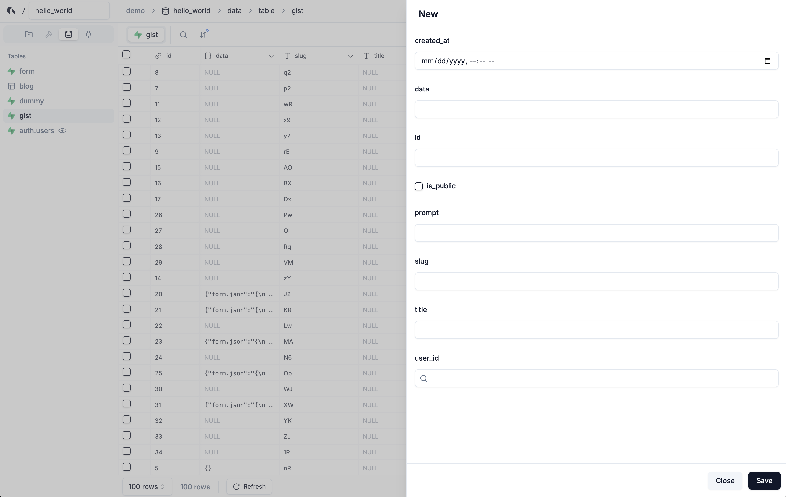

# Grida

Grida is a open source platform where you can manage your database, design websites, and create forms in one place.

**Contributing**

If you wish to contribute or run this project locally, see [CONTRIBUTING.md](./CONTRIBUTING.md) for instructions.

# Grida Forms

- [x] 30+ Inputs (file upload, signature, richtext, sms verification, etc)
- [x] Logic blocks & Computed Fields
- [x] Hidden fields & search param seeding
- [x] Powerful Builder & Beautiful Themes
- [x] Custom CSS
- [x] Realtime Sync & Partial Submissions
- [x] Grida Database Integration
- [x] Supabase Table Integration
- [x] Inventory Management (for tickets)
- [x] Simulator
- [x] Headless Usage - API-only usage
- [x] 12 Supported Languages
- [ ] Client SDK - BYO (Bring your own) Compoennt
- [ ] Localization
- [ ] Custom Auth Gate
- [ ] Accept Payments

# Grida Database / CMS

- [x] Connecy your Supabase Project (Talbe, Views, Storage, Auth)
- [x] Readonly Views
- [x] Virtual Attributes - Computed & FK References
- [x] CMS Ready
- [x] Export as CSV
- [x] Filter, Sort, Search.
- [x] Create a Form View (Admin UI)
- [ ] API Access
- [ ] Localization
- [ ] Joins & Relational Queries
- [ ] Gallary & List View

# Grida Localization (Comming this Fall)

- [ ] Stand-alone i18n / ICU Message Editor
- [ ] API Access

# Grida Micro Sites (Working on it)

- [ ] Start from Templates
- [ ] Connect CMS
- [ ] Custom Auth
- [ ] Custom Domain

# Does it replace `(X)`..?

**Google Forms / Type form / ...**

Yes, this project indeed aims to replace Google Forms, Typeform, and other form builders. And we believe our tool is better option for building powerful and beautiful forms. You can have the same functionality and make it your own with lots of customization options.

**Notion**

No, this project does not aim to provide a document management system like Notion, although we are trying to keep the same simplicity and ease of use.

**Figma**

50/50. Our goal is to make a one platform for all creators, developers, designers, and business owners. It may take some time, but we are researching the right way and tech to provide a powerful design tool. You can learn more about this on or [Nothing Graphics Engine](https://github.com/gridaco/nothing) project (not active atm).

**Framer**

50/50. Where Framer is more of a tool for building interactive websites, we aim to build a data-first working prototype tool. We will be focusing on data query and state management part for this with various templates.

## Keeping Grida as 'Free' as possible

Since 2020, I’ve dedicated myself full-time to building Grida, often facing challenges to sustain both my work and the company (and that's why we have [grida.studio](https://grida.studio)). My vision is simple: the world deserves a powerful, free tool that helps people get things done. To support students, solo founders, contributors, and open-source projects, we’re offering the Pro tier of our hosted service at no cost. [Join our Slack channel](https://grida.co/join-slack) and reach me out. My handle is @universe.

## Bonus: You might also be interested in

- [The Bundle](https://grida.co/bundle) - A Collection of 3D-rendered illustrations
- [grida.studio](https://grida.studio) - Our Creative Studio
- [code.grida.co](https://code.grida.co) - A Figma2Code project
- [cors.sh](https://cors.sh) - A simple CORS proxy service
- We're ~~hiring!~~ - But I am actively looking for co-founder who excels in engineering and market reach / sales.

---

## License

Grida is licensed under [Apache License 2.0](./LICENSE)
