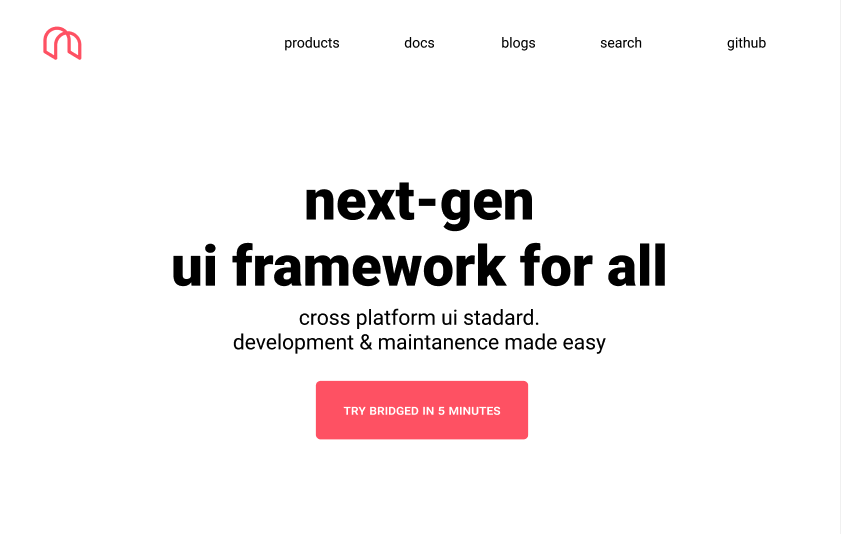

# [bridged.xyz](https://bridged.xyz/)




## In case you are looking for roadmap or contribution
- [join slack](https://join.slack.com/t/bridgedhq/shared_invite/zt-h9eyanie-U_t2XB1mrzRxcPww306aCA) and develop with community
- [general contribution guideline](https://github.com/bridgedxyz/contributing-and-license)
- [raodmap](https://github.com/bridgedxyz/roadmap)


## Design

The design of bridged.xyz website is oppenned and shared, can be found [here](https://www.figma.com/file/Gaznaw1QHppxvs9UkqNOb0/bridged.xyz?node-id=0%3A1)


> This is a [Next.js](https://nextjs.org/) project bootstrapped with [`create-next-app`](https://github.com/vercel/next.js/tree/canary/packages/create-next-app).

## Getting Started

First, run the development server:

```bash
npm run dev
# or
yarn dev
```

Open [http://localhost:3000](http://localhost:3000) with your browser to see the result.

You can start editing the page by modifying `pages/index.js`. The page auto-updates as you edit the file.

## Learn More

To learn more about Next.js, take a look at the following resources:

- [Next.js Documentation](https://nextjs.org/docs) - learn about Next.js features and API.
- [Learn Next.js](https://nextjs.org/learn) - an interactive Next.js tutorial.

You can check out [the Next.js GitHub repository](https://github.com/vercel/next.js/) - your feedback and contributions are welcome!

## Deploy on Vercel

The easiest way to deploy your Next.js app is to use the [Vercel Platform](https://vercel.com/import?utm_medium=default-template&filter=next.js&utm_source=create-next-app&utm_campaign=create-next-app-readme) from the creators of Next.js.

Check out our [Next.js deployment documentation](https://nextjs.org/docs/deployment) for more details.


## Sitemap
- [code.bridged.xyz](https://code.bridged.xyz)
- [design.bridged.xyz](https://design.bridged.xyz)
- [console.bridged.xyz](https://console.bridged.xyz)
- [labs.bridged.xyz](https://labs.bridged.xyz)
- [bridged.xyz/roadmap](https://bridged.xyz/roadmap)
- [bridged.xyz/github](https://bridged.xyz/github)
- [bridged.xyz/products](https://bridged.xyz/products)
- [bridged.xyz/products/dynamic](https://bridged.xyz/products/dynamic)
- [bridged.xyz/products/inappbridge](https://bridged.xyz/products/inappbridge)
- [bridged.xyz/products/schema-studio](https://bridged.xyz/tools/schema-studio)
- [bridged.xyz/products/react](https://bridged.xyz/products/react)
- [bridged.xyz/platforms/flutter](https://bridged.xyz/platforms/flutter)
- [bridged.xyz/plugins](https://bridged.xyz/plugins)
- [bridged.xyz/plugins/figma](https://bridged.xyz/plugins/figma)
- [bridged.xyz/plugins/sketch](https://bridged.xyz/plugins/sketch)
- [bridged.xyz/tools](https://bridged.xyz/tools)
