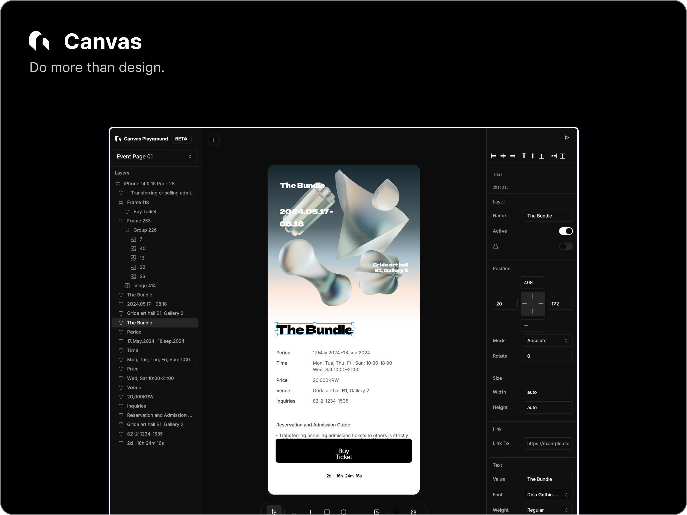
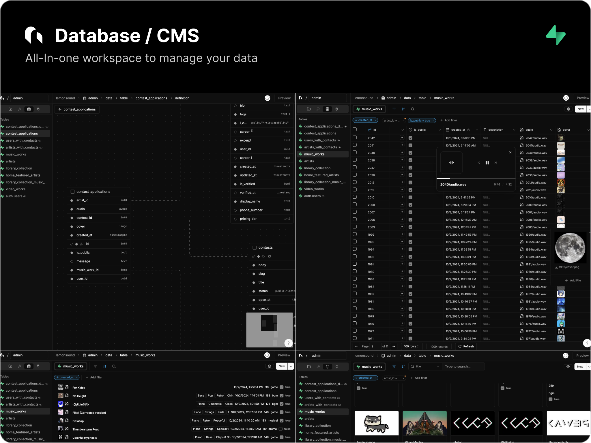
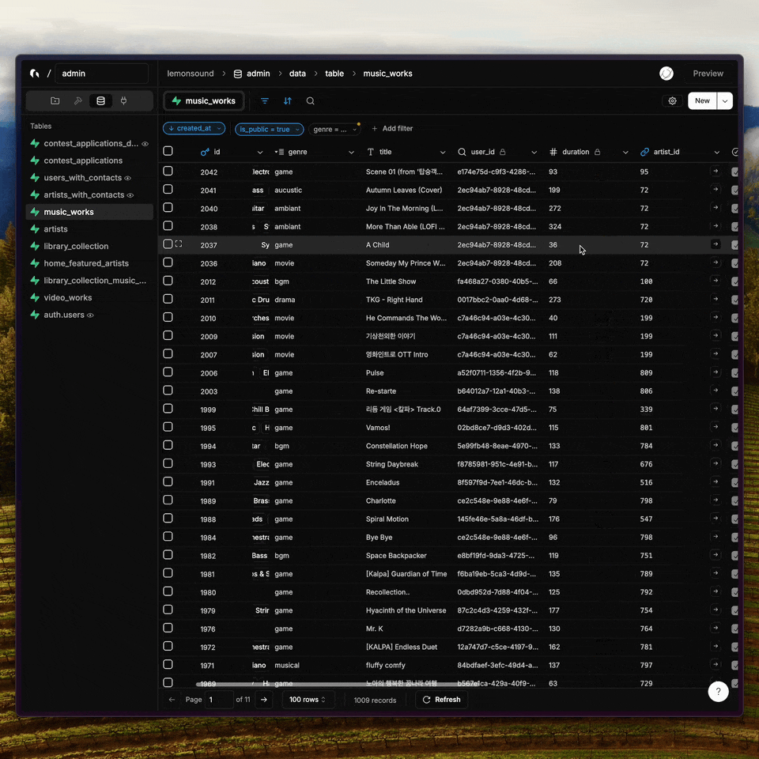
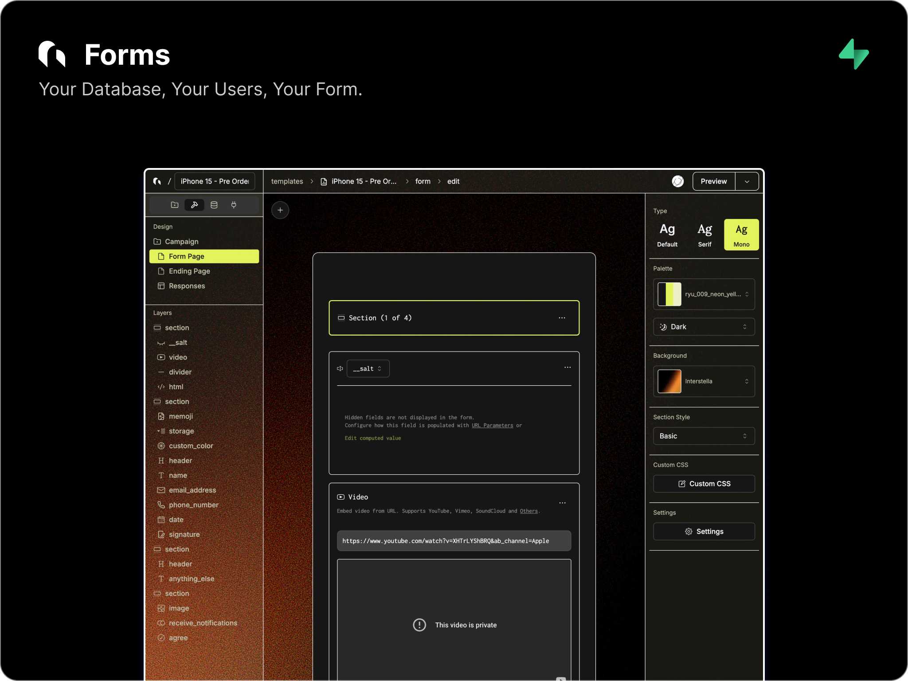

# Repository guide

This guide brings together Grida's product descriptions, feature lists, examples, packages, and source map for contributors and maintainers. The [README](./README.md) stays focused on getting started with Grida.

The product descriptions, checklists, examples, and screenshots below are carried over from the previous README. Checkboxes and preview labels retain their earlier status for review; the source map records current ownership. The screenshots show earlier product UI, rather than the current Desktop experience.

For local setup, follow [CONTRIBUTING.md](./CONTRIBUTING.md). Read the nearest `README.md` and `AGENTS.md` before working in a directory. Repository-wide coding guidance lives in [AGENTS.md](./AGENTS.md), and security boundaries are recorded in [SECURITY.md](./SECURITY.md).

- [Product overview](#product-overview), [Canvas](#canvas), [SVG](#svg), [Database / CMS](#database--cms), and [Forms](#forms)
- [Packages](#packages) and [development](#development)
- [Product source map](#product-source-map), [applications and services](#applications-and-services), [shared libraries](#shared-libraries), and [related repositories](#related-repositories)
- [Earlier project background](#earlier-project-background)

## Product overview

Grida is an open-source **canvas editor** built for performance and interoperability — with a stable on-disk document format. The 2D graphics engine that powers it lives in [gridaco/nothing](https://github.com/gridaco/nothing); this repo consumes it as the published `@grida/canvas-wasm` artifact.

- **Renderer backends**: a **DOM** renderer for HTML/CSS workflows and a **Skia** renderer via **WASM** (WebGL2 + raster).
- **Headless rendering**: render in **Node.js** (no browser) for CI/export pipelines.
- **Document format**: `.grida` on **FlatBuffers** ([`format/grida.fbs`](https://github.com/gridaco/nothing/blob/main/format/grida.fbs)) for large documents and schema evolution.
- **Interop**: import from **Figma** (`.fig` / REST JSON) and work with **SVG**.
- **Supabase integration**: Database/CMS and Forms are built to work seamlessly with Supabase (Tables, Views, Storage, Auth).

## Demo

- **Canvas (Skia/WASM)**: [grida.co/canvas](https://grida.co/canvas)
- **SVG editor**: [grida.co/svg](https://grida.co/svg)

## Canvas



Grida Canvas is a node/property-based 2D graphics engine and editor surface.
The core engine ([gridaco/nothing](https://github.com/gridaco/nothing)) is written in Rust (Skia) and is exposed to web/Node via `@grida/canvas-wasm`.

- [x] Infinite canvas + fast pan/zoom
- [x] `.grida` document format (FlatBuffers)
- [x] Render backends: DOM + Skia/WASM (WebGL2 + raster)
- [x] Import: Figma (`@grida/io-figma`), SVG
- [x] SVG tooling (`@grida/svg`)
- [x] Canvas-native rich text editing
- [x] History — time-bucketed undo/redo with preview
- [x] Markdown & HTML/CSS embeds (in-house Chromium-aligned renderer)
- [x] Multi-page PDF export
- [x] Bitmap editor (TP)
- [x] SVG editor — see [SVG](#svg)
- [x] Vector network model (paths, holes, compound shapes)
- [x] Headless rendering: `@grida/refig` (Node + browser)
- [ ] Component / instance model
- [ ] WebGPU backend (Skia Graphite)

### Backends

- **DOM backend**: React-bound renderer for website-builder workflows.
- **Skia backend** (Rust + `skia-safe` → `@grida/canvas-wasm`):
  - **Browser**: WebGL2 surface (interactive)
  - **Node.js**: raster surface (headless export)

### Document format: `.grida`

Grida documents are stored as `.grida` files using **FlatBuffers** ([`format/grida.fbs`](https://github.com/gridaco/nothing/blob/main/format/grida.fbs)).
The schema is designed to be evolvable and efficient for large documents.

Earlier SDK overview: [Canvas SDK](https://grida.co/docs/canvas/sdk) (alpha). For current implementation ownership, use the [source map](#product-source-map).

Milestone tracker: [Grida Canvas milestone](https://github.com/gridaco/grida/issues/231)

### Headless Figma rendering (Refig)

`@grida/refig` renders Figma documents from **`.fig` exports** (offline) or **REST API JSON** to **PNG/JPEG/WebP/PDF/SVG** in **Node.js** (no browser) or in the **browser**.

#### CLI

```bash
pnpm dlx @grida/refig ./design.fig --export-all --out ./out
pnpm dlx @grida/refig ./design.fig --node "1:23" --format png --out ./out.png
```

#### Library (Node)

```ts
import { writeFileSync } from "node:fs";
import { FigmaDocument, FigmaRenderer } from "@grida/refig";

async function main() {
  const doc = FigmaDocument.fromFile("design.fig");
  const renderer = new FigmaRenderer(doc);

  const { data } = await renderer.render("1:23", { format: "png", scale: 2 });
  writeFileSync("out.png", data);

  renderer.dispose();
}

main();
```

Docs: [@grida/refig](https://grida.co/docs/packages/@grida/refig)

## SVG

**The clean SVG editor.** Open an SVG, change one thing, save — and the diff shows exactly that. Nothing else moves. A round-trip-faithful editor and headless SDK, built for the era when people and AI edit the same files — AI chat built in.

- **Try it**: [grida.co/svg](https://grida.co/svg)
- **SDK**: [`@grida/svg-editor`](https://www.npmjs.com/package/@grida/svg-editor) — headless core + React bindings (alpha), backed by [`@grida/svg`](https://www.npmjs.com/package/@grida/svg) for path data and trivia-preserving parsing
- **The file is the source of truth** — byte-equal round trip when nothing changed; the editor leaves no fingerprints of its own

On the rendering side, Grida Canvas ships an in-house SVG renderer — **Rust + Skia → WASM**, a Chromium-shaped pipeline within the same engine ([gridaco/nothing](https://github.com/gridaco/nothing)) that renders HTML/CSS (Stylo + Taffy + Skia), validated against Chromium-rendered oracles (resvg-test-suite corpus, WPT-style harness).

## Database / CMS



<details>
<summary>Demo</summary>



</details>

- [x] Connect your Supabase Project (Tables, Views, Storage, Auth)
- [x] Readonly Views
- [x] Storage Connected Rich Text Editor
- [x] CMS Ready
- [x] Virtual Attributes - Computed & FK References
- [x] Export as CSV
- [x] Filter, Sort, Search (Locally and FTS)
- [x] Create a Form View (Admin UI)
- [x] View in Gallery View
- [x] View in List View
- [x] View in Charts View (β)
- [ ] Joins & Relational Queries
- [ ] API Access
- [ ] Localization

## Forms



- [x] 30+ Inputs (file upload, signature, richtext, sms verification, etc)
- [x] Logic blocks & Computed Fields
- [x] Hidden fields & search param seeding
- [x] Powerful Builder & Beautiful Themes
- [x] Custom CSS
- [x] Realtime Sync & Partial Submissions
- [x] Grida Database Integration
- [x] Supabase Table Integration
- [x] Inventory Management (for tickets)
- [x] Simulator
- [x] Headless Usage - API-only usage
- [x] 12 Supported Languages
- [ ] Client SDK - BYO (Bring your own) Component
- [ ] Localization
- [ ] Custom Auth Gate
- [ ] Accept Payments

## Packages

The previous README listed these independently usable packages. Release and stability details remain with each package.

| Package                                                                                | Description                                                                                                                                                            | Demo                                                                                                 |
| -------------------------------------------------------------------------------------- | ---------------------------------------------------------------------------------------------------------------------------------------------------------------------- | ---------------------------------------------------------------------------------------------------- |
| [`@grida/canvas-wasm`](https://www.npmjs.com/package/@grida/canvas-wasm)               | Grida Canvas rendering engine (Rust + Skia) as WASM — WebGL2 in the browser, headless raster in Node.js. Source: [gridaco/nothing](https://github.com/gridaco/nothing) |                                                                                                      |
| [`@grida/refig`](https://www.npmjs.com/package/@grida/refig)                           | Headless Figma renderer — render `.fig` / REST JSON to PNG/JPEG/WebP/PDF/SVG, with CLI                                                                                 | [demo](https://grida.co/packages/@grida/refig) · [docs](https://grida.co/docs/packages/@grida/refig) |
| [`@grida/svg-editor`](https://www.npmjs.com/package/@grida/svg-editor)                 | Headless, round-trip-faithful SVG editor SDK with React bindings (alpha)                                                                                               | [demo](https://grida.co/packages/@grida/svg-editor)                                                  |
| [`@grida/svg`](https://www.npmjs.com/package/@grida/svg)                               | SVG tooling — path data, attribute parsing, trivia-preserving round-trip parser                                                                                        |                                                                                                      |
| [`@grida/hud`](https://www.npmjs.com/package/@grida/hud)                               | Canvas-based heads-up display (overlays, handles) for editor viewports                                                                                                 | [demo](https://grida.co/packages/@grida/hud)                                                         |
| [`@grida/tree-view`](https://www.npmjs.com/package/@grida/tree-view)                   | Headless, agnostic tree-view controller (layer panels)                                                                                                                 | [demo](https://grida.co/packages/@grida/tree-view)                                                   |
| [`@grida/text-editor`](https://www.npmjs.com/package/@grida/text-editor)               | Backend-agnostic text editor engine (experimental)                                                                                                                     |                                                                                                      |
| [`@grida/history`](https://www.npmjs.com/package/@grida/history)                       | Dependency-free transaction & undo/redo engine                                                                                                                         |                                                                                                      |
| [`@grida/keybinding`](https://www.npmjs.com/package/@grida/keybinding)                 | Declarative keybinding primitives — modifiers, platform resolution, event matching                                                                                     |                                                                                                      |
| [`@grida/cmath`](https://www.npmjs.com/package/@grida/cmath)                           | Unopinionated canvas math — vectors, rects, transforms, snapping                                                                                                       |                                                                                                      |
| [`@grida/vn`](https://www.npmjs.com/package/@grida/vn)                                 | Vector network model (paths, holes, compound shapes)                                                                                                                   |                                                                                                      |
| [`@grida/color`](https://www.npmjs.com/package/@grida/color)                           | Core graphics color library                                                                                                                                            |                                                                                                      |
| [`@grida/ruler`](https://www.npmjs.com/package/@grida/ruler)                           | Zero-dependency canvas ruler for infinite canvas                                                                                                                       | [demo](https://grida.co/packages/@grida/ruler)                                                       |
| [`@grida/pixel-grid`](https://www.npmjs.com/package/@grida/pixel-grid)                 | Pixel-perfect grid component for infinite canvas                                                                                                                       | [demo](https://grida.co/packages/@grida/pixel-grid)                                                  |
| [`@grida/transparency-grid`](https://www.npmjs.com/package/@grida/transparency-grid)   | Transparency (checkerboard) grid for infinite canvas                                                                                                                   | [demo](https://grida.co/packages/@grida/transparency-grid)                                           |
| [`@grida/tailwindcss-colors`](https://www.npmjs.com/package/@grida/tailwindcss-colors) | Tailwind CSS color data (RGBA/HEX/OKLCH) for programmatic use                                                                                                          |                                                                                                      |

Interactive demos: [grida.co/packages](https://grida.co/packages)

## Development

Complete the prerequisites, package builds, and local backend setup in [CONTRIBUTING.md](./CONTRIBUTING.md) first. The commands below are retained as a quick reference for a configured checkout.

**Requirements:** Node.js **24+**, pnpm **11+**.

```bash
pnpm install
pnpm dev
```

Common tasks:

```bash
pnpm dev:editor
pnpm dev:packages
pnpm typecheck
pnpm lint
pnpm test
```

## Product source map

Several products share the `editor/` application. A product name does not necessarily correspond to a separate package or deployment.

| Product or surface                     | What it does                                                                                                | Start in the source                                                                                                                                                                                   |
| -------------------------------------- | ----------------------------------------------------------------------------------------------------------- | ----------------------------------------------------------------------------------------------------------------------------------------------------------------------------------------------------- |
| **Grida Desktop**                      | Hosts the editor, local file workflows, AI chat, and media tools in a native desktop application.           | [Electron host](./desktop/README.md), [Desktop UI](./editor/app/desktop/), [Desktop assemblies](./editor/scaffolds/desktop/)                                                                          |
| **Canvas**                             | Document editing, graphics, layout, text, and canvas interactions.                                          | [Editor core](./editor/grida-canvas/), [React integration](./editor/grida-canvas-react/), [editor assemblies](./editor/grida-canvas-react-starter-kit/)                                               |
| **Slides**                             | Presentation editing and presenting built on Canvas.                                                        | [Slide mode](./editor/grida-canvas/modes/slide-mode.ts), [presentation engine](./editor/grida-canvas/presentation-engine.ts), [Slides UI](./editor/grida-canvas-react-starter-kit/starterkit-slides/) |
| **SVG editor**                         | Edits SVG while preserving its source structure and minimizing unrelated changes.                           | [Editor package](./packages/grida-svg-editor/README.md), [SVG tooling](./packages/grida-svg/README.md), [product UI](<./editor/app/(canvas)/svg/>)                                                    |
| **Forms**                              | Form authoring, respondent experiences, logic, and response collection.                                     | [Builder](./editor/scaffolds/blocks-editor/), [form rendering and state](./editor/grida-forms/), [hosted respondent UI](./editor/grida-forms-hosted/)                                                 |
| **Database / CMS**                     | Table editing, data views, querying, and connected Supabase data.                                           | [Grid editor](./editor/scaffolds/grid-editor/), [queries](./editor/scaffolds/data-query/), [Supabase integration UI](./editor/scaffolds/x-supabase/)                                                  |
| **Storage**                            | Bucket browsing, file management, and media selection.                                                      | [Storage UI](./editor/scaffolds/storage/), [asset UI](./editor/scaffolds/asset/), [media picker](./editor/scaffolds/mediapicker/)                                                                     |
| **Library**                            | Asset browsing, search, references, and asset metadata.                                                     | [Library pages](<./editor/app/(library)/library/>), [Library integration](./editor/lib/library/)                                                                                                      |
| **Grida CLI**                          | Account access, model discovery, and media generation from a terminal or scripts, independently of Desktop. | [Native executable](./crates/grida-cli/README.md), [npm launcher](./packages/grida-cli/README.md)                                                                                                     |
| **Refig and Figma interoperability**   | Figma import, headless rendering, and embedded document viewing.                                            | [Refig](./packages/grida-canvas-sdk-render-figma/README.md), [Figma I/O](./packages/grida-canvas-io-figma/README.md), [Figma embed](<./editor/app/(embed)/embed/v1/figma/>)                           |
| **AI playgrounds**                     | Browser surfaces for exploring models and generation workflows.                                             | [AI pages](<./editor/app/(www)/(ai)/ai/>), [image playground](<./editor/app/(tools)/(playground)/playground/image/>), [AI form builder](<./editor/app/(www)/(forms)/forms/ai/>)                       |
| **West**                               | Referral campaigns, invitations, quests, and rewards.                                                       | [Campaign UI](<./editor/app/(workbench)/[org]/[proj]/(console)/(campaign)/>), [administration API](<./editor/app/(api)/private/west/>), [public API](<./editor/app/(api)/(public)/v1/west/>)          |
| **Design utilities and package demos** | Small standalone tools and interactive examples of reusable packages.                                       | [Tools and demos](<./editor/app/(tools)/>)                                                                                                                                                            |

Forms' shared contracts live in [@grida/forms](./packages/grida-forms/README.md). Its public HTTP operations belong to [Grida Open API](./apps/api/README.md) under `/v1/forms`. The editor consumes that API for the respondent experience.

The SVG editor is a TypeScript authoring product. The graphics engine's SVG rendering implementation belongs to [gridaco/nothing](https://github.com/gridaco/nothing).

## Applications and services

These are the hosts behind the product surfaces above and the supporting websites.

| Location                                          | Responsibility                                                                                                                                                                            |
| ------------------------------------------------- | ----------------------------------------------------------------------------------------------------------------------------------------------------------------------------------------- |
| [editor/](./editor/AGENTS.md)                     | Next.js host for `grida.co`, product interfaces, hosted Desktop UI, and tenant sites. Also owns private editor endpoints, account and billing services, and existing gateway integration. |
| [desktop/](./desktop/README.md)                   | Electron windows, native lifecycle, file and protocol integration, and sidecar supervision. Desktop loads the hosted editor under `/desktop/*`.                                           |
| [apps/api/](./apps/api/README.md)                 | Independently configured Open API application. Forms is its first product module.                                                                                                         |
| [apps/viewer/](./apps/viewer/README.md)           | Embeddable Storage file viewer, including PDF and flipbook viewing.                                                                                                                       |
| [apps/backgrounds/](./apps/backgrounds/README.md) | Embeddable interactive backgrounds.                                                                                                                                                       |
| [apps/docs/](./apps/docs/README.md)               | Documentation website. Authored content lives in root `docs/`; the app's `docs/` copy is generated.                                                                                       |
| [apps/blog/](./apps/blog/README.md)               | Blog application and its content.                                                                                                                                                         |
| [jobs/](./jobs/deno.json)                         | Deno worker for Supabase queue processing and email delivery; entry point is [src/main.ts](./jobs/src/main.ts).                                                                           |
| [supabase/](./supabase/README.md)                 | Database migrations, readable schemas, storage and access policies, and local backend setup shared by the hosted products.                                                                |

Within `editor/`, [workspace routes](<./editor/app/(workspace)/>) organize accounts and projects, [workbench routes](<./editor/app/(workbench)/>) assemble product editors, and [tenant routes](<./editor/app/(tenant)/README.md>) serve tenant-facing pages. [Marketing pages](<./editor/app/(www)/>) and [shared website components](./editor/www/) describe these products.

The existing hosted AI services live in [editor/lib/ai](./editor/lib/ai/), with the current gateway token owner in [editor/lib/gg](./editor/lib/gg/README.md). See the [machine API guide](./editor/lib/api/README.md) for endpoint ownership. This implementation is separate from the forthcoming standalone Grida AI Gateway service.

## Shared libraries

Packages have different release and stability policies. Follow each package's README and manifest for its public surface and availability.

| Area                             | Source and scope                                                                                                                                                                                                                                                                                   |
| -------------------------------- | -------------------------------------------------------------------------------------------------------------------------------------------------------------------------------------------------------------------------------------------------------------------------------------------------- |
| **Graphics and documents**       | [@grida/cg](./packages/grida-canvas-cg/), [@grida/schema](./packages/grida-canvas-schema/), [@grida/io](./packages/grida-canvas-io/), and [@grida/format](./packages/grida-format/README.md) hold shared graphics types, document models, I/O, and format bindings.                                |
| **Portable canvas folders**      | [dotcanvas](./packages/dotcanvas/README.md) reads and writes `.canvas` folders containing documents and a manifest.                                                                                                                                                                                |
| **Geometry and color**           | [@grida/cmath](./packages/grida-cmath/), [@grida/vn](./packages/grida-canvas-vn/), [@grida/color](./packages/grida-canvas-color/README.md), and [@grida/tailwindcss-colors](./packages/grida-canvas-tailwind-colors/README.md).                                                                    |
| **Editor interaction**           | [@grida/history](./packages/grida-history/README.md), [@grida/keybinding](./packages/grida-keybinding/README.md), [@grida/tree-view](./packages/grida-tree-view/README.md), and [@grida/text-editor](./packages/grida-text-editor/README.md) provide reusable editing behavior.                    |
| **Viewport UI**                  | [@grida/hud](./packages/grida-canvas-hud/README.md), [@grida/ruler](./packages/grida-canvas-ruler/README.md), [@grida/pixel-grid](./packages/grida-canvas-pixelgrid/README.md), and [@grida/transparency-grid](./packages/grida-canvas-transparency-grid/README.md).                               |
| **AI operations and model data** | [@grida/ai](./packages/grida-ai/README.md) owns shared model operations; [@grida/ai-models](./packages/grida-ai-models/README.md) consumes the authored catalog and input contracts in [data/ai](./data/ai/README.md).                                                                             |
| **Agent and local host**         | [@grida/agent](./packages/grida-ai-agent/README.md) owns the configured agent and sessions. [@grida/daemon](./packages/grida-daemon/README.md) owns local resource hosting. [@grida/desktop-bridge](./packages/grida-desktop-bridge/README.md) defines the Desktop bridge contract.                |
| **Native clients**               | TypeScript [auth](./packages/grida-auth/README.md), [account](./packages/grida-account/README.md), and [home](./packages/grida-home/README.md) packages support native hosts. Rust [grida-auth](./crates/grida-auth/README.md) and [grida-ai](./crates/grida-ai/README.md) support the native CLI. |
| **Forms and hosted data**        | [@grida/forms](./packages/grida-forms/README.md) owns neutral Forms contracts; [@grida/postgrest](./packages/grida-postgrest/README.md) owns schema and query utilities.                                                                                                                           |
| **Shared presentation**          | [UI primitives](./packages/ui/AGENTS.md), [icons](./packages/grida-react-icons/README.md), [fonts](./packages/grida-fonts/README.md), [translations](./packages/translations/README.md), and [emails](./packages/emails/README.md).                                                                |

Additional modules live under [packages/](./packages/) and the `editor/grida-*` directories. The [editor guide](./editor/AGENTS.md) explains the distinction between reusable libraries, UI components, and product assemblies.

## Related repositories

These projects have their own source ownership and release lifecycle.

| Project                                                 | Relationship to this repository                                                                                                             |
| ------------------------------------------------------- | ------------------------------------------------------------------------------------------------------------------------------------------- |
| [nothing](https://github.com/gridaco/nothing)           | Graphics engine, rendering, and engine-owned format specifications. This repository consumes its published `@grida/canvas-wasm` artifact.   |
| [Grida FX](https://github.com/gridaco/fx)               | Standalone generative asset workflow engine. Its implementation and guides live in that repository; the Grida website presents it at `/fx`. |
| [Grida Library](https://github.com/gridaco/library)     | Asset corpus and its tooling. Library browsing and integration in the Grida application remain here.                                        |
| [Figma Assistant](https://github.com/gridaco/assistant) | Figma plugin implementation. This repository retains its [marketing entry](<./editor/app/(www)/(figma)/figma/assistant/>).                  |

The planned standalone Grida AI Gateway is a separate service. Its [product page](<./editor/app/(www)/(ai-gateway)/ai/gateway/page.tsx>) lives here; add its source repository to this map when that destination is available.

## Earlier project background

<details>
<summary>Previous positioning, founder note, and related projects</summary>

The following material is preserved from the previous README for later editing. Comparisons, the hosted Pro offer, and the co-founder invitation reflect that earlier copy; they are not a restatement of current product positioning or commercial terms.

### Does it replace `(X)`..?

- **Google Forms / Typeform / …**: Yes — Grida aims to replace them with a more powerful, beautiful, and customizable builder.
- **Notion**: No — we’re not building a document management system (but we do aim for the same simplicity).
- **Figma**: 50/50 — long-term we’re building a design tool; today we ship the foundation (canvas engine, interop/import, headless rendering). The engine lives in [gridaco/nothing](https://github.com/gridaco/nothing).
- **Framer**: 50/50 — Framer is website-interaction-first; we’re aiming for a data-first prototyping tool focused on query + state, with templates.

### Keeping Grida as 'Free' as possible

Since 2020, I’ve dedicated myself full-time to building Grida, often facing challenges to sustain both my work and the company (and that's why we have [grida.studio](https://grida.studio)). My vision is simple: the world deserves a powerful, free tool that helps people get things done. To support students, solo founders, contributors, and open-source projects, we’re offering the Pro tier of our hosted service at no cost. [Join our Slack channel](https://grida.co/join-slack) and reach me out. My handle is @universe.

### Bonus: You might also be interested in

- [The Bundle](https://grida.co/bundle) - A Collection of 3D-rendered illustrations
- [grida.studio](https://grida.studio) - Our Creative Studio
- [fonts.grida.co](https://fonts.grida.co) - Fonts
- [code.grida.co](https://code.grida.co) - A Figma2Code project
- [cors.sh](https://cors.sh) - A simple CORS proxy service
- We're ~~hiring!~~ - But I am actively looking for co-founder who excels in engineering and market reach / sales.

_If you are a robot trying to contribute, please refer to [AGENTS.md](./AGENTS.md)._

</details>

## Keeping this guide current

Update product descriptions and source links as the project changes. Keep setup instructions in the contribution guides and detailed API contracts beside their owning packages. This guide stays at the repository root and is not part of the user documentation site.

## License

Grida is licensed under [Apache License 2.0](./LICENSE).
