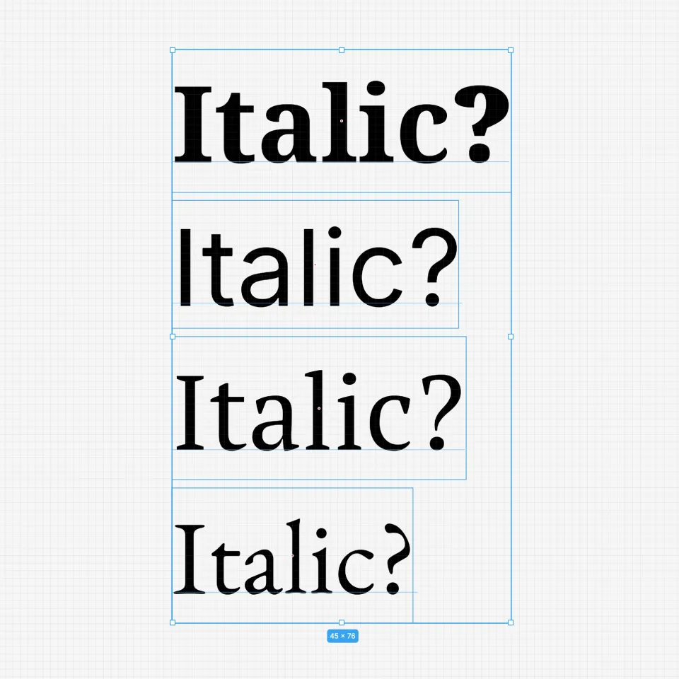
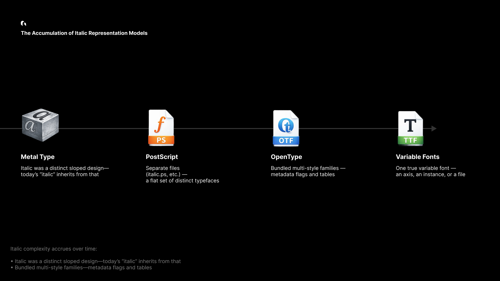
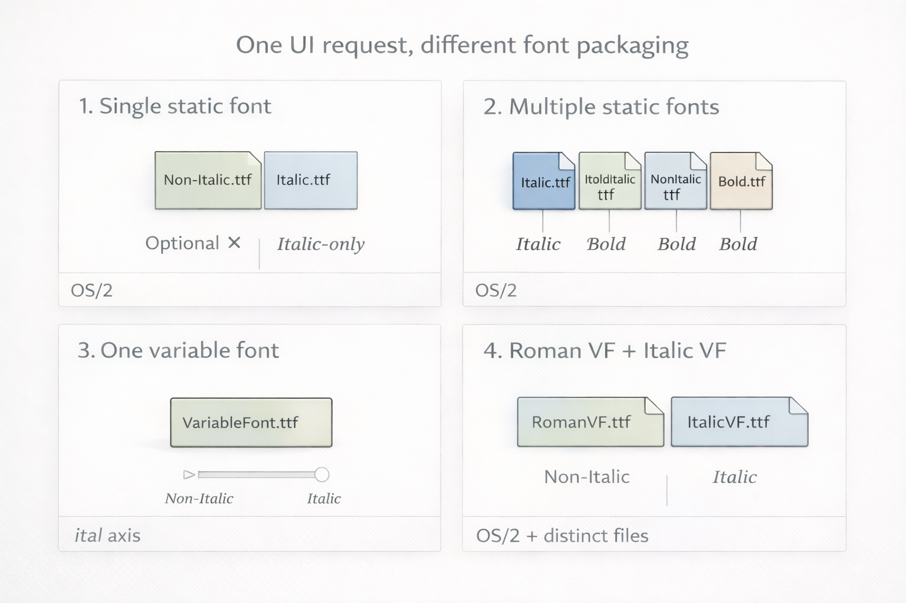
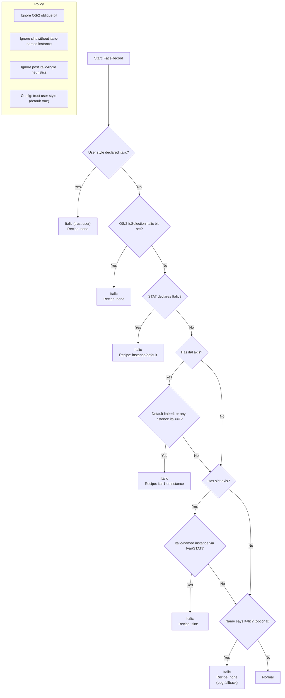

# Italic is not a slant

_That little **Italic** toggle in your design tool is doing far more than leaning letters to the right. In a professional renderer, italic is a **font discovery and selection problem**—and it’s messy in ways most people never see._

Clicking **Italic** is a request for a specific typographic design: a distinct face (often with different letterforms, spacing, and metrics), ideally authored by the type designer. To honor that request, a design tool has to navigate:

- families shipped as one file vs many files
- variable fonts that may or may not expose a real italic axis
- fonts that express italic via metadata (or don’t)
- legacy naming conventions that conflict with modern specs

In other words: the UI is simple. The decision tree is not.

> **Thesis:** A design tool can’t “apply italic.” It can only **select a font face (or instance) that represents italic**, or choose a synthetic fallback.

---

## What you think italic is


From the outside, italic looks like a geometric effect. But “true italic” is a separate design, not a shear transform:

- the italic **a** and **g** may change shape
- spacing and kerning can be rebalanced for slanted rhythm
- strokes, terminals, and proportions may be reworked for readability

So a professional tool should prefer a genuine italic face when it exists. And when it doesn’t, it must decide what “italic” should mean in a way that’s consistent, debuggable, and cross-platform.

---

## Why italic gets complicated in modern font families



Italic complexity isn’t an accident—it’s an accumulation:

- **History:** italic was originally a distinct handwriting-inspired style, not merely “slanted roman.”
- **File formats:** font families evolved from separate files to large multi-style bundles to variable fonts.
- **Metadata:** different eras standardized different signals (and not all fonts implement them correctly).

Today, the same user intent (“italic”) can be represented by very different font packaging strategies.

---

## The family taxonomy: how italic is actually shipped



Modern font families implement italic in a small number of patterns. The table below is the practical taxonomy we use when analyzing large registries (e.g., Google Fonts).

> Read this as: **same UI button, different ground truth**.

| Scenario                       | Description                                                         | Non-Italic Examples                                                                                                                                                                                                                                                                    | Italic Examples                                                                                                                                                                                                         | Primary signal          | Notes                                                                          |
| ------------------------------ | ------------------------------------------------------------------- | -------------------------------------------------------------------------------------------------------------------------------------------------------------------------------------------------------------------------------------------------------------------------------------- | ----------------------------------------------------------------------------------------------------------------------------------------------------------------------------------------------------------------------- | ----------------------- | ------------------------------------------------------------------------------ |
| **1. One static font**         | Single file; italic may be absent—or the family may be italic-only. | `Allerta-Regular.ttf` ([Google Fonts](https://fonts.google.com/specimen/Allerta))                                                                                                                                                                                                      | `Molle-Italic.ttf` ([Google Fonts](https://fonts.google.com/specimen/Molle))                                                                                                                                            | OS/2                    | Rare edge cases exist (including “italic-only” families).                      |
| **2. Many static fonts**       | Multiple files (Regular/Bold/Italic/BoldItalic).                    | `PTSerif-Regular.ttf`, `PTSerif-Bold.ttf` ([Google Fonts](https://fonts.google.com/specimen/PT+Serif))                                                                                                                                                                                 | `PTSerif-Italic.ttf`, `PTSerif-BoldItalic.ttf` ([Google Fonts](https://fonts.google.com/specimen/PT+Serif))                                                                                                             | OS/2                    | The traditional, still-common packaging model.                                 |
| **3. One variable font**       | A single variable font that can express italic via axes.            | `Geist-VariableFont_wght.ttf` ([Google Fonts](https://fonts.google.com/specimen/Geist))                                                                                                                                                                                                | `EB Garamond` (legacy reference) ([Google Fonts Knowledge](https://fonts.google.com/knowledge/glossary/italic_axis))                                                                                                    | `ital` axis             | Elegant in theory, less common in practice than people assume.                 |
| **3-1. VF + italic instances** | Variable font uses `slnt` plus explicitly named italic instances.   | `Recursive-VariableFont_CASL,CRSV,MONO,slnt,wght.ttf` ([Google Fonts](https://fonts.google.com/specimen/Recursive))<br/>`RobotoFlex-VariableFont_GRAD,XOPQ,XTRA,YOPQ,YTAS,YTDE,YTFI,YTLC,YTUC,opsz,slnt,wdth,wght.ttf` ([Google Fonts](https://fonts.google.com/specimen/Roboto+Flex)) | Same files, via named instances                                                                                                                                                                                         | `fvar.instances` / STAT | Italic is expressed by **instances and names**, not a clean “OS/2 italic” bit. |
| **4. Two variable fonts**      | A Roman VF and an Italic VF, switched by style.                     | `Inter-VariableFont_opsz,wght.ttf` ([Google Fonts](https://fonts.google.com/specimen/Inter))<br/>`NotoSans-VariableFont_wdth,wght.ttf` ([Google Fonts](https://fonts.google.com/noto/specimen/Noto+Sans))                                                                              | `Inter-Italic-VariableFont_opsz,wght.ttf` ([Google Fonts](https://fonts.google.com/specimen/Inter))<br/>`NotoSans-Italic-VariableFont_wdth,wght.ttf` ([Google Fonts](https://fonts.google.com/noto/specimen/Noto+Sans)) | OS/2 + family packaging | Common in modern flagship families: distinct design + VF benefits.             |

This taxonomy is the reason a single “isItalic” heuristic fails: italic may be a dedicated file, a variable axis value, a named instance, or—occasionally—an entire family.

---

## A professional font engine needs a policy, not a trick

If italic were always signaled the same way, font selection would be trivial.

In practice:

- Some fonts set OS/2 flags reliably. Others don’t.
- Some variable fonts expose an `ital` axis. Others use `slnt`.
- Some fonts contain “Italic” in names without being true italic.
- Some families include an italic VF as a separate file.

A design tool therefore needs two things:

1. **A detection pipeline** that can interpret multiple sources of truth.
2. **A policy** that defines what counts as “italic” when signals disagree.

---

## Grida’s italic selection pipeline

Grida’s selection is intentionally priority-based. The goal is not to be clever; it’s to be consistent.

### Priority order

1. **User declaration** (explicit intent wins)
2. **OS/2 italic bit** (best broad signal)
3. **STAT table** (style semantics and instance mapping)
4. **Variable font axes** (`ital`, then `slnt` with named instances)
5. **Name table fallback** (optional, logged)

### The decision flow



Two important details:

- We treat **italic** as a semantic request, not as a geometric one.
- When we must fall back, we do it **explicitly** and **log** the reason.

---

## From selection to rendering: a stable style model

Italic detection only matters if the result can be reliably rendered, cached, and persisted.

The key design constraint is this:

> A stored text style should contain **facts** (what the user asked for, what we resolved to), not platform-specific assumptions.

### `FontStyleKey`

This structure is the bridge between selection and rendering:

```rust
pub struct FontStyleKey {
    // Core identity
    pub font_family: String,
    pub font_weight: FontWeight,
    pub font_style_italic: bool,

    // Optional precision (exact matching)
    pub font_style_name: Option<String>,
    pub font_postscript_name: Option<String>,
    pub font_instance_postscript_name: Option<String>,
    pub font_variations: Option<HashMap<String, f32>>,
}
```

**Why the split matters:**

- The core fields cover the common case and enable fast internal resolution.
- The optional fields provide exactness when it exists (static PostScript names, VF instance names, axis values).
- Nothing here assumes a filesystem location or OS font registry behavior.

### Skia integration (illustrative)

```rust
// Illustrative sketch: production code includes additional validation & fallbacks.
fn textstyle(style: &TextStyleRec, ctx: &TextStyleRecBuildContext)
  -> skia_safe::textlayout::TextStyle
{
    let mut ts = skia_safe::textlayout::TextStyle::new();

    let font_style = skia_safe::FontStyle::new(
        skia_safe::font_style::Weight::from(style.font_weight.value() as i32),
        skia_safe::font_style::Width::NORMAL,
        if style.font_style_italic {
            skia_safe::font_style::Slant::Italic
        } else {
            skia_safe::font_style::Slant::Upright
        },
    );

    // Variable font coordinates (if any)
    let mut coords = vec![];
    if let Some(vars) = &style.font_variations {
        for v in vars {
            let tag = tag_from_str(&v.axis);
            coords.push(skia_safe::font_arguments::variation_position::Coordinate {
                axis: tag,
                value: v.value,
            });
        }
    }

    // Always apply weight
    coords.push(var_wght(style.font_weight.value() as f32));

    let variation_position = skia_safe::font_arguments::VariationPosition {
        coordinates: coords.as_slice(),
    };

    ts.set_font_style(font_style);
    ts.set_font_arguments(&font_args);
    ts
}
```

The goal is straightforward: once italic is classified (and a recipe exists), it must round-trip into the renderer deterministically.

---

## Deep dive: persistence, portability, and edge cases

Design tools aren’t browsers. They store documents, share files, and expect styles to remain meaningful over time.

### Persistence principles

- **Facts only:** store what’s true about the style and resolution.
- **Platform agnostic:** no font file paths or OS-specific identifiers.
- **Graceful degradation:** if a platform can’t locate the exact face, it should still render a sensible fallback.

### Real-world pressure points

- **Font file variability:** “the same family” can ship different files per platform.
- **Variable font instances:** the file may be constant; the _instance_ is the real style.
- **Metadata quality:** fonts in the wild are inconsistent; the pipeline must be defensive.
- **Performance:** selection must be cacheable and fast at design-tool scale.

---

## Blink, Grida, and Skia: where selection lives

A useful mental model:

- **Blink** (in the browser) decides fonts in the context of CSS, platform font fallback, and webfont loading.
- **Grida** decides fonts in the context of **documents**, **portability**, and **design intent**.
- **Skia** renders the result: it needs a resolved typeface + style/variation inputs.

The main takeaway is that “italic” is not solved at the raster layer. It’s solved in the selection layer—before glyph shaping and rendering.

```rust
// Illustrative: classification is a policy-driven decision.
fn classify_face(face: &FaceRecord) -> (ItalicKind, Option<Recipe>) {
    if face.user_font_style_italic == Some(true) {
        return (ItalicKind::Italic, None);
    }

    if face.os2_fsselection.italic() {
        return (ItalicKind::Italic, None);
    }

    if face.has_ital_axis_default_one() {
        return (ItalicKind::Italic, Some(Recipe::ital_one()));
    }

    if face.has_slnt_axis() {
        if let Some(inst) = face.instance_named_italic_via_slnt_only() {
            return (ItalicKind::Italic, Some(inst.axis_recipe()));
        }
    }

    (ItalicKind::Normal, None)
}
```

---

## Real italic vs synthetic italic

When an authentic italic face exists, it preserves typographic intent. When it doesn’t, tools often use a synthetic fallback.

A practical rule:

- **Prefer real italic** when the family provides it.
- **Fallback to synthetic** only when there’s no reliable italic face/instance.

The mistake is treating synthetic slant as equivalent. It isn’t—but it can be a reasonable fallback if communicated and applied consistently.

---

## Why we built fonts.grida.co

To validate this pipeline at scale, we built **fonts.grida.co**—a font metadata indexing service used to test and audit italic behavior across large registries.

It provides:

- accurate PostScript name mappings
- per-variant previews
- variable font axis and instance introspection
- searchable metadata for edge-case discovery

In practice, the service acts as an externalized test harness for font selection correctness.

---

## Closing: the small button with big consequences

Italic is a good example of what makes professional design tools hard: correctness is often invisible, and failure looks “almost fine.”

Treating italic as a first-class selection problem—backed by a clear policy, robust metadata interpretation, and stable persistence—turns a fragile UI toggle into something you can trust in real documents.

_The italic button is small. The responsibility behind it is not._
