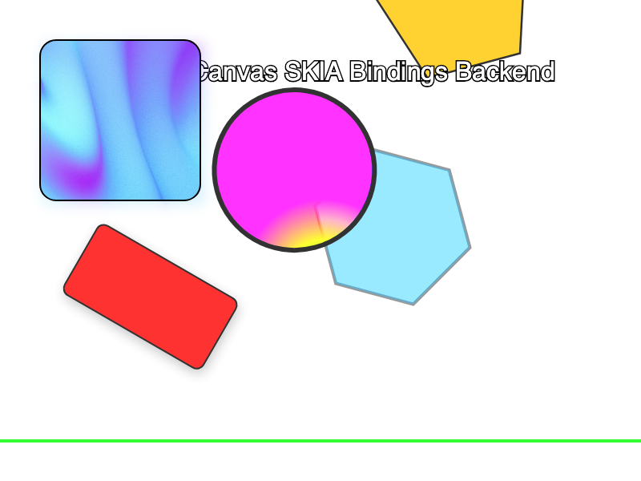

# grida-canvas (`cg`)



## Build

```bash
make build
make build_release
```

## Rendering

**2D Nodes**

- [ ] TextSpan
- [ ] Text (Text with mixed styles)
- [ ] Image
- [ ] Bitmap (for bitmap drawing)
- [ ] Group
- [ ] Container (Frame)
- [ ] Rectangle
- [ ] Ellipse
- [ ] Polygon
- [ ] RegularPolygon
- [ ] RegularStarPolygon
- [ ] Path (SVG Path)
- [ ] Vector (Vector Network)
- [ ] Line

**Meta**

- [ ] Mask
- [ ] Clip

**Styles & Effects**

- [ ] SolidPaint
- [ ] LinearGradientPaint
- [ ] RadialGradientPaint
- [ ] DropShadow
- [ ] BoxShadow
- [ ] BlendMode

## API

**Camera**

- [ ] 2D Camera

**Pipeline & API**

- [ ] load font
- [ ] load image

## Interactivity

- [ ] Hit testing
