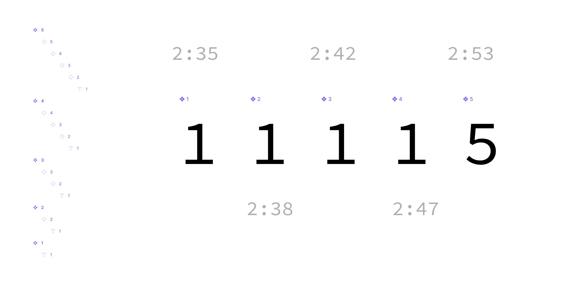

# Understanding Nested Components


So, let's define the scenario based on above image.

We have component 1 to 5, each instanciating a previous component. (except 1)

As the final tree structire is:

```
- 1 master
  - text

- 2 master
  - 1 instance instnace of 1
    - text

- 3 master
  - 2 instance instance of 2
    - 1 instance instance of 1
      - text

- 4 master
  - 3 instance instance of 3
    - 2 instance instance of 2
      - 1 instance instance of 1
        - text

- 5 master
  - 4 instance of 4
    - 3 instance instance of 3
      - 2 instance instance of 2
        - 1 instance instance of 1
          - text
```

If you had only `1`, we'de define the component as:

```tsx
function _1() {
  return <p>1</p>;
}
```

if with instanciation, with override text:

```tsx
function _1({ text = "1" }: { text: string }) {
  return <p>{text}</p>;
}
```

If we had only `1` & `2` master components and `1'` & `2'` instanciation
We'de define `1` & `2` as below

```tsx
function _1({ text = "1" }: { text: string }) {
  return <p>{text}</p>;
}

function _2() {
  return <_1 text="2" />;
}
```

The problem starts from 3rd. you might be thinking there's no big deal about this, but for computer iterating through the tree, it gets a bit tricky.

Since the `3` is instanciating `2`, but actually having the value overriden for `1` (which is instanciation of `2`).

```tsx
function _1({ text = "1" }: { text: string }) {
  return <p>1</p>;
}

function _2() {
  return <_1 text="2" />;
}
```

But what if case like this?


**If master `1` ~ `4` and `5` as a instance of `4`**

```tsx
function _1() {
  return <p>1</p>;
}

function _2() {
  return <_1 />;
}

function _3() {
  return <_2 />;
}

function _4() {
  return <_3 />;
}

const _5 = <_4 />;
```

**If all `1` ~ `5` as a master**

```tsx
function _1({ text = "1" }: { text: string }) {
  return <p>{text}</p>;
}

function _2({ text = "2" }: { text: string }) {
  return <_1 text={text} />;
}

function _3({ text = "3" }: { text: string }) {
  return <_2 text={text} />;
}

function _4({ text = "4" }: { text: string }) {
  return <_3 text={text} />;
}

function _5({ text = "1" }: { text: string }) {
  return <_4 text="5" />;
}
```

And this will impact all the masters starting from `4` to the starting `1`.
