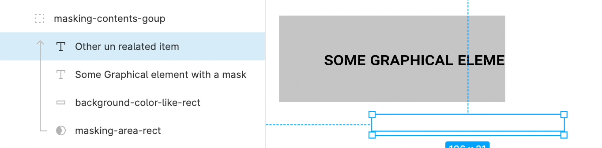

# Figma mask (not frame)


While frame has a built-in clip content property, figma also has a traditional graphics tool masking layer just like in photoshop.

[Figma mask on youtube](https://www.youtube.com/watch?v=tUcBcz8bjVs)

**A slightly bizarre structure**

While frame and other code implementation (css container or flutter clip) has a straight forward hierarchical structure, masking in design tool does not have a hierarchical structure.

Here is a example of how making works


```txt
| (mask) | a | b | d | e | f | g     -- none will be masked
| a | b | (mask) | d | e | f | g     -- a, b will be masked
| a | b  | d | e | f | g | (mask)    -- all will be masked
```

A target masking layer will have property `isMask` set to true.

_References_

- https://help.figma.com/hc/en-us/articles/360040450253-Masks
- https://www.youtube.com/watch?v=tUcBcz8bjVs
- https://www.figma.com/plugin-docs/api/RectangleNode/#ismask

## Web - css

**With Positioning + overflow hidden**

```css
/* wip */
```

## Flutter

**With `Stack` + `clipBehaviour`**

```dart
// wip
```

**With `ClipRect` | `CipRRect` | `ClipPath`**

```dart
// wip
```

_References_

- [Flutter Devs medium - ClipRRect & ClipPath In Flutter](https://medium.com/flutterdevs/cliprrect-clippath-in-flutter-4c41abe4e8)
- [Flutter#ClipPath](https://api.flutter.dev/flutter/widgets/ClipPath-class.html)
- [Flutter#ClipRect](https://api.flutter.dev/flutter/widgets/ClipRect-class.html)
