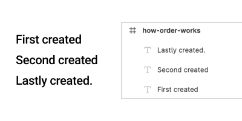
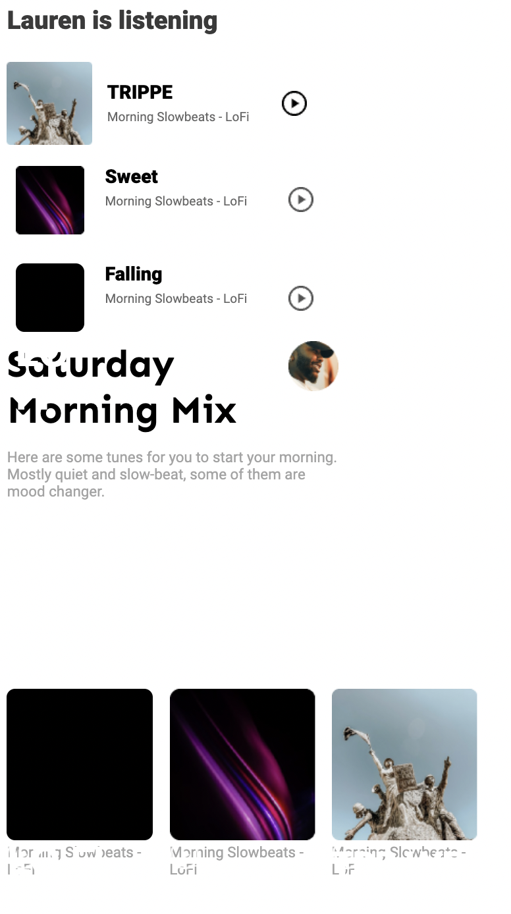

# How item order works & sanitizing options

**The order in editor's hierarchy (on design tools)**



**The actual array data via api**

And below is the short version of the above image.

```json
[
  {
    "type": "TEXT",
    "characters": "First created",
    "id": "501:6153",
    "name": "First created",
    "removed": false,
    "visible": true,
    "locked": false,
    "x": 13,
    "y": 28,
    "rotation": 0,
    "width": 55,
    "height": 9
  },
  {
    "type": "TEXT",
    "characters": "Second created",
    "id": "501:6154",
    "name": "Second created",
    "removed": false,
    "visible": true,
    "locked": false,
    "x": 13,
    "y": 45,
    "rotation": 0,
    "width": 68,
    "height": 9
  },
  {
    "type": "TEXT",
    "characters": "Lastly created.",
    "id": "501:6155",
    "name": "Lastly created.",
    "removed": false,
    "visible": true,
    "locked": false,
    "opacity": 1,
    "x": 13,
    "y": 62,
    "rotation": 0,
    "width": 64,
    "height": 9
  }
]
```

**Relation between index and z-index**
As shown above, the lastly created item places on the last of the array index, and top of the visual tree (on design tool), which will have the highest z-index also.

**Sorting strategy**

When sorting strategy not applied and code gen with raw input, below result may come.


**Exceptional cases**

> What if the item is intetionally on the top (z) even if it's placed at the bottom of the parent?

On this case, it can be both intended or a design error. the good example of this being a valid case is a bottom navigation. But also bottom navigation should be constrained to follow the bottom.
