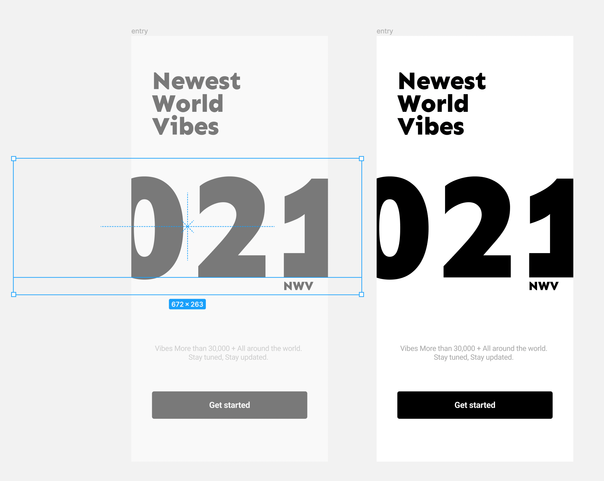

# Item overflowing scenarios (static, no-scroll)

This is not a document for overflowing layout, a scroll. ([Go here for overflowing layout scroll docs](./overflow-layout-scroll.md))

This document describes how to handle intentionally overflowed items per by frameworks.

This is a good example of the overflowing static example.


## Web - css

```css
.container {
  background-color: black; /*(visual factor)*/
  overflow: hidden; /* <-- do not scroll overflow */
}

.overflow {
  position: relative;
  left: calc(
    (100% - 1000px) * 0.5
  ); /* <-- overflow static position (center) (parent.width - this.with / 2) */
  /* or for non-semitric alignment, left:calc((100% - w - x) / 2) */

  margin: 10px; /*(visual factor)*/
  background-color: red; /*(visual factor)*/
  width: 1000px; /* <-- overflowing size */
}
```

The math for finding the constrainted position is.

- left: `calc((100% - w - x) / 2)`

## Flutter

**Using OverflowBox**

```dart
OverflowBox(
    minWidth: 0.0,
    minHeight: 0.0,
    maxWidth: double.infinity,
    maxHeight: double.infinity,
    alignment: Alignment.center,    /* <--- we can dynamically align to match the design's snapshot */
    child:
        Container(
            color: red,
            width: 4000,            /* <--- overflowing width */
            height: 50
        )
);
```

The math for finding the constrainted position is.

<!-- TODO: math not complete - read https://api.flutter.dev/flutter/widgets/Align-class.html-->

- alignment: `Alignment(x, y)`

_References_

- [Flutter#OverflowBox](https://api.flutter.dev/flutter/widgets/OverflowBox-class.html)
- [Flutter#Align](https://api.flutter.dev/flutter/widgets/Align-class.html)
