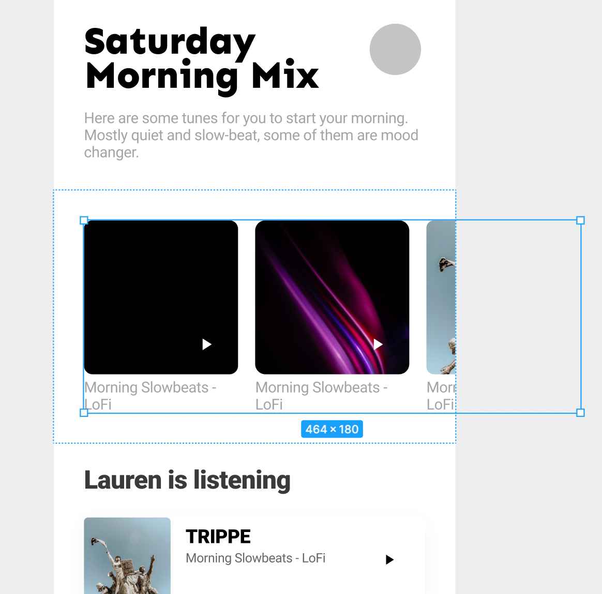

# How to determine if flexbox should have overflow porperty?

> To make flexbox scroll, we have to put `overflow: auto` property. E.g. flexbox under root (screen) shoyld be scrolled.

## By platforms

- flutter uses SignleChildScrollView & overflowing child.
- css uses `overflow: auto` for enable scrolling.

## The real question - is this scrollable (should it be scrollable) ?

Our answer to this is yes, when the child is bigger than it's parent. BUT only on below scenarios

**YES**

- When child uner layout (e.g. autolayout in figma) is overflowed.

**NO**

- When simply content is overflows inside group / frame as a visual content.

### Strategy 1. set overflow when content is already bigger thatn parent based on design.

### Strategy 2. always overflow when direct child of a root (screen)
