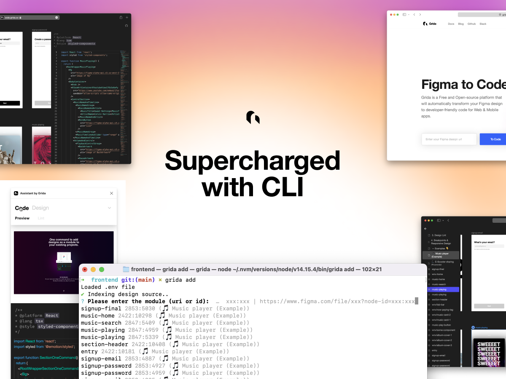

# CLI



Grida CLI 는 디자인을 마치 모듈처럼 관리할수 있도록 도와주는 일종의 패키지 매니저 입니다. 간단히는 디자인 모듈을 임포트하여 프로젝트에 사용하거나, 응용으로는 디자인을 바탕으로 CI/CD 파이프라인을 구축할수도 있습니다.

## Install CLI

```
npm i -g grida
```

> Note: It is recommended to install Griad CLI inside a project (instead of globally) - `yarn add --dev grida` or `npm i --save-dev grida`.

## `grida init`

Fisrt, you need to initialize your project with `grida init`.
grida init works for both empty project and for existing project.

If you don't have a existing node project (react, rn, svelte, ...) (with package.json) or dart/flutter project (with pubspec.yaml), grida will prompt you to create a new project.

**Starting from scratch (no existing project)**

You'll get the message below if you run grida init under empty directory with no project root.

```

\$ grida init

> No project root is found (package.json or pubspec.yml) with framework configuration. Do you want to continue without creating a project? (y/N)

```

- No (default) - grida will walk you through to create a new base project.
- Yes - grida ignores the base project and continues with the initialization. (this make break the configuration afterwards. not recommanded)

### 1. Design source configuration

Once init is complete, you'll be prompted to configure the design source like below.

```
> Where from to import your design? : figma
> Please enter your figma file url : https://www.figma.com/file/xxx
> Please enter your figma personal access token.: ******************
```

- origin : The provider of your design (figma, sketch, ...)
- file : The unique identifier or file path to your design.
- token (for figma) : A [personal-access-token](../with-figma/guides/how-to-get-personal-access-token) for grida cli to read your design (readonly).

### 2. Framework configuration

Once the design source configuration is complete, you'll be prompt to configure settings for your framework.
The promps & specs vary by frameworks, you can see each configurations at [`@grida/builder-config`](https://github.com/gridaco/code/tree/main/packages/builder-config).

You may follow the cli prompts to configure your project. You can edit this manually in grida.config.js once the init process is complete.

**React example of framework config**

```js
/**
 * @type {import('@grida/builder-config').FrameworkConfig}
 */
const frameworkConfig = {
  framework: "react",
  language: "tsx",
  component_declaration_style: {
    exporting_style: {
      type: "export-named-functional-component",
      declaration_syntax_choice: "function",
      exporting_position: "with-declaration",
    },
  },
};
```

### Project structure

Once project setup is complete, you'll see you project tree organized like below.

**For example, NextJS**

```
...
├── .grida             (created)
├── .env               (modified)
├── .gitignore         (modified)
├── README.md
├── grida              (created)
│   └── .gitkeep       (created)
├── grida.config.js    (created)
├── next-env.d.ts
├── package.json       (modified)
├── pages
│   ├── _app.tsx
│   └── index.tsx
├── public
├── styles
├── tsconfig.json
└── ...
```

**For example, Flutter**

```
...
├── .grida                   (created)
├── .env                     (modified)
├── .gitignore               (modified)
├── README.md
├── analysis_options.yaml
├── build
├── flutter_app.iml
├── grida.config.js
├── lib
│   ├── grida                (created)
│   │   └── .gitkeep
│   └── main.dart
├── pubspec.lock
├── pubspec.yaml
├── test
│   └── widget_test.dart
├── web
├── macos
├── ios
├── landroid
├── linux
├── windows
└── ...
```

## `grida add`

grida add 는 패키지 매니저와 비슷하게 작동합니다. `grida add [modules...]` 의 형식으로 사용합니다.

```

```

## See also

- [(ko) Grida CLI @ disquiet.io](https://disquiet.io/product/figma-cli-by-grida)

```

```
