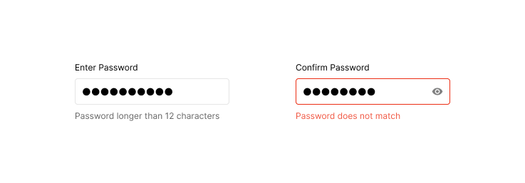

# How to design (structure) a text-field component - with realworld-enterprise-design-system example

## Intro

In this guide, we will learn how to..

- Create a base text-field component
- Create a variant text-field with states such as

## Anatomy

## Tokens

- (color) input-value
  - `input-value/placeholder`
  - `input-value/default`

## Combo - Password field

Use `●` [[Unicode Character 'BLACK CIRCLE' (U+25CF)]](https://www.fileformat.info/info/unicode/char/25CF/index.htm) for representing the obscured text.

Create a new component for trailing show/hide toggle button

Swap the trailing placeholder slot to the `password-field-show-hide-adornment` that we've just created.

💡 Tip - when you use sequence of `●●●●` in your design, Grida will automatically match the design to be a text field with `type=password`

## FAQ

- Q: How do I handle the password type field?
  - A: Use a combo of text-field's trailing slot and your own show/hide toggle button - [follow this read](./19-text-field-password)
