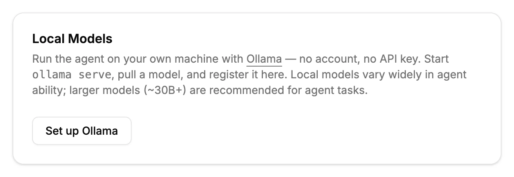
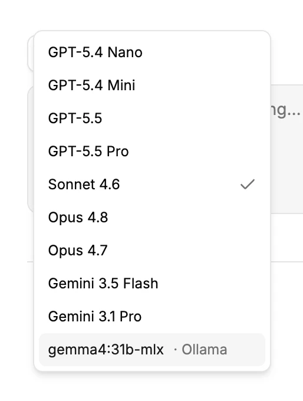

# Local Models (Ollama)

Grida Desktop's AI agent can run on models that live entirely on your own
machine, served by [Ollama](https://ollama.com). There is no account to
create and no API key to paste — your prompts, files, and the model's
responses never leave your computer.

You can use local models alongside provider keys (OpenRouter, Vercel), or
as your only setup.

## Requirements

- **Grida Desktop** installed.
- **Ollama** installed and running (`ollama serve` — the desktop Ollama app
  runs it for you).
- At least one model pulled, for example:

  ```sh
  ollama pull gpt-oss:20b
  ```

A note on expectations: local models vary widely in how well they drive
the agent. The agent leans on tool calling (reading and writing files,
running commands, planning), and small models often handle this poorly.
Models in the ~30B class and up are recommended for agent tasks.

## Set up Ollama

Open **Settings** from the app menu and find the **Local Models** card.



Click **Set up Ollama**. The base URL is prefilled with Ollama's local
address (`http://localhost:11434/v1`), and the models you have pulled are
detected automatically — including whether each one supports tool calls.


Review the list and click **Save**:

- **Detect** re-scans the endpoint — use it after you `ollama pull` a new
  model. You can also add a model manually by id, or remove ones you
  don't want in the picker.
- The **context window** is detected too: for a model that is currently
  loaded, Grida reads the size your server actually allocated; otherwise
  it uses the model's maximum. The value stays editable — if you cap
  your server's context (e.g. `OLLAMA_CONTEXT_LENGTH`) below a model's
  maximum, lower it to match so long sessions summarize at the right
  time. Manually added models default to a conservative `8192`.
- Leave **tools** on unless you know the model cannot make tool calls.

The first model in the list is the default — background work like session
titles and summaries also runs on it.

## Use a local model

Registered models appear in the model picker in every agent composer,
grouped under the endpoint name.



Pick the model and chat as usual. Everything the agent does — reading
your workspace files, making edits, planning — runs against the local
model. Each session remembers the model it ran with.

If you have no provider key configured at all, the agent uses your Ollama
setup automatically.

## The tools toggle

The agent works through tool calls, so a model that cannot make them
loses most of its abilities. If you switch **tools** off for a model, the
composer shows a warning while that model is selected, but you can still
chat with it.

Ollama lists each model's capabilities — `ollama show <model>` includes
`tools` when the model supports tool calling.

## Troubleshooting

- **The model errors immediately.** Check that Ollama is running: open
  `http://localhost:11434` in a browser — it should answer
  `Ollama is running`.
- **A model is missing from the picker.** Only registered models appear.
  Click **Detect** in **Settings → Local Models** after pulling a new
  model, or add its id manually.
- **Long sessions stop or degrade.** The registered context window may be
  larger than what your Ollama serving configuration actually allows.
  Lower the context window value for the model in **Settings → Local
  Models**.
- **Slow responses.** Local speed is your hardware's speed. Smaller
  models respond faster but handle agent tasks worse.

## Other OpenAI-compatible endpoints

The base URL accepts any OpenAI-compatible server on your machine, so a
local gateway such as LiteLLM or vLLM works the same way: point the base
URL at it and register the models it serves. If the gateway needs an API
key, save the key for it under **Settings** — it is stored by the agent
host and never shown back.
