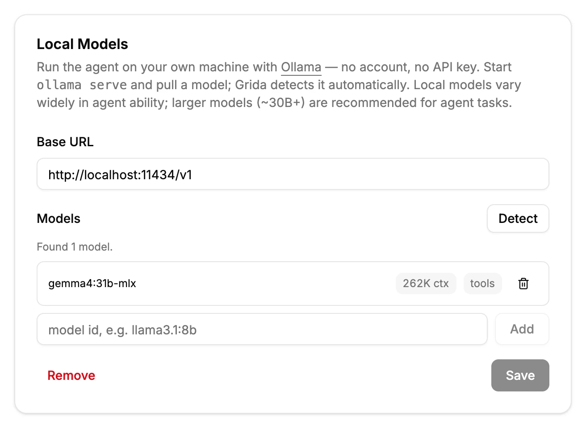

# Local Models (Ollama)

Grida Desktop's AI agent can run on models that live entirely on your own
machine, served by [Ollama](https://ollama.com). There is no account to
create and no API key to paste — your prompts, files, and the model's
responses never leave your computer.

You can use local models alongside provider keys (OpenRouter, Vercel), or
as your only setup.

## Requirements

- **Grida Desktop** installed.
- **Ollama** installed and running (`ollama serve` — the desktop Ollama app
  runs it for you).
- At least one model pulled, for example:

  ```sh
  ollama pull gpt-oss:20b
  ```

A note on expectations: local models vary widely in how well they drive
the agent. The agent leans on tool calling (reading and writing files,
running commands, planning), and small models often handle this poorly.
Models in the ~30B class and up are recommended for agent tasks.

## Set up Ollama

Open **Settings** from the app menu, find the **Local Models** card, and
click **Set up Ollama**. The base URL is prefilled with Ollama's local
address (`http://localhost:11434/v1`), and the models you have pulled are
detected automatically.



Review the list and click **Save**:

- Each detected model shows its **context window** and **tool-calling**
  support as read-only badges. These come from the endpoint itself and
  refresh whenever you open Settings (and on **Detect**, useful after you
  `ollama pull` a new model). For a model that is currently loaded, the
  context window is the size your server actually allocated; otherwise it
  is the model's maximum.
- A model you add manually by id (for example on a gateway that doesn't
  report capabilities) keeps editable fields instead — there, you are
  the data source. Manually added models default to a conservative
  `8192` context.

The first model in the list is the default — background work like session
titles and summaries also runs on it.

## Use a local model

Registered models appear in the model picker in every agent composer,
grouped under the endpoint name (for example `gpt-oss:20b · Ollama`).
Pick one and chat as usual. Everything the agent does — reading your
workspace files, making edits, planning — runs against the local model.
Each session remembers the model it ran with.

If you have no provider key configured at all, the agent uses your Ollama
setup automatically.

## Models without tool support

The agent works through tool calls, so a model that cannot make them
loses most of its abilities. Tool support is detected per model — Ollama
reports it, and `ollama show <model>` lists `tools` when a model supports
tool calling. When you select a model without tool support, the composer
shows a warning, but you can still chat with it.

## Troubleshooting

- **The model errors immediately.** Check that Ollama is running: open
  `http://localhost:11434` in a browser — it should answer
  `Ollama is running`.
- **A model is missing from the picker.** Only registered models appear.
  Click **Detect** in **Settings → Local Models** after pulling a new
  model, or add its id manually.
- **Long sessions stop or degrade.** The detected context window may be
  larger than what your serving configuration actually allows (it
  converges to the served size once the model has been loaded). To pin a
  smaller value, set an override in the config file — see below.
- **Slow responses.** Local speed is your hardware's speed. Smaller
  models respond faster but handle agent tasks worse.

## Other OpenAI-compatible endpoints

The base URL accepts any OpenAI-compatible server on your machine, so a
local gateway such as LiteLLM or vLLM works the same way: point the base
URL at it and register the models it serves. If the gateway needs an API
key, save it in the card's **API key** field (it appears once the
endpoint is saved) — the key is stored by the agent host and never shown
back. Ollama itself needs no key.

## Advanced: the config file

Everything on this page is stored as plain JSON in `endpoints.json` (the
settings card links to it). Detected values refresh automatically, so
hand-edits to them won't stick — if an endpoint reports a value that is
wrong for your setup (for example, your server caps context below the
model's maximum), pin the correction in the model's `overrides` instead.
Overrides always win over detected values, and detection never touches
them:

```json
{
  "id": "gemma4:31b-mlx",
  "tool_call": true,
  "contextWindow": 262144,
  "overrides": { "contextWindow": 32768 }
}
```
