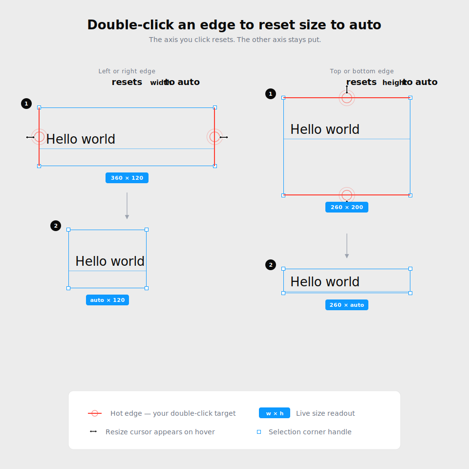
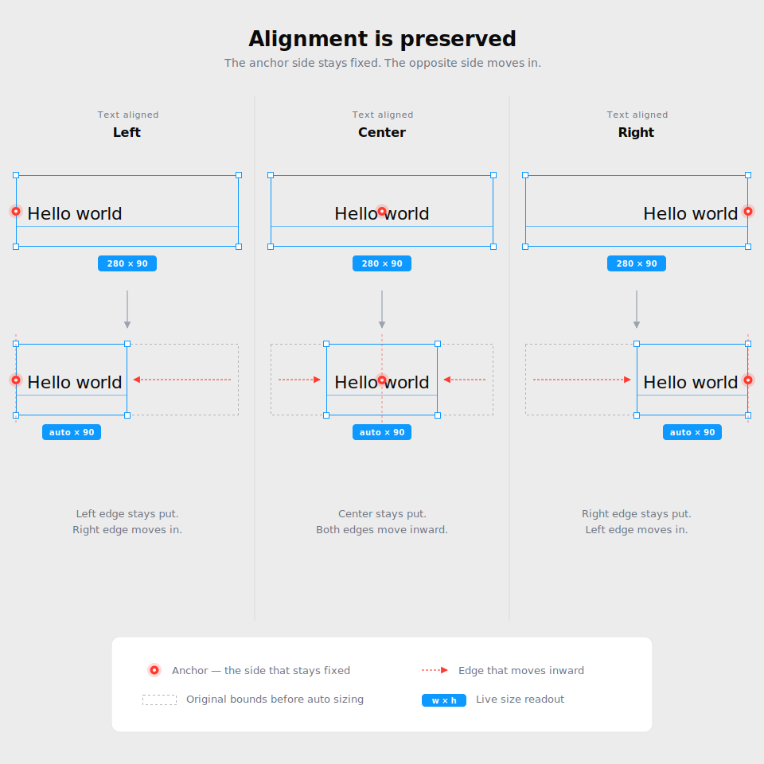

# Text node auto size

Text nodes can be sized **fixed** (a width/height you set explicitly) or
**auto** (the node hugs the rendered text). You can switch any edge back to
auto without opening the inspector — just double-click that edge.

## How to use

- Double-click the **left** or **right** edge to set **width** to `auto`.
- Double-click the **top** or **bottom** edge to set **height** to `auto`.

The double-click only resets the axis you clicked. The other axis keeps
whatever size it had — fixed or auto.

## Alignment is preserved

When the node shrinks to fit, the side that matches the text alignment
stays put. The opposite side moves in.

| Text alignment   | What stays fixed     | What moves    |
| ---------------- | -------------------- | ------------- |
| Left / top       | Left or top edge     | Opposite edge |
| Center / middle  | Center of the axis   | Both edges    |
| Right / bottom   | Right or bottom edge | Opposite edge |

This means the text appears to stay in place while the bounding box
collapses around it, instead of jumping to a new position.

## When to use it

- After typing into a fixed-size text node that ended up with extra
  whitespace around the content.
- After pasting text that was longer than the original node, leaving the
  height padded out.
- Any time you want the node to track the text again without re-typing
  values into the inspector.
