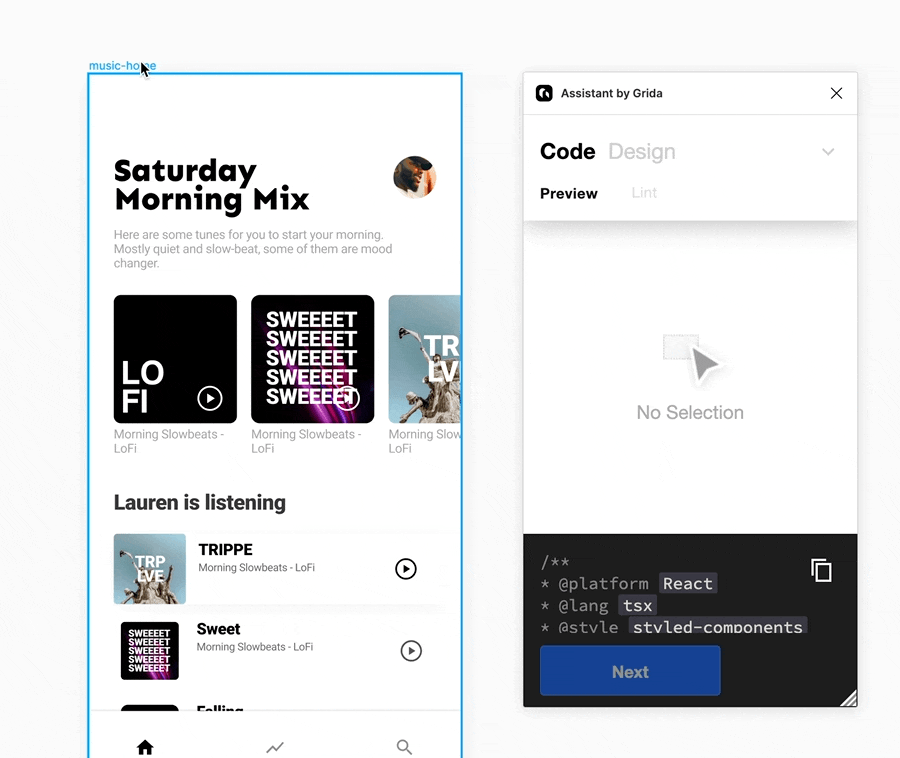

# Clean Design for Clean Code

## Do the Design

In this guide, we assume that you have your own ready-to-go design.
If you want to design from scratch, you can start with the following tutorial:

- [Design Tutorials - Start from scratch](../design/intro)

## Run lints & Fix problems

**What is design lint and why do you need it?**
Design lint is a concept for making all visible and invisible part of the design more consistent.

Witout lint, you might counter following issues:

- Non responsive design; breaking layout when resizing.
- Ambitious Names like `Frame13` or `Rectangle411`
- Unused elements
- Missing TextStyles
- And More

The good part of this is that, with Grida Assistant, you can instantly view the result code.

You can iterate this process until your design is ready for production, once this part is done, you'll have layout-perfect; behind-the-scene-perfect design.

<!-- ## See the changes -->
<!-- TODO: Add naming & layout example - before | after -->
