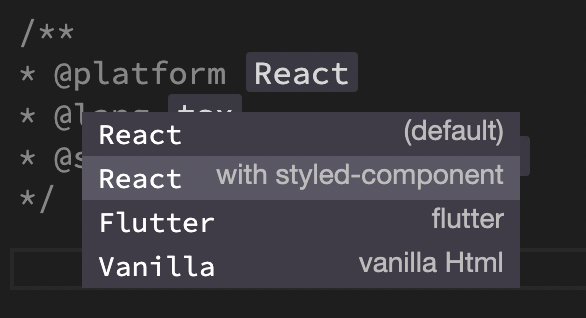

# Configuration

You can configure your design style, naming conventions, custom flags

## Frameworks

You can choose one of the framework supported by Grida and customize the coding styles and conventions.
This can easily be changed at anytime.

- [ReactJS](#react)
- [Flutter](#flutter)
- [Vanilla HTML/CSS](#vanilla)

### React

**Supported**

1.  Styled Components with `styled-components` and `@emotion/styled`

**Under Development**

1.  Material UI (@mui)
1.  Ant Design
1.  Bootstrap
1.  Semantic UI
1.  Tailwindcss

#### React Native

1. StyleSheet

### Flutter

> Flutter is well known for built-in Material Design. And Grida's approach for Flutter is "no additional libraries, do it all with built-in material ui"

You can find the supported Flutter Widget Catalog here.

### Vanilla
