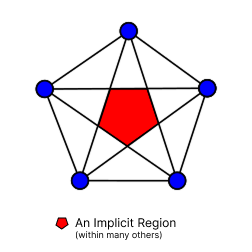

# Vector Network: Core Concepts and Terminology

This document defines the key mathematical and structural concepts used in the `VectorNetwork` model for representing vector graphics.

## Overview

- A **Vector Network** is a graph-based structure for 2D vector shapes.
- It generalizes SVG `<path>` data with explicit support for multiple subpaths, compound shapes, holes, and both linear and Bézier segments.
- The core components are: **vertices**, **segments**, **loops**, **regions**, and **fill rules**.

## Vertices

- **Vertex**: A point in 2D space, defined as `(x, y) ∈ ℝ²`.
- Vertices are indexed by position in the `vertices` list.
- All segments reference vertices by their indices.

## Segments

- **Segment**: An edge connecting two vertices, possibly with Bézier control tangents.
  - Defined by:
    - `a`: start vertex index
    - `b`: end vertex index
    - `ta`: (optional) tangent vector at start vertex (for Bézier control)
    - `tb`: (optional) tangent vector at end vertex (for Bézier control)
- Types:
  - **Linear**: if both tangents are zero or omitted.
  - **Cubic Bézier**: if either tangent is nonzero.
- Segments are directed (from `a` to `b`).

## Loops

- **Loop**: A closed, ordered sequence of segment indices forming a contiguous path (contour) that starts and ends at the same vertex.
- Each loop must be topologically closed (forms a ring).
- Analogous to a "subpath" or a single closed shape in SVG.

## Regions

- **Region**: A filled area defined by one or more loops.
  - The **first loop**: defines the outer boundary ("positive" area).
  - Subsequent loops: define holes ("negative" areas) inside the region.
- A region may represent:
  - A simple shape (single loop, no holes)
  - A compound shape with holes (multiple loops)
  - Disjoint islands (multiple regions)

## Fill Rules

- **Fill Rule**: Determines how overlapping loops and holes combine to define filled areas.
  - **EvenOdd**: A point is inside the region if it crosses an odd number of loops (parity rule).
  - **NonZero**: A point is inside if the sum of winding numbers (directional crossings) ≠ 0.
- Fill rules affect how compound shapes and holes are rendered.

## Planar vs Nonplanar Networks

- **Planar Network**: All segments and vertices lie in a single 2D plane, and no segments cross except at shared vertices.
- **Nonplanar Network**: The graph may have crossing segments (not embeddable in the plane without intersections), which can lead to ambiguous or undefined regions.
- The `VectorNetwork` model is primarily intended for planar networks, but does not enforce planarity.

## Implicit Regions

- If no explicit regions are defined:
  - The network is interpreted as a set of open or closed paths (for stroking or outline rendering).
  - No fill is applied; only the connectivity of segments is used.
- If regions are defined:
  - Only areas described by the regions and their fill rules are considered filled.
