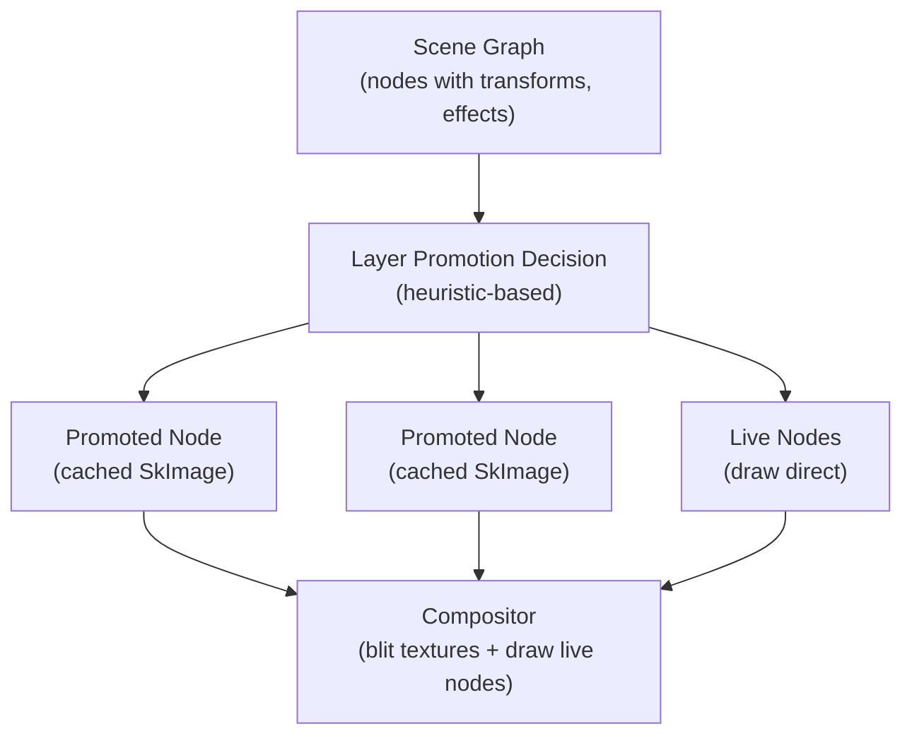

# Rendering Optimization Strategies

A summary of all discussed optimization techniques for achieving high-performance rendering (e.g., 144fps with large design documents).

---

## Transform & Geometry

1. **Transform Cache**

   - Store `local_transform` and derived `world_transform`.
   - Use dirty flags and top-down updates.

2. **Geometry Cache**

   - Cache `local_bounds`, `world_bounds`.
   - Used for culling, layout, and hit-testing.

3. **Flat Scene Graph + Parent Pointers**

   - Flat arena with parent/children relationships.
   - Enables O(1) access and traversal.

---

## Rendering Pipeline

4. **GPU Acceleration (Skia Backend::GL/Vulkan)**

   - Use hardware compositing, filters, transforms.

5. **Scene-Level Picture Caching**

   - Use `SkPicture` to record full-scene vector draw ops.
   - Serves as the always-up-to-date canonical snapshot.
   - Resolution-independent; ideal for rerendering or tile regeneration.

6. **Tile-Based Raster Cache (Hybrid Rendering)**

   - Render the full viewport, take snapshot. debounced (after no more changes. e.g. 150ms)
   - Divide the snapshot into fixed-size tiles (e.g., 512×512).
   - When new area discovered, render the cached, non-overlapping parts with tile cache. only render newly discovered area.
   - Repeat step 1.
   - Optional padding per tile to account for effects (blur, shadows).

7. **Dynamic Mode Switching (Picture vs Tile)**

   - Render from `SkPicture` directly during normal zoom or active edits.
   - Fallback to raster tiles for zoomed-out or complex views.
   - Tile invalidation/redraw is driven by zoom level, camera transform, or frame budget.

8. **Dirty & Re-Cache Strategy**

   - Nodes marked dirty will trigger re-recording of affected picture regions or tiles.
   - Use change tracking to only re-record minimum needed areas.
   - Recording large subtrees is expensive—optimize granularity based on tree structure.

9. **Scene Cache Config / Strategy**

   - Defines how scene caching is organized.
   - Properties include:

     - `depth`:

       - `0` → Entire scene is one cache.
       - `1` → Cache per top-level container.
       - `n` → Cache at depth `n`, chunking deeper layers.

     - `mode`: `AlwaysPicture`, `Hybrid`, `AlwaysTile`

     - `tile_size`, `tile_padding`

     - `zoom_threshold_for_tiles`

     - `frame_budget_threshold_ms`

     - `use_bbh`, `enable_lod`, etc.

   - Cache accessors like `get_picture_cache_by_id()` support scoped re-rendering.

10. **Will-Change Optimization**

    - Nodes marked with "will-change" are expected to become dirty soon.
    - Examples:

      - Image node waiting on async src resolution
      - Text node waiting on font availability

    - Tree holders of such nodes are chunked for localized re-recording.
    - Prevents re-recording full subtrees—minimizes recording cost.

11. **Flattened Render Command List**

    - Scene is compiled into a flat list of `RenderCommand` structs with resolved:

      - Transform
      - Clip bounds
      - Opacity
      - Z-order

    - Enables non-recursive rendering and independent layer recording.
    - Required for tiling at arbitrary depths and for caching subtrees.

    **Example:**

    ```text
    Logical Tree:
    Frame
      └── Group
           ├── Rect1
           ├── Rect2
           └── Rect3

    Flattened:
    [
      RenderCommand { node_id: Rect1, transform: ..., clip: ..., z: ... },
      RenderCommand { node_id: Rect2, transform: ..., clip: ..., z: ... },
      RenderCommand { node_id: Rect3, transform: ..., clip: ..., z: ... },
    ]
    ```

    - Each command can be grouped and recorded separately into its own `SkPicture`.
    - Nesting is preserved logically via sort order, but rendering is flat.
    - This model is essential for dynamic caching, parallel planning, and GPU-aware scheduling.

12. **Dirty-Region Culling**

    - Use camera’s `visible_rect` to cull `world_bounds`.
    - Optional: accelerate with quadtree or BVH.

13. **Minimize Canvas State Changes**

- Reuse transforms and paints.
- Precompute common values like DPI × Zoom × ViewMatrix.

14. **Tight Bounds for `save_layer` Operations**

- Always provide explicit bounds to `save_layer` calls instead of using unbounded layers.
- Unbounded `save_layer` creates full-canvas offscreen buffers, which can be 100× or more larger than necessary.
- Compute tight bounds that include all visual content:
  - Base shape bounds (in local coordinates)
  - Effect expansions (drop shadows: offset + spread + 3× blur radius)
  - Transform to world coordinates before passing to `save_layer`
- **Critical for blend mode isolation**: Blend modes require `save_layer` for isolation semantics. Using tight bounds reduces offscreen buffer size dramatically.
- **Coordinate space consistency**: Ensure bounds are in the correct coordinate space (world space) when `save_layer` is called, accounting for transforms applied before the layer.
- **Future optimization**: Consider pre-computing blend mode isolation bounds in the geometry stage alongside render bounds for unified geometry computation.

15. **Text & Path Caching**

- Cache laid-out paragraphs and SVG paths keyed by node ID.
- Each entry stores a hash of the text/style or path string and the current
  font repository generation.
- Caches are invalidated when fonts or the original data change.
- Hit testing reuses these paths for `path.contains` checks.

16. **Render Pass Flattening**

- Group nodes with same blend/composite states.
- Sort draw calls for fewer GPU flushes.

---

## Layer Compositing Cache (Per-Node Image Cache)

> **This section describes the preferred caching architecture.** It replaces
> _global_ tile-based raster caching (item 6) as the primary cache strategy.
> Global tiles cache arbitrary rectangular regions of composited output that
> cut across node boundaries; layer compositing caches individual _nodes_ as
> rasterized textures and composites them with transforms. This eliminates
> pixel bleeding at tile boundaries, works correctly with effects, and maps
> naturally to animated/interactive nodes.
>
> Note: tiles are not eliminated entirely — they remain useful _within_ a
> promoted layer when the node is very large (see "Tiled Layers" below).

### Why not tiles?

Tile-based caching divides the viewport into a fixed grid (e.g. 512x512) and
snapshots each cell. This is how map renderers work (Google Maps, Mapbox) and
it works well for **static, flat imagery**. It fails for a design tool because:

1. **Pixel bleeding.** Anti-aliased edges, shadows, and blurs extend beyond
   node bounds. When these effects cross a tile boundary, they are clipped at
   the tile edge, producing visible seams.
2. **Effects don't align with grids.** A blur kernel that spans two tiles must
   be rendered in both. Padding helps but never fully solves it — the padding
   size depends on the effect, which varies per node.
3. **Invalidation is spatial, not semantic.** Changing one node's color
   invalidates all tiles it overlaps. A 10px rectangle edit can dirty a
   2048x2048 tile region.
4. **Animation breaks the model.** An animated node invalidates entire tile
   columns every frame, eliminating the caching benefit.

### What browsers do (and what we should do)

Browsers use **layer-based compositing**. Chrome's compositor (`cc`) builds a
layer tree and rasterizes each layer independently; Safari uses Core
Animation with a similar model. (Firefox's WebRender takes a different
approach — it is a display-list renderer closer to a GPU-driven game engine —
but the outcome is similar: intermediate artifacts are cached and composited
without full-scene repaint.)

The key idea shared across all approaches:

- Certain DOM elements are "promoted" to **composited layers** — each gets
  its own offscreen texture (backing store). For large layers, Chrome
  internally subdivides the backing store into tiles (e.g. 256x256), but
  these tiles belong to _that layer_ and share its invalidation scope — they
  are not a global viewport grid.
- When only the layer's transform changes (translate, rotate, scale), the
  compositor just moves the texture on the GPU. **Zero repaint.**
- When a layer's _content_ changes, only that layer's texture is
  re-rasterized. The rest of the scene is untouched.

This maps directly to a design tool canvas:

| Browser concept | Canvas equivalent |
|---|---|
| Composited layer | A node (or subtree) promoted to its own `SkImage` |
| Layer backing store | Rasterized snapshot of that node at current zoom |
| Compositor transform | The node's world transform (or camera view matrix) |
| Repaint | Re-rasterize only the changed node's image |
| Compositing | Blit cached textures with their transforms |

### Architecture



**Per-frame flow:**

1. **Classify frame** — determine `CameraChangeKind` (pan-only, zoom, etc.).
2. **Check promotions** — for each visible node, decide: use cached image or
   draw live.
3. **Composite** — for promoted nodes, blit their cached `SkImage` at the
   node's world transform. For live nodes, draw normally (with `SkPicture`
   replay or direct draw).
4. **On content change** — re-rasterize only the changed node's image.
   Everything else stays cached.

### Effect Cacheability Classification

Not all effects can be rasterized into an isolated offscreen texture. The
critical distinction is whether an effect is **self-contained** (depends only
on the node's own content) or **context-dependent** (reads the backdrop).

**Self-contained** (safe to cache as isolated image):

| Effect | Notes |
|---|---|
| Fills (solid, gradient, image) | Pure paint operations |
| Strokes (all variants) | Computed from path + stroke params |
| Drop shadows | Extends beyond bounds — cached image must include expanded bounds |
| Inner shadows | Clipped to shape; operates on own content only |
| Noise effects | Blends with fills within same surface |
| Layer blur (Gaussian + Progressive) | `save_layer` with image filter — reads own buffer only |
| Opacity | Standard alpha compositing |
| Clip paths | Restricts visible area |
| Geometry & image mask groups | Self-contained, but must cache the entire group as a unit |
| Image color filters | Pure color matrix transforms |

**Context-dependent** (cannot cache in isolation):

| Effect | Why | Mitigation |
|---|---|---|
| Backdrop blur | `SaveLayerRec.backdrop()` reads pixels behind the node | Must draw live, or implement two-pass capture |
| Liquid glass | Runtime shader reads + distorts backdrop | Must draw live |
| Blend modes (Multiply, Screen, etc.) | Final pixels depend on `src × dst` | Cache the _content_ as image; apply blend mode at composite time |
| PassThrough blend mode | No isolation boundary; children interact with backdrop directly | Skip promotion for PassThrough groups, or force isolation to Normal |

**Design rule:** A node with any context-dependent effect is **not promoted**
to a cached image. It draws live every frame. Its _siblings_ and _neighbors_
can still be promoted — the context-dependent node just paints between the
cached textures.

### Promotion Heuristics

Not every node should be promoted. Promotion has costs: memory for the backing
store, and rasterization time when the image is first captured or
invalidated. The goal is to promote nodes where **cache benefit > cache cost**.

**Promote when:**

| Condition | Rationale |
|---|---|
| Node has expensive effects (blur, shadow, noise) | Replay cost is high; single image blit is 100x cheaper |
| Node is stable (content hasn't changed in N frames) | High reuse probability |
| Node is an ancestor of an animated/editing target | Siblings of the active node benefit from caching |
| Node subtree is large (many descendants) | Drawing the entire subtree is expensive; one image blit replaces it |
| User explicitly marks `will-change` | Opt-in signal that this node will animate |

**Do NOT promote when:**

| Condition | Rationale |
|---|---|
| Node has context-dependent effects | Cached image would be wrong |
| Node is actively being edited | Content changes every frame; cache is immediately stale |
| Node is very small (< 64x64 px on screen) | Overhead exceeds benefit |
| Node has PassThrough blend mode | Cannot isolate from backdrop |

### Coordinate Space & Bounds

Cached images should be rasterized in **local coordinates** (origin at node's
top-left, size = node's local bounds including effect expansion).

- The `absolute_render_bounds` from `GeometryCache` already includes effect
  expansion (shadow offset + spread + 3x blur radius). Use this for the
  cached image dimensions.
- At composite time, the image is drawn with the node's **world transform**
  applied externally. This matches the existing `PainterPictureLayer`
  architecture, which separates content from composite properties (transform,
  opacity, blend mode).
- When zoom changes, cached images at the old zoom become wrong-density.
  Either re-rasterize (on stable frames) or blit with scaling (during active
  zoom — same as the two-phase rendering model in item 27).

### Invalidation

| Trigger | Action |
|---|---|
| Node content changes (fill, stroke, text, etc.) | Re-rasterize that node's image |
| Node transform changes | **No re-rasterize** — just update the composite transform |
| Child of promoted subtree changes | Re-rasterize the promoted ancestor's image |
| Zoom level changes beyond density threshold | Re-rasterize all promoted images at new zoom (debounced) |
| Camera pan (no zoom) | **No re-rasterize** — all images are still valid |
| Font loaded / image resolved | Re-rasterize affected nodes |

### Memory Budget

Each promoted node costs `width × height × 4 bytes` (RGBA). For a 1080p
viewport at 2x DPR:

- A full-viewport image: ~16 MB
- 50 promoted nodes at avg 200x200 px: ~8 MB
- Budget cap: configurable, e.g. 64–128 MB. When exceeded, evict least-
  recently-used promoted images (unpromote them to live drawing).

### Interaction with Existing Caches

| Existing cache | Relationship |
|---|---|
| `PictureCache` (SkPicture per node) | Complementary. Pictures record draw commands; layer images rasterize them. A promoted node's SkPicture is used to generate its cached SkImage. |
| `ImageTileCache` | **Repurposed.** Global viewport tiles are replaced by per-node caching. However, tiles remain useful in two cases: (1) _within_ a promoted layer when the node is very large (tiled layers — see below), and (2) for zoomed-out overview where per-node images would be wasteful at tiny sizes. |
| `GeometryCache` | Provides bounds for cached image sizing (render bounds with effect expansion). |
| `ParagraphCache` / `VectorPathCache` | Used during rasterization of the cached image; not affected by promotion. |
| `RTree` spatial index | Used for visibility culling of promoted + live nodes alike. |

### Tiled Layers (Large Node Handling)

A single promoted node usually gets one `SkImage` backing store. But if a
node (or subtree) is very large — e.g. a 10,000x10,000 px artboard — a
single texture would be prohibitively expensive. Chrome solves this the same
way: it tiles _within_ the layer.

The critical difference from global tiling:

- **Global tiles** divide the _viewport_ into a fixed grid that cuts across
  node boundaries. Effects bleed across tiles, invalidation is spatial.
- **Layer tiles** divide a single _node's backing store_ into a grid. All
  tiles share the node's invalidation scope. Effects are fully contained
  within the node's render bounds (which include effect expansion). There is
  no cross-node bleeding because tile boundaries never cross node boundaries.

For Grida, this means:

- Nodes below a size threshold (e.g. < 2048x2048 px at current zoom) get a
  single backing image. This covers the vast majority of design tool nodes.
- Nodes above the threshold get a tiled backing store, using the existing
  `ImageTileCache` infrastructure scoped to that node.
- The compositor treats both cases identically: it blits the node's texture(s)
  at its world transform.

### Integration Point

The insertion point is `Painter::draw_render_commands()`, which already has
the pattern:

```rust
// Current: check SkPicture cache, replay if hit
if let Some(pic) = scene_cache.get_node_picture_variant(id, variant_key) {
    canvas.draw_picture(pic, None, None);
    continue;
}
```

The compositing path adds a layer above this:

```rust
// Proposed: check SkImage cache first (single GPU blit),
// then fall back to SkPicture replay, then live draw.
if let Some(img) = layer_image_cache.get(id, zoom_level) {
    canvas.draw_image(&img, (0, 0), None);  // single texture blit
    continue;
}
if let Some(pic) = scene_cache.get_node_picture_variant(id, variant_key) {
    canvas.draw_picture(pic, None, None);  // command replay
    continue;
}
self.draw_layer(layer);  // live draw
```

The wrapping chain (blend mode → transform → clip → opacity) stays
unchanged — it applies on top of whichever content source is used.

### Pan-Only Synergy

With layer compositing, pan-only frames become **extremely cheap**:

- All cached images remain pixel-perfect (zoom hasn't changed).
- The compositor just blits textures at shifted positions.
- No re-rasterization, no R-tree re-query (if using incremental visible-set).
- Only live (non-promoted) nodes need actual draw calls.
- If most of the scene is promoted, a pan frame is essentially `N` texture
  blits where `N` = number of visible promoted nodes.

This is the architecture that makes 144fps panning achievable on large
documents.

---

## Pan-Only Optimization

In real-world authoring, users pan **far more often** than they zoom. Panning is a pure translation — the camera offset changes, but zoom (scale) stays constant. This constraint unlocks a class of optimizations that are impossible when scale is also changing: geometry stays the same size, cached rasters remain valid, and the visible set changes incrementally rather than completely.

Separating pan-only from zoom-only (and combined pan+zoom) at the camera level is critical. Every frame should know _what kind_ of camera change occurred so that downstream stages can take the cheapest path.

17. **Camera Change Classification**

Detect what changed between frames and propagate this as a flag:

```text
enum CameraChangeKind {
    None,       // no camera change
    PanOnly,    // translation changed, zoom did not
    ZoomOnly,   // zoom changed, translation did not (rare in practice)
    PanAndZoom, // both changed (pinch gesture)
}
```

Derive this by comparing `prev_transform` and `current_transform`:

- If `zoom_prev == zoom_curr` and `translation_prev != translation_curr` → `PanOnly`
- If `zoom_prev != zoom_curr` and `translation_prev == translation_curr` → `ZoomOnly`
- Both changed → `PanAndZoom`
- Neither changed → `None`

This flag should be computed once per frame and threaded through the rendering pipeline so every stage can branch on it.

18. **Tile Reuse Without Re-Raster (Blit-Scroll)**

When panning only, all existing raster tiles remain pixel-perfect — they were captured at the same zoom level. The renderer can:

1. Shift (blit/scroll) the existing framebuffer by the pan delta in screen pixels.
2. Compute the newly exposed strip(s) — at most two L-shaped regions (horizontal + vertical edges).
3. Rasterize **only** the newly exposed regions, querying the R-tree for layers intersecting those strips.
4. Composite the shifted buffer + new strips into the final framebuffer.

This reduces per-frame paint cost from `O(viewport)` to `O(exposed_strip)`, which for typical small pan deltas is 1–5% of the viewport area.

**Implementation notes:**

- Use `surface.draw(cached_surface, dx, dy)` or GPU-level framebuffer scroll if available.
- The exposed region is: `new_visible_rect \ old_visible_rect` (set difference).
- Works with the existing tile cache: shift tile grid coordinates, keep all tiles, only generate new edge tiles.
- Falls back to full repaint if pan delta exceeds viewport dimensions (large jump).

19. **Incremental Visible-Set Update**

Full R-tree queries on every pan frame are wasteful when the viewport shifts by a few pixels. Instead:

- Track the previous frame's visible set (`prev_visible_layers`).
- On pan, compute only the **entering** layers (intersecting newly exposed strips) and **exiting** layers (no longer intersecting the viewport).
- New visible set = `prev_visible_layers - exiting + entering`.

For small pan deltas, entering/exiting sets are tiny, making this significantly cheaper than a full spatial query.

**When to fall back to full query:**

- Pan delta > 50% of viewport dimension
- After zoom (visible set changes unpredictably)
- After scene mutation (R-tree was rebuilt)

20. **Skip Tile Cache Invalidation on Pan**

When zoom has not changed, existing tiles are at the correct density. The tile cache should:

- **Not** clear or invalidate any tiles.
- **Not** trigger re-capture of stable tiles (they are already correct).
- Only capture tiles for newly visible regions that have no cached tile.

This avoids the current behavior where tile caches are touched on every camera change regardless of type.

21. **Skip LOD / Resolution Recalculation on Pan**

Several per-frame computations depend on zoom level but not on pan offset:

- `effective_dpr` (adaptive resolution) — unchanged during pan.
- Image mipmap level selection — unchanged during pan (projected screen size of each image is the same).
- Effect LOD decisions (blur sigma, shadow quality) — unchanged during pan.
- `interactive_scale` — should not degrade during pan; panning is cheap.

Guard these computations with `if zoom_changed { ... }` to avoid redundant work.

22. **Stable Tile Grid During Pan**

When tiles are keyed in world-space coordinates (as they should be per item 31 below), panning only changes _which_ tile keys are visible — it does not invalidate any tile content. The tile grid itself is stable:

- Tile at world-rect `(0, 0, 512, 512)` remains valid regardless of camera translation.
- Pan merely shifts the set of tile keys that intersect the viewport.
- This means tile hit rate during panning approaches 100% after the initial viewport is filled — only edge tiles are ever missing.

**Contrast with zoom:** Zooming changes the world-space size of each tile (since tile size is defined in screen pixels), invalidating the entire grid. This asymmetry is why pan-only detection matters.

23. **Overlay Layer Fast Path**

UI overlays (selection handles, guides, rulers, cursors, snapping hints) must update on every pan frame. Since these are drawn at native resolution in screen space:

- Their world-space positions change with pan, but their screen-space rendering is a simple offset.
- Maintain overlay draw commands in a separate list. On pan-only frames, apply the delta as a uniform translation to all overlay positions rather than recomputing from world coordinates.
- This is especially effective for rulers, where tick positions shift by exactly the pan delta.

24. **Pan Velocity-Based Prefetch**

During sustained panning (e.g., hand-tool drag), predict upcoming visible regions:

- Track pan velocity: `v_pan = (current_offset - prev_offset) / dt`
- Prefetch region: extend the viewport by `v_pan * lookahead_time` in the pan direction.
- Pre-render tiles for the prefetch region at idle priority (e.g., during `requestIdleCallback` or on a background thread).
- Typical lookahead: 100–200ms of predicted motion, clamped to 1–2 tile widths.

This eliminates the "white flash" at viewport edges during fast panning.

25. **GPU Texture Scroll (When Available)**

On GPU backends (GL/Vulkan/Metal), panning can be implemented as a texture coordinate offset rather than re-rendering:

- Render the scene to an offscreen texture slightly larger than the viewport (e.g., viewport + 1 tile ring of padding).
- On pan, shift the texture sampling coordinates. No re-render needed until the padding is consumed.
- When padding is consumed, re-render the oversized texture centered on the new position.
- Effective "free" frames: `padding_pixels / pan_speed_pixels_per_frame`.

This is the same technique used by map renderers (Google Maps, Mapbox) and mobile OS compositors.

---

## Zoom & Interaction Optimization

Scaling-specific optimization tricks for real-world authoring UX (zoom/pinch).

26. **Adaptive Interactive Resolution (LOD While Zooming)**

- Maintain `interactive_scale` s ∈ (0, 1]
- Effective render resolution: `effective_dpr = device_dpr * s`
- Drive `s` by zoom velocity, not zoom level:
  - High `|d(zoom)/dt|` → lower `s` (faster)
  - Near-zero velocity → ramp `s` → 1 (sharpen)

**Practical heuristics:**

- **Hysteresis**: Enter low-res when `v > V_hi`, exit when `v < V_lo`
- **Settle timer**: After last zoom input, wait 80–150ms, then refine
- **Smoothing**: EMA on velocity to avoid flicker:
  - `v_smooth = lerp(v_smooth, v_raw, α)` (α≈0.2–0.4)

**Suggested scale mapping (simple, stable):**

- `s = clamp(1 / (1 + k * v_smooth), s_min, 1)`
- Typical: `s_min=0.25–0.5`, `k` tuned to device

27. **Two-Phase Rendering: "Fast Preview" Then "Refine"**

    **During active zoom:**

- Render coarse:
  - Reuse cached tiles even if they're "wrong density" and just scale them
  - Prefer nearest/linear sampling for speed
  - Skip expensive effects (see below)

**After settle:**

- Render final:
  - Regenerate tiles at full `effective_dpr` for the current zoom
  - Do it progressively (center first)

28. **Progressive Refinement Ordering (Perceptual Priority)**

When restoring full quality, update tiles in this order:

1.  Tiles near focal point (pinch center / cursor)
2.  Tiles in the visible viewport
3.  Tiles in a margin ring (prefetch)

**Implementation detail:**

- Compute `priority = distance(tile_center, focal_point)`
- Process in a min-heap / bucketed rings

29. **Crossfade to Hide "Pop"**

To avoid harsh swaps from blurry→sharp:

- Keep old tile texture around for ~80–120ms
- Blend old → new with a short fade (or swap on vsync boundaries)

This is especially important for text and thin strokes.

30. **Effect LOD: Degrade Expensive Passes Only While Scaling**

While zooming, selectively replace/skip heavy operations:

- Drop `saveLayer` + `ImageFilter` chains (blur, shadows, backdrop) → cheap placeholder
- Reduce blur sigma / shadow blur radius proportionally to `s`
- Replace complex paths with simplified geometry (optional)
- Clamp very thin strokes to a minimum pixel width to prevent shimmer

After settle: restore exact effects.

**Key point**: This is UX-acceptable because users perceive motion first, fidelity second.

31. **Stable Tile Identity: Cache in World-Space, Not Zoom-Space**

Avoid "cache per zoom level" keys. Prefer:

- Tile key based on world coordinates at a reference density
- During zoom:
  - Sample existing tiles (scaled)
  - Only re-render when zoom exceeds your density budget

If GPU supports it, use mipmaps for zoom-out so tiles remain usable.

32. **Snap Bounds to Reduce Thrash**

If zoom changes continuously, tiny float differences can cause re-raster storms.

- Snap tile bounds / layer bounds to integer pixels in device space
- Quantize `effective_dpr` to a small set (e.g. `{0.5, 0.67, 0.75, 1.0}`)

This greatly increases cache hit rate during pinch.

33. **Temporal Throttling: Don't Re-Render on Every Wheel Tick**

During active zoom:

- Rate-limit expensive re-raster to e.g. 30–60 Hz
- Still update transform (scale) every frame for responsiveness
- "Refine" pass runs only after settle

This keeps input feel crisp even on heavy documents.

34. **Text-First Refinement (Optional but Huge for Authoring Tools)**

People notice text blur more than shape blur.

After settle (or even during slow zoom), prioritize:

- Glyph atlas/text tiles
- Selection/caret overlays at full resolution

Even if the scene is still refining, the editor feels "sharp".

35. **Interaction Overlays Rendered at Full-Res**

Always render UI overlays separately at native resolution:

- Selection bounds, handles, guides, cursor, rulers
- Snapping hints, hover highlights

Even if content is temporarily low-res, the tool still feels precise.

---

## Image Optimization

36. **LoD / Mipmapped Image Swapping**

- Use lower-res versions of images at low zoom.
- Prevents high GPU bandwidth use at low visibility.

37. **ImageRepository with Transform-Aware Access**

- Pick image resolution based on projected screen size.
- _TODO_: currently we select mipmap levels solely by the size of the
  drawing rectangle. This is a temporary strategy until a proper cache
  invalidation mechanism based on zoom is introduced.

---

## Text & Glyph Optimization

38. **Glyph Cache (Atlas or Paragraph Caching)**

    - Cache rasterized or vector glyphs used across the document.
    - Prevents redundant layout or rendering of text.
    - Essential for high-DPI or frequently zoomed views.

---

## Engine-Level

39. **Precomputed World Transforms**

- Avoid recalculating transforms per draw call.
- Essential for random-access rendering.

40. **Flat Table Architecture**

- All node data (transforms, bounds, styles) stored in flat maps.
- Enables fast diffing, syncing, and concurrent access.

41. **Callback-Based Traversal with Fn/FnMut**

- Owner controls child behavior via inlined, zero-cost closures.

42. **Scene Planner & Scheduler**

- A dynamic system that builds the flat render list per frame.
- Reacts to scene changes, memory pressure, or frame budget changes.
- Drives the decision to re-record, cache, evict, or downgrade fidelity.

---

## Optional Advanced

43. **Multithreaded Scene Update**

- Parallelize transform/bounds resolution.

44. **CRDT-Ready Data Stores**

- Flat table model enables future collaboration support.

45. **BVH or Quadtree Spatial Index**

- Build dynamic index from `world_bounds` for fast spatial queries.

---

## With Compromises

> Practical, UX-safe tradeoffs that simplify implementation and improve performance, especially under load. These techniques sacrifice exactness for speed — but in ways users won’t notice.

---

- **Quantize Camera Transform**

  Instead of using fully continuous float precision for the camera position and zoom, round them to the nearest N units (e.g., 0.1 for position, 0.01 for zoom):

---

This list is designed to help evolve a renderer from minimal single-threaded mode to scalable, GPU-friendly real-time performance.
