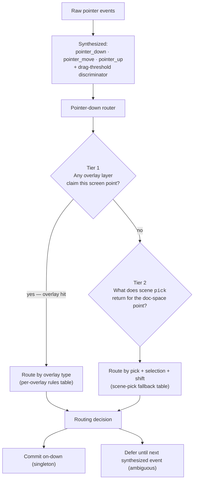

> **See also:** the UX-narrative sibling spec at
> [`selection`](./selection.md). That doc describes what selection should
> _feel_ like, in worked test-case form. This doc describes _how_
> implementations route pointer events to produce that feel — the per-overlay
> rules, the scene-pick fallback, and the scenario catalog used for testing.
> Neither is canonical alone.

## Motivation

A canvas editor's selection logic is a tiny event-routing engine in disguise.
The user sees a single act ("I clicked the rectangle"); underneath sits a
dense decision about whether they meant **select**, **narrow**, **toggle**,
**drag**, **marquee**, **enter edit**, or **move past on the way to a drag**.

Most editors patch this together with timers, heuristics, and
event-suppression flags layered on top of DOM `click`/`mousedown`/`drag`. It
holds until the editor grows enough overlays — chrome above content, handles
above chrome, body regions claiming the same area as a scene pick — at which
point "approximately right" decays into a chain of subtly broken interactions
that each look reasonable in isolation.

The fix is structural. Define the selection surface as a deterministic
**event router over real overlay layers**, with synthesized pointer events
on top of raw input. Each overlay declares what it routes; nothing is
implicit. The scenario catalog at the bottom of this doc is a descriptive
index for tests and review — not a contract the router imposes.

## Mental model



Three load-bearing properties:

1. **Real layers, not virtual rules.** Every overlay (`resize_handle`,
   `rotate_handle`, `endpoint_handle`, `translate_handle`, etc.) is a
   concrete UI layer the host caused the surface to construct. It has a hit
   region, a routing rule, and a cursor. The router never invents an overlay
   from selection state.
2. **Priority by overlay type, not by event order.** The router inspects the
   overlay's type to decide how to route — a `resize_handle` always commits
   a gesture immediately; a `translate_handle` always defers. There is no
   z-index dance; layered overlays at the same screen point are resolved by
   the host's hit-region registration order (the same way DOM stacking
   resolves overlapping listeners — but the rules are explicit, not implicit
   in bubbling).
3. **Synthesized events.** The surface emits its own `pointer_down`,
   `pointer_move`, `pointer_up`, and drag-threshold-crossing — it does not
   consume native `click` or rely on DOM ordering. The drag threshold is
   the sole discriminator between click-intent and drag-intent.

## Goals

- **A precise per-overlay-type routing contract** that the router applies
  uniformly. Adding a new overlay type means defining its routing rule;
  it does not require touching scene-pick fallback or other overlays.
- **A scene-pick fallback (Tier 2)** for the case where no overlay claims
  the point. The fallback is also rule-driven, not heuristic.
- **Deterministic classification.** Given the same `(overlay hit, pick,
selection, modifiers)` tuple, every implementation routes to the same
  decision.
- **The "singleton vs ambiguous" structural rule.** Whenever multiple user
  intents are plausible for an input combination, the router defers until
  the next synthesized event discriminates. Whenever exactly one is
  plausible, the router commits on pointer-down.
- **Hover decoupled from intent.** The hover signal always reflects what
  scene `pick` returned, regardless of which overlay sits above.
- **Implementation-agnostic.** This spec must be enforceable by a TypeScript
  reducer, an offscreen canvas surface, or a native Rust event loop — no
  framework dependencies.

## Non-goals

- Defining DOM event handlers, reducer method names, or function signatures
  of any specific implementation.
- Specifying gesture-level concerns (axis-lock during translate, snapping
  during resize, marquee intersection semantics) beyond what the
  pointer-down router needs.
- Replacing the host's responsibility for hit-testing scene content or
  rendering chrome.
- Defining keyboard-driven selection (arrow navigation, Tab-cycling).

## Why DOM events don't suffice

Three concrete reasons the platform event model cannot express selection
intent cleanly:

1. **`click` fires even after a drag.** The native `click` event is
   "pointerdown then pointerup on the same element," with no regard for
   whether a drag happened in between. To disambiguate click from drag, an
   implementation must swallow `click` after drag-start using a timer or
   distance flag. Every such flag is a latent source of "the click should not
   have fired" bugs.
2. **DOM event order reflects layering, not intent.** When a chrome overlay
   sits above content and the user presses pointer-down, the overlay receives
   the event first; the content beneath never sees it. But the _user's
   intent_ may be to click through the overlay onto the node behind. The DOM
   has already made a routing decision that the spec wants to override.
3. **A composited canvas has no DOM identity.** Once the surface renders to
   a single bitmap (`<canvas>` in a browser, a native window, an offscreen
   buffer), `elementFromPoint` returns the canvas itself — there is no event
   ladder of "chrome → content" to walk. Hit-testing must be owned by the
   surface, not delegated to the platform.

The fix is structural: **overlay hits (Tier 1) and scene pick (Tier 2) are
computed independently, and routing is derived from the combination at
pointer-down**, not inferred from event ordering afterwards.

## Vocabulary

| Term                                            | Meaning                                                                                                                                                                                                                                                   |
| ----------------------------------------------- | --------------------------------------------------------------------------------------------------------------------------------------------------------------------------------------------------------------------------------------------------------- |
| **pick**                                        | Scene content hit-test. A function from a document-space point to "the node the user is pointing at, or none." Host-provided; sees scene content only.                                                                                                    |
| **hit**                                         | Overlay hit-test. A function from a screen-space point to "the overlay layer the user is pointing at, or none." Surface-owned; sees overlays only.                                                                                                        |
| **overlay**                                     | A real UI layer the host instructs the surface to construct (resize knob, rotate region, endpoint knob, translate body, etc.). Has a hit region and a routing rule keyed by overlay type.                                                                 |
| **chrome**                                      | The selection-related overlays drawn around a selected node — typically the selection outline, the resize/rotate handles, and the translate body. "Chrome" is a render concept; the router only sees the underlying overlays.                             |
| **hover**                                       | The currently-pointed-at scene node, as reported by `pick`. Always reflects scene content under the cursor. Independent of overlay hits.                                                                                                                  |
| **selection**                                   | The set of node IDs the editor considers currently selected. Read-only from the router's perspective; mutated only through committed intents.                                                                                                             |
| **translate-body overlay** (a.k.a. body region) | A specific overlay type that occupies a selection's bbox AABB and claims pointer-down as "the user may be about to drag the existing selection." Has no visual fill; content underneath is still pickable. Per the routing contract, always defers.       |
| **scenario**                                    | A name for one combination of `(overlay hit, pick, selection, modifiers)`. Used as a label in tests and dispatch — descriptive, not prescriptive. The contract is the per-overlay routing rules below, not the scenario names.                            |
| **commit (on-down / on-up-no-drag / on-drag)**  | The three moments at which a routing decision can mutate selection or start a gesture. _On-down_ is immediate. _On-up-no-drag_ is the deferred path: pointer-up before drag-threshold. _On-drag_ is the other deferred path: pointer-move past threshold. |
| **drag threshold**                              | The minimum screen-space distance from pointer-down that promotes a pending state into a drag. Small constant; implementation-defined.                                                                                                                    |
| **modifier (shift)**                            | The "extend selection" modifier. This document calls it _shift_ throughout. Other modifiers are out of scope here.                                                                                                                                        |

## The router contract

The contract has two parts: **per-overlay routing rules** (Tier 1) and the
**scene-pick fallback** (Tier 2). Both apply on pointer-down.

### Tier 1 — overlay routing rules

Every overlay type the surface accepts MUST declare one of three routing
behaviors. Adding a new overlay type means writing one new row here.

| Overlay type       | Routing                                                                                                                                                                                                                                  |
| ------------------ | ---------------------------------------------------------------------------------------------------------------------------------------------------------------------------------------------------------------------------------------- |
| `resize_handle`    | **Commit on-down.** Start a resize gesture with the overlay's recorded direction and the selection's bbox. Singleton: there is no other plausible intent.                                                                                |
| `rotate_handle`    | **Commit on-down.** Start a rotate gesture. Singleton.                                                                                                                                                                                   |
| `endpoint_handle`  | **Commit on-down.** Start an endpoint-drag gesture (line p1/p2). Singleton.                                                                                                                                                              |
| `select_node`      | **Hand off to the scene-pick rules (Tier 2)** as if the pointer hit the node the overlay represents. Used for content-affordance overlays that exist purely to expose a select target.                                                   |
| `translate_handle` | **Defer.** Pointer-down records a pending anchor with `ids_at_down = chrome group members`. If the underlying `pick` returns a node, also record a deferred select intent. The drag-threshold-crossing discriminator decides what fires. |

A double-click on any content-class overlay (`select_node`, `translate_handle`)
or on a Tier-2 content pick commits an **enter-content-edit** intent
immediately on the second down — the host decides what "edit" means for that
node type.

### Tier 2 — scene-pick fallback

Reached when no Tier-1 overlay claimed the screen point. Routing depends on
what `pick(point_doc)` returned and the shift modifier:

| `pick`                  | shift | Routing                                                                                                                                                                     |
| ----------------------- | ----- | --------------------------------------------------------------------------------------------------------------------------------------------------------------------------- |
| `id` ∉ selection        | off   | **Commit replace on-down.** Drag (if any) translates the new selection. Singleton.                                                                                          |
| `id` ∉ selection        | on    | **Commit toggle-add on-down.** Drag (if any) translates the combined set. Singleton: with no overlay claiming the drag, every interpretation needs the node selected first. |
| `id` ∈ selection        | any   | **Defer.** On pointer-up without drag, commit a select intent: `replace` if no shift (narrow), `toggle` if shift (toggle off). On drag, translate the existing selection.   |
| `null`, selection empty | any   | No selection mutation. Pending anchor for marquee.                                                                                                                          |
| `null`, selection ≠ ∅   | off   | **Commit `deselect_all` on-down.** Drag (if any) starts a non-additive marquee.                                                                                             |
| `null`, selection ≠ ∅   | on    | No selection mutation. Drag (if any) starts an additive marquee (preserves existing selection).                                                                             |

### The singleton-vs-ambiguous rule

A pointer-down input has either one or several plausible user intents:

- **Singleton** — one intent. Commit on-down. Every reasonable
  interpretation of the input wanted that commit, so there is nothing to
  wait for.
- **Ambiguous** — multiple intents. Defer until the next synthesized event
  discriminates. Pointer-move past the drag threshold means the user
  committed to drag; pointer-up before the threshold means they committed
  to click.

The discriminator is **mechanical**: distance crossed. Implementations MUST
NOT add timing or velocity heuristics on top.

This rule is what prevents the entire class of "the click fired when it
shouldn't have" bugs. If a scenario is ambiguous, no commit happens until
the discriminator resolves; if it is singleton, the commit is safe because
every plausible interpretation wanted it.

### Hover is decoupled from routing

The hover signal — what the surface highlights under the cursor — is
**always** `pick(point_doc)`. Overlay hits do not suppress hover. If a
selection bbox covers the cursor but a different node sits underneath,
hover reflects the node beneath; the cursor and the overlay may still
indicate that pointer-down will claim the existing selection.

Hover answers _"what am I looking at?"_; cursor and overlay state answer
_"what will happen if I press down right now?"_ Collapsing the two — which
is what DOM event targeting does — is the source of most
click-through-overlay bugs.

## Scenario catalog (descriptive)

The combinations above produce a finite set of named scenarios. The names
are useful for tests and for reading the dispatch — but the **scenarios are
labels for combinations, not rules the router enforces**. The actual rules
are the per-overlay routing table and the scene-pick fallback above.

### Tier-1 overlay scenarios

| Scenario         | Trigger                             | Outcome                         |
| ---------------- | ----------------------------------- | ------------------------------- |
| `HandleResize`   | Pointer on a `resize_handle`.       | Start resize gesture on-down.   |
| `HandleRotate`   | Pointer on a `rotate_handle`.       | Start rotate gesture on-down.   |
| `HandleEndpoint` | Pointer on an `endpoint_handle`.    | Start endpoint gesture on-down. |
| `EnterEdit`      | Double-click on content (any tier). | Emit `enter_content_edit`.      |

### Tier-1 translate-body scenarios

These are the labels for what happens after a `translate_handle` overlay
claimed the pointer-down. Every one defers — the body overlay's routing
rule says so.

| Scenario           | `pick` under cursor | shift | On-up-no-drag                  | On-drag                       |
| ------------------ | ------------------- | ----- | ------------------------------ | ----------------------------- |
| `BodyDragOnly`     | `null`              | any   | No selection mutation.         | Translate existing selection. |
| `BodyNarrowOrDrag` | `id` ∈ selection    | off   | Narrow selection to `[id]`.    | Translate existing selection. |
| `BodyToggleOrDrag` | `id` ∈ selection    | on    | Toggle `id` off the selection. | Translate existing selection. |
| `BodySwapOrDrag`   | `id` ∉ selection    | off   | Swap selection to `[id]`.      | Translate existing selection. |
| `BodyAddOrDrag`    | `id` ∉ selection    | on    | Add `id` to the selection.     | Translate existing selection. |

`BodyAddOrDrag` is worth highlighting because shift+would-select normally
commits on-down (`ContentAdd` in Tier 2). Here it defers, because the body
overlay's drag claim remains a live candidate. Treating it as singleton was
the multi-select-on-shift-hover bug.

### Tier-2 scene-pick scenarios

| Scenario                   | `pick` under cursor | shift | Selection-side state | Outcome                                                                 |
| -------------------------- | ------------------- | ----- | -------------------- | ----------------------------------------------------------------------- |
| `ContentReplace`           | `id` ∉ selection    | off   | any                  | Commit `select_replace([id])` on-down; drag → translate.                |
| `ContentAdd`               | `id` ∉ selection    | on    | any                  | Commit `select_toggle([id])` on-down; drag → translate combined set.    |
| `ContentNarrowOrDrag`      | `id` ∈ selection    | off   | any                  | Defer; on-up commit `select_replace([id])`; on-drag translate existing. |
| `ContentToggleOrDrag`      | `id` ∈ selection    | on    | any                  | Defer; on-up commit `select_toggle([id])`; on-drag translate existing.  |
| `EmptyMarquee`             | `null`              | off   | empty                | No mutation; drag → non-additive marquee.                               |
| `EmptyDeselectThenMarquee` | `null`              | off   | non-empty            | Commit `deselect_all` on-down; drag → non-additive marquee.             |
| `EmptyAdditiveMarquee`     | `null`              | on    | any                  | No mutation; drag → additive marquee.                                   |

### Tier-1 sub-selection scenarios

The routing rule for control overlays inside a path-edit's sub-selection
(vertex / tangent / segment) is the **same** asymmetry as Tier-2 content,
applied per sub-selection axis. The implementation shares the
`classifyAgainstAxisSet(in_set, shift)` helper across all three axes;
only the membership probe (which `axis_set` to test against) differs.

For each axis × variant combination, drag-promotion has a uniform rule:

- **∉ Replace / ∉ Add (singleton)** — commit `select_<axis>` on-down. On
  drag, translate the newly-singleton (vertex/tangent) or the implied
  endpoints (segment carries `[a_idx, b_idx]` so the host's expansion
  picks them up before the select intent has echoed through the mirror).
- **∈ NarrowOrDrag / ∈ ToggleOrDrag (ambiguous)** — defer the
  `select_<axis>` intent. On-up commit it (narrow / toggle). On drag,
  **cancel the deferred select** and promote to the unifying delta
  gesture `translate_vector_selection`, which translates the host's
  authoritative sub-selection (vertices + segment endpoints + selected
  tangents whose parent vertex isn't moving). The multi-element
  sub-selection is preserved.

| Scenario                    | `target` membership  | shift | Outcome                                                                                                                                 |
| --------------------------- | -------------------- | ----- | --------------------------------------------------------------------------------------------------------------------------------------- |
| `HandleVertexReplace`       | index ∉ `vertices`   | off   | Commit `select_vertex(replace)` on-down; drag → translate singleton-vertex.                                                             |
| `HandleVertexAdd`           | index ∉ `vertices`   | on    | Commit `select_vertex(toggle)` on-down; drag → translate combined.                                                                      |
| `HandleVertexNarrowOrDrag`  | index ∈ `vertices`   | off   | Defer; on-up commit `select_vertex(replace)`; on-drag translate existing sub-selection.                                                 |
| `HandleVertexToggleOrDrag`  | index ∈ `vertices`   | on    | Defer; on-up commit `select_vertex(toggle)`; on-drag translate existing sub-selection.                                                  |
| `HandleTangentReplace`      | ref ∉ `tangents`     | off   | Commit `select_tangent(replace)` on-down; drag → singleton `set_tangent` (curve gesture).                                               |
| `HandleTangentAdd`          | ref ∉ `tangents`     | on    | Commit `select_tangent(toggle)` on-down; drag → singleton `set_tangent`.                                                                |
| `HandleTangentNarrowOrDrag` | ref ∈ `tangents`     | off   | Defer; on-up commit `select_tangent(replace)`; on-drag: singleton-this → `set_tangent`; multi/mixed → translate existing sub-selection. |
| `HandleTangentToggleOrDrag` | ref ∈ `tangents`     | on    | Defer; on-up commit `select_tangent(toggle)`; on-drag: same as NarrowOrDrag.                                                            |
| `HandleSegmentReplace`      | segment ∉ `segments` | off   | Commit `select_segment(replace)` on-down; drag → translate endpoints (`[a_idx, b_idx]`).                                                |
| `HandleSegmentAdd`          | segment ∉ `segments` | on    | Commit `select_segment(toggle)` on-down; drag → translate combined endpoints.                                                           |
| `HandleSegmentNarrowOrDrag` | segment ∈ `segments` | off   | Defer; on-up commit `select_segment(replace)`; on-drag translate existing sub-selection.                                                |
| `HandleSegmentToggleOrDrag` | segment ∈ `segments` | on    | Defer; on-up commit `select_segment(toggle)`; on-drag translate existing.                                                               |

**Meta + segment drag** is a per-axis dispatch quirk. Meta promotes to
`bend_segment` (re-shape the cubic by pulling its projected pivot)
**only** when the sub-selection is exactly `{ segments: [this one] }`
(singleton-this). Multi or mixed selections (e.g. "point A, B and line
AB") translate; Meta is ignored. Mirrors main editor's
`use-sub-vector-network-editor.ts:141-149` branch.

**Singleton-this tangent + drag** routes to the absolute `set_tangent`
("curve") gesture so mirror modifiers (Alt = break, etc.) remain
applicable. Multi or mixed tangent selection drag routes through the
same unified `translate_vector_selection` as vertex/segment, with the
host applying delta to selected tangents (excluding tangents whose
parent vertex is already moving as a vertex — main editor's `vector.ts:39-42` exclusion). Mirror is pinned to `"none"` in
multi-translate.

**Absolute-gesture click-no-drag invariant.** `start_translate_tangent`
opens an absolute-position gesture on-down (the commit writes
`set_tangent(pos = cursor_doc)`). When the pointer never moves between
down and up, the surface MUST NOT emit the commit — the select intent
at pointer-down already covers the user's "select-only" intent, and an
absolute commit would snap the control point to the cursor's down
position (which lands within the knob's Fitts'-tolerant hit area, not
pixel-perfect on the control point). Delta-based gestures (e.g.
`translate_vertex` with dx=dy=0) are naturally safe and require no
special handling; the invariant applies only to absolute-position
commits (`set_tangent`, `bend_segment`).

### Ghost-handle (eager) scenario

| Scenario           | Trigger                                                 | Outcome                                                                                                                                        |
| ------------------ | ------------------------------------------------------- | ---------------------------------------------------------------------------------------------------------------------------------------------- |
| `HandleGhostSplit` | Pointer on a ghost insertion knob (half-point preview). | Eager: `split_segment` fires on-down; the new vertex is selected; the same press opens a translate-vertex gesture (insert + grab single pass). |

The ghost is unrelated to the "would-deselect → defer" rule — the
ghost vertex doesn't exist pre-split, so membership doesn't apply.

### Suppressed

| Scenario | Trigger                                                                 |
| -------- | ----------------------------------------------------------------------- |
| `Noop`   | Readonly mode + handle hit; non-primary button; other suppressed cases. |

## The discriminator

After a deferred scenario, the next synthesized event resolves the
ambiguity. The pointer's lifecycle is a small state machine:

```mermaid
stateDiagram-v2
  [*] --> Idle
  Idle --> Singleton: pointer_down<br/>(input classifies singleton)
  Singleton --> [*]: commit on-down<br/>back to Idle

  Idle --> Pending: pointer_down<br/>(input classifies ambiguous)
  Pending --> Pending: pointer_move<br/>(distance < DRAG_THRESHOLD)
  Pending --> Gesture: pointer_move<br/>(distance ≥ DRAG_THRESHOLD)<br/>cancel deferred select
  Pending --> Click: pointer_up<br/>commit deferred select (if any)

  Gesture --> [*]: pointer_up<br/>commit gesture
  Click --> [*]
```

Reference pseudocode:

```
on pointer-move at point p:
  dist = |p - pointer_down_screen|
  if dist < DRAG_THRESHOLD:
    remain pending
  else:
    promote to gesture, cancel deferred select

on pointer-up:
  if pending and not yet promoted:
    emit deferred select (if any), clear pending
  if gesture active:
    commit gesture
```

Two invariants:

1. **Promotion to a gesture ALWAYS cancels any deferred select.** A drag
   means the user committed to "drag the existing selection," not to "change
   the selection." This is the single source of cancellation; no other code
   path may mute the deferred select.
2. **The drag threshold is the only discriminator.** Implementations MUST
   NOT layer additional heuristics (e.g. "if pointer-up within 200ms commit
   click anyway") on top.

## Cross-cutting rules

### Shift asymmetry

Shift never changes _when_ a select commits — only the _mode_ (`toggle` vs
`replace`). The asymmetry that does decide when:

- **Would-select** (target ∉ selection): in Tier 2, singleton — commit
  on-down (`ContentReplace`, `ContentAdd`). Inside a translate-body overlay,
  the body's drag claim is still a live candidate, so defer
  (`BodySwapOrDrag`, `BodyAddOrDrag`).
- **Would-deselect** (target ∈ selection): always ambiguous, always defer.
  No-shift case may be about to narrow; shift case may be about to drag with
  shift held as an axis-lock modifier. Either way, committing on-down would
  steal a drag the user was about to start.

This is the only asymmetry worth memorising. Everything else in the
scenario tables follows from it plus the translate-body routing rule.

### Marquee modifier behaviour

- **No shift, empty selection** (`EmptyMarquee`): non-additive marquee.
- **No shift, non-empty selection** (`EmptyDeselectThenMarquee`): commit
  `deselect_all` on-down, then start non-additive marquee on drag. The
  deselect commits on-down (it is singleton) even though no drag has started
  yet, because the alternative — keeping the selection until drag promotion
  — would make an aborted click-on-empty silently preserve the old
  selection, contradicting the "empty-space click clears selection"
  convention.
- **Shift** (`EmptyAdditiveMarquee`): no immediate selection change.
  Marquee on drag is additive — nodes intersected by the marquee rect are
  added to the current selection.

### Meta — region-select from anywhere

Holding **meta** (Cmd / ⌘) turns a drag into a marquee **regardless of what is
under the pointer** — over scene content, and over a selected node's move-body
(`translate_handle`). Routing only: a meta-press classifies as `MetaMarquee`
→ `start_marquee_pend` with **no on-down emit**, so it neither selects nor
moves on down; the drag region-selects.

- **Real handles are still respected.** A meta-press on a resize / rotate /
  endpoint (or any sub-selection) handle returns its handle scenario above.
  Meta overrides **only** the move-body — the one overlay whose job is "drag
  to move the selection."
- **Scoped.** `meta && !in_content_edit && click_count < 2`: dblclick still
  enters edit; content-edit keeps meta's own meaning (segment bend).
- **Routing, not resolution.** Meta decides a drag _is_ a marquee; it does not
  change _what_ the marquee selects.

**When it is useful.** A full-bleed background `<rect>` is a normal pickable,
move-able node, so a plain drag over it selects or moves the background instead
of marquee-selecting the content on top. Meta-drag is the escape hatch: start
a marquee anywhere — even on the background — without selecting or moving it.
It is a power-user affordance (most users will not discover it), not a
substitute for a product-level "background is not a selection target" decision,
which is tracked separately (issue gridaco/grida#838).

### Cursor (independent of intent)

Cursor is set on every pointer-move while no gesture is active. **Driven by
what the next pointer-down would do**, not by what is visually under the
pointer. Same decoupling as hover-from-intent, but in the other direction:
hover tracks `pick`; cursor tracks the same routing logic the pointer-down
classifier would run.

| Condition                                              | Cursor                                       |
| ------------------------------------------------------ | -------------------------------------------- |
| Overlay hit is a resize handle                         | Resize cursor matching the handle direction. |
| Overlay hit is a rotate handle                         | Rotate cursor matching the corner.           |
| Overlay hit is a translate body                        | Move cursor.                                 |
| Overlay hit is `select_node` or `endpoint_handle`      | Pointer cursor.                              |
| No overlay hit; `pick` ∈ selection                     | Move cursor.                                 |
| No overlay hit; `pick` ∉ selection (or `pick` is null) | Default cursor.                              |

While a gesture is active, the cursor reflects the gesture (e.g. move
during translate). Restoration is a gesture-level concern.

### Hover (restated)

Hover is `pick(point_doc)` on every pointer-move, regardless of overlays.
Implementations MUST NOT suppress hover when the pointer is over an
overlay. The user needs continuous visual feedback about which scene node
is under the cursor — even when the overlay will claim the next click.

## Deferred for v1

The following are intentionally out of scope, listed so future revisions
don't relitigate the design:

- **Choice of which descendant `pick` returns inside a selected group.**
  Whether the host returns the deepest descendant, the immediate child, or
  the group itself is host policy. The router handles all three identically
  via the body-overlay scenarios above.
- **Axis-lock during translate.** Holding shift during an active translate
  should lock the drag to the dominant axis. A gesture-level concern, not a
  pointer-down router concern. The router only ensures that pressing shift
  before pointer-down does not steal the drag (which is what the
  translate-body defer rule guarantees).
- **Descendant-edit semantics on double-click.** `EnterEdit` emits one
  intent; the host decides what "edit" means per node type (text editor
  open, vector edit mode, group descend).
- **Right-click and middle-click intents.** Primary button only.
- **Touch, pen, and multi-pointer gestures.** Single primary pointer with a
  screen-pixel drag threshold.

## Conformance

Any implementation that calls itself a Grida selection surface MUST satisfy
the following:

1. **Per-overlay routing rules are honoured.** Every overlay type the
   implementation accepts MUST route per the Tier-1 table.
2. **Scene-pick fallback is honoured.** Every Tier-2 row MUST route per
   the fallback table.
3. **Same input, same routing.** Given identical `(overlay hit, pick,
selection, shift)`, every implementation MUST route the same way.
4. **Same routing, same commit timing.** On-down, on-up-no-drag, and
   on-drag MUST match the tables. Implementations MUST NOT introduce
   intermediate commits.
5. **Drag-threshold-crossing is the only discriminator.** No timing or
   velocity heuristics.
6. **Promotion cancels deferred select.** When a pending state promotes to
   a gesture, any deferred select MUST be cancelled. No other cancellation
   path exists.
   6a. **Absolute-gesture click-no-drag is mute.** Gestures whose commit
   writes an absolute position (`set_tangent`, `bend_segment`) MUST NOT
   emit their commit intent when the pointer never moved between down
   and up. The on-down select intent is the only mutation in that case.
7. **Hover and cursor are computed every move.** Hover reflects `pick`;
   cursor reflects the same routing logic as pointer-down. Neither is
   suppressed by overlays.
8. **Selection normalization.** The host MUST maintain the invariant that
   a parent and any of its descendants are NEVER selected simultaneously.
   The router may assume the input selection already satisfies this.
9. **Selection-related overlays are hit-testable even when the selected
   node is invisible.** If the host marks a selected node as culled or
   otherwise visually hidden, its overlays — including the translate body
   — MUST remain present in the hit-region registry. Selection is
   persistent state independent of visibility.

### Test coverage

Each implementation MUST have at least one test per named scenario:

- `HandleResize`, `HandleRotate`, `HandleEndpoint`, `EnterEdit`
- `ContentReplace`, `ContentAdd`
- `ContentNarrowOrDrag`, `ContentToggleOrDrag`
- `BodyDragOnly`
- `BodyNarrowOrDrag`, `BodyToggleOrDrag`
- `BodySwapOrDrag`, `BodyAddOrDrag`
- `HandleVertexReplace`, `HandleVertexAdd`, `HandleVertexNarrowOrDrag`, `HandleVertexToggleOrDrag`
- `HandleTangentReplace`, `HandleTangentAdd`, `HandleTangentNarrowOrDrag`, `HandleTangentToggleOrDrag`
- `HandleSegmentReplace`, `HandleSegmentAdd`, `HandleSegmentNarrowOrDrag`, `HandleSegmentToggleOrDrag`
- `HandleGhostSplit`
- `EmptyMarquee`, `EmptyDeselectThenMarquee`, `EmptyAdditiveMarquee`
- `Noop`

Each test MUST assert: which scenario the input classifies to, what
commits on-down (if anything), what commits on-up without drag (if
anything), what gesture starts on drag (if any), and that drag-promotion
cancels any deferred select. Tests MUST use the scenario name in their
assertion or `describe`/`it` text so cross-implementation drift can be
detected by grep.

### Auditing an implementation

A short checklist for reviewing a selection-surface change:

1. Did the change add a new overlay type? If so, does it have a routing
   rule in the Tier-1 table? Adding a routing rule requires a spec
   amendment.
2. Did the change move a commit from on-up-no-drag to on-down (or vice
   versa)? That's a commit-timing change; verify it matches the spec.
3. Did the change introduce a new heuristic on the click-vs-drag decision?
   The drag threshold is the only discriminator; reject anything else.
4. Does the change make hover or cursor conditional on overlay state? Both
   are independent of routing; reject any coupling.

## Summary

The surface is a router over real overlay layers with synthesized pointer
events. The contract is the per-overlay routing rules plus the scene-pick
fallback. The scenario catalog is a descriptive index of what those rules
produce for each input combination — useful for tests and code review, but
not itself a contract. Implementations that disagree on the routing of a
given input are wrong about the same input.
