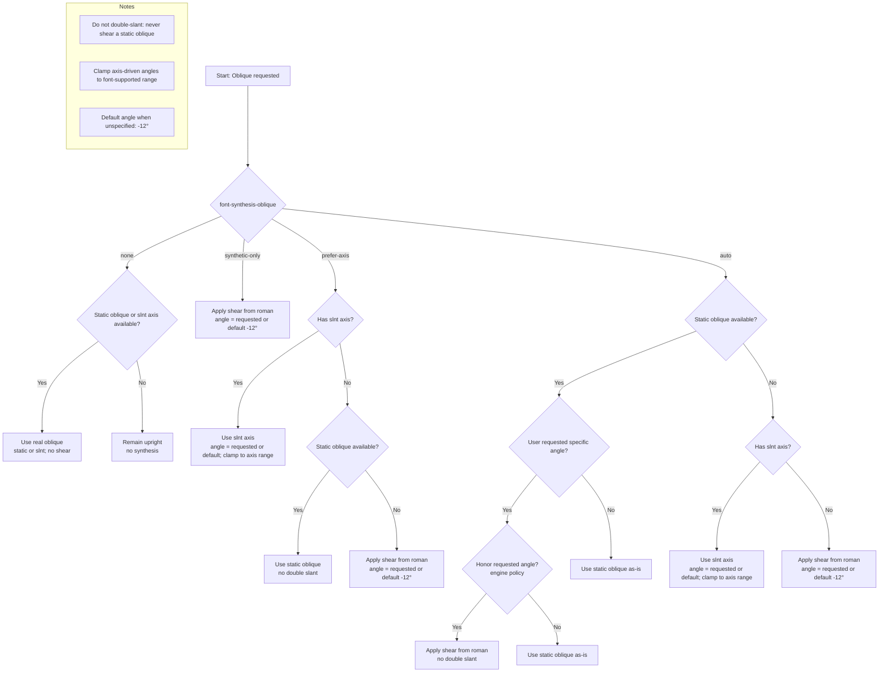
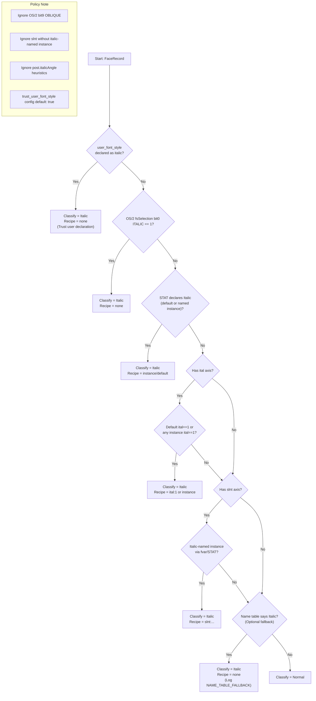
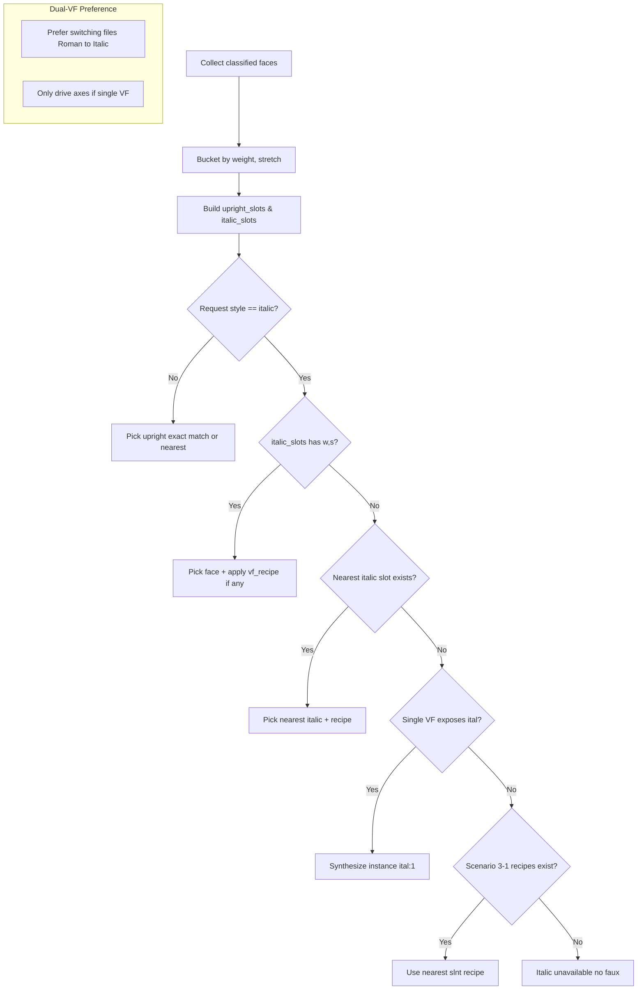

# Paragraph - `italic`

| feature id | status | description                                               | PRs                                               |
| ---------- | ------ | --------------------------------------------------------- | ------------------------------------------------- |
| `italic`   | draft  | implementation details for italic/oblique and faux italic | [#415](https://github.com/gridaco/grida/pull/415) |

## Implementation Challenges

Key challenges in implementing italic styles:

- **Real vs Faux Italic**: Distinguishing between true italics (dedicated glyph sets) and synthetic slanting affects readability and quality
- **Font Fallback**: Ensuring proper italic variants across multilingual and mixed-script contexts
- **Mixed Scripts**: Handling Latin + CJK combinations requires careful fallback strategies for visual consistency
- **Font Variants**: Some fonts provide only oblique variants, complicating style selection decisions

## When Fake Italic Can Be Beneficial

As a professional-grade design tool, Grida's default philosophy is to be explicit for everything and not assume anything. However, there are specific scenarios where fake italic can actually be useful:

### Legitimate Use Cases

- **Emoji Italicization**: Users might want to italicize emoji for design consistency, but since emoji fonts almost never have italic variants, fake italic provides the only way to achieve this visual effect
- **Mixed Script Fallback**: When using mixed scripts (languages) where the fallback font for a specific script doesn't have italic variants, but the user has explicitly chosen a main paragraph font with italic - in this scenario, applying fake italic to the fallback text could maintain visual consistency (though Grida won't implement this approach)
- **Variable Font Limitations**: Some variable fonts may have limited italic axis support, where fake italic could provide additional styling options
- **Legacy Font Support**: When working with older fonts that lack proper italic variants but users need italic styling for design consistency

### Design Tool Considerations

- **User Intent vs. Technical Reality**: Professional designers often need visual consistency even when technical limitations exist
- **Explicit Control**: Fake italic should only be applied when explicitly requested by the user, not as an automatic fallback
- **Visual Feedback**: Users should be clearly informed when fake italic is being applied vs. real italic fonts

## Supported CSS Properties (or equivalent)

| property                  | ready   | implementation        | description                            | notes |
| ------------------------- | ------- | --------------------- | -------------------------------------- | ----- |
| `font-family`             | yes     | fully compatible, 1:1 | used as-is                             |       |
| `font-style`              | planned | depends on config     | only when synthesis explicitly enabled |       |
| `font-synthesis`          | planned | by engine level flag  |                                        |       |
| `font-variation-settings` | yes     | fully compatible, 1:1 | used as-is                             |       |

## Are you Really Italic?

When dealing with italic styles in font families, there are four common scenarios to consider, each with different implications for how italic styles are handled and synthesized:

### Scenarios in Font Families

**See [Italic Fonts](../../reference/italic-fonts.md)** for comprehensive examples with real-world test cases from the Google Fonts registry.

1. **One family, one static (non-variable) font**  
   In this simplest case, the font family consists of a single static font file without any variable axes. This includes both non-italic fonts (like Allerta) and rare italic-only fonts (like Molle). If the font does not include an italic variant, fake italic might be considered if explicitly requested.

2. **One family, many static fonts (some may be italic)**  
   Here, the font family includes multiple static font files, some of which are designated as italic or oblique variants (like PT Serif with Regular, Bold, Italic, and BoldItalic). The system can select the appropriate font file based on the requested style, reducing the need for synthetic italicization.

3. **One family, one variable font (theoretical ital axis or slnt axis)**  
   This scenario involves a single variable font file that could theoretically support axes such as 'ital' (italic) or 'slnt' (slant) for smooth interpolation between upright and italic styles. However, no examples of this scenario were found in the 2025 Google Fonts registry.

   - 3-1. **One family, one variable font with italic instances (exceptional case)**  
      This is an exceptional scenario where a single variable font supports the `slnt` axis and has explicit italic instances defined in `fvar.instances` (like Recursive and Roboto Flex). These fonts are not flagged as "italic" by OS/2 flags, but they support `slnt` axis with explicit italic instances. Detection relies on PostScript names in `fvar.instances` rather than reliable table sources, making this a unique case that requires special handling in font parsing logic.

4. **One family, two variable fonts (Roman VF + Italic VF)**  
   Some font families provide two separate variable fonts: one for the Roman (upright) style and another for the Italic style (like Inter and Noto Sans). This setup allows switching between these variable fonts depending on the style requested, combining the benefits of variable fonts with distinct design differences between Roman and Italic.

### OS/2 Flag Combinations (Designer Intent Ambiguity)

The OS/2 `fsSelection` field provides separate bits for ITALIC (bit 0) and OBLIQUE (bit 9), creating potential ambiguity in interpretation depending on designer intent and font vendor practices:

| ITALIC | OBLIQUE | Common Interpretation               | Notes                                                           |
| ------ | ------- | ----------------------------------- | --------------------------------------------------------------- |
| 0      | 0       | Upright roman                       | Standard upright font                                           |
| 1      | 0       | True italic face                    | Dedicated italic design with custom letterforms                 |
| 0      | 1       | Oblique face                        | Mechanical slant of roman design                                |
| 1      | 1       | Italic (treating oblique as italic) | Many fonts set both flags, treating oblique as a kind of italic |

### Grida Policy on OS/2 Flags

Historically, many fonts used the OBLIQUE bit to indicate a mechanically slanted style rather than a true italic. However, this flag does not encode an actual slant angle, nor does it guarantee a distinct design — often it is mathematically equivalent to applying a shear transform to the roman.

For this reason, our system will **only use the ITALIC bit (bit 0)** as a signal for true italic capability. The OBLIQUE bit (bit 9) is not considered part of the default UX or style resolution pipeline. In future or advanced configurations, OBLIQUE may be surfaced as an optional toggle for power users, but it is not part of our intended default workflow.

This design choice follows our discussion: oblique faces are genuine style files, but usually just pre-slanted romans. Since oblique is already well-represented in variable fonts via the `slnt` axis, we treat OBLIQUE as legacy metadata rather than a primary signal.

---

These scenarios form the foundation for how italic styles are parsed and applied within the system, guiding decisions on when to use real italic fonts, variable font axes, or synthetic italicization. The examples above serve as test cases for development and validation.

## Oblique (Fake Italic)

This section proposes how Grida will support **fake italic** (synthetic oblique), but only when explicitly requested.

### Concept

Fake italic is always oblique-based: it is a shear transform applied to the upright roman face. There are three possible sources for oblique style:

1. **Static oblique face** — A separate file flagged OBLIQUE in OS/2, representing a mechanically slanted variant.
2. **Variable font `slnt` axis** — A registered axis that parameterizes slant angle in degrees.
3. **Synthetic oblique** — A runtime shear transform when no real oblique face or axis exists.

### Resolution Pipeline

When _oblique_ is requested:

1. **Static oblique face**: If available, use it directly.
2. **`slnt` axis**: If present, use the requested angle if given, or a default value (e.g. −12°). Clamp to the font’s supported range.
3. **Synthetic oblique**: Apply a shear transform to the roman face.

**Angle behavior**:

- If a user requests a specific angle and `slnt` exists → honor that value.
- If only a static oblique exists → do not double-slant; either accept the static oblique as-is or fall back to synthetic from roman to honor the angle.
- If synthetic is used → apply the requested angle; otherwise default to −12°.

### Policy Control

Introduce an explicit control knob for synthesis behavior:

- `font-synthesis-oblique: auto | none | synthetic-only | prefer-axis`

Definitions:

- **auto (default)**: static oblique → `slnt` → synthetic.
- **none**: only static oblique or `slnt` accepted; otherwise remain upright.
- **synthetic-only**: always use shear, ignoring static oblique or `slnt`.
- **prefer-axis**: if `slnt` exists, prefer it over static oblique.

### Notes

- Never apply a shear on top of a static oblique (no double slant).
- This design mirrors CSS behavior (`font-style: italic` → oblique fallback, `font-synthesis: style`) but makes oblique synthesis explicit.
- In UI, italic requests may still be labeled “Italic,” but internally they may be satisfied by oblique, `slnt`, or synthetic depending on availability.

### Flow Diagram



---

## Parsing Pipeline (Family → Italic Capability Map)

**Goal.** Given a **set of distinct font files** that belong to the same typographic family, compute a **deterministic italic capability map** that (a) identifies _real italic_ availability and (b) provides selection recipes for variable fonts.  
**Policy note.** _Oblique_ (including OS/2 `fsSelection` bit 9 and pure `slnt` availability without explicit italic mapping) is **not used** as a decision signal for italic. We only acknowledge **true italic**.

### Inputs: Normalized Face Record

For each face (file) discovered in a family, extract and normalize:

- `face_id`: stable identifier for the file
- `ps_name`: PostScript name (NameID 6)
- `family_name`: legacy family (NameID 1)
- `typographic_family`: preferred family (NameID 16), if present
- `subfamily_name`: legacy style (NameID 2)
- `typographic_subfamily`: preferred style (NameID 17), if present
- `is_variable`: boolean
- `axes`: present variable axes with ranges:
  - `ital` (registered axis, boolean 0/1 or stepped)
  - `slnt` (registered axis, degrees; negative slants are common)
  - `wght`, `wdth`, `opsz`, …
- `os2.fsSelection`: capture **bit 0 (ITALIC)**; ignore other bits for decision
- `head.macStyle`: italic bit (legacy; sanity-check only)
- `post.italicAngle`: numeric (hint only; not a decision source)
- `STAT`: Axis/AxisValue descriptors and style name mappings
- `fvar.instances`: list of named instances (axis → value map + style names)
- `user_font_style`: optional explicit user declaration (equivalent to CSS `@font-face { font-style: italic }`)

### Truth Signals & Priority (per face)

**We classify a face as `Italic` only through the following ordered signals (first match wins):**

0. **User font style declaration** → `Italic` (if `user_font_style` is provided and indicates italic)  
   Rationale: explicit user declaration takes highest priority. Equivalent to CSS `@font-face { font-style: italic }`.  
   Use cases: custom uploaded fonts with user configuration, trustworthy providers (e.g., Google Fonts API providing files by variant).

1. **OS/2 ITALIC bit (bit 0) = 1** → `Italic`  
   Rationale: primary cross‑platform indicator used by engines.

2. **STAT-mapped Italic** → `Italic`  
   If a STAT `AxisValue`/style mapping explicitly names the style “Italic” (or localized equivalent) for the face’s default location (or for a named instance shipped within the same file), treat it as italic. This covers VFs where vendors rely on STAT for style naming.

3. **Variable‑font Italic via `ital` axis** → `Italic` (with recipe)

   - If the face exposes `ital` and either:
     - default location has `ital=1`, **or**
     - a named instance sets `ital=1`,
       then register an italic capability with an axis recipe (e.g., `{ital:1}`).

4. **Scenario 3‑1: VF with `slnt` axis & _italic instances_ (no OS/2 italic)** → `Italic` (with recipe)

   - If there is **no** OS/2 italic bit, **no** `ital` axis, **but** the face has `slnt` **and** at least one `fvar`/STAT‑named instance whose style name clearly denotes _Italic_ (e.g., “Italic”, “Bold Italic”),  
     then register that instance as italic and **record its `slnt` value** as the recipe (e.g., `{slnt:-10}`).
   - This explicitly whitelists families like **Recursive** and **Roboto Flex** where italic is provided through named `slnt` instances rather than flags.

5. _(Optional minimal fallback)_ **Name table only** → `Italic`
   - If none of the above match but the `subfamily_name` / `typographic_subfamily` clearly equals “Italic”/“Bold Italic”, accept as italic.
   - Use sparingly; log a warning for QA. This is a last‑resort compatibility shim for rare mis‑flagged fonts.

**Not signals (ignored for decision):**

- OS/2 **OBLIQUE** bit (bit 9)
- Presence of `slnt` **without** an italic‑named instance/STAT mapping
- Non‑zero `post.italicAngle` by itself
- Heuristics based on glyph slant measurements

### Classification Output (per face)

Each face yields:

- `italic_kind ∈ {Normal, Italic}` _(no Oblique in decision model)_
- `vf_recipe`: optional axis recipe used to realize italic for this face (e.g., `{ital:1}` or `{slnt:-10}`)
- `instance_info`: optional instance metadata when italic is derived from `fvar.instances`:
  - `instance_name`: PostScript name of the italic instance (e.g., "Recursive-Italic")
  - `instance_ps_name`: full PostScript name for the instance
  - `instance_style_name`: human-readable style name from the instance
- `weight_key` & `stretch_key`: derived from `usWeightClass` / `usWidthClass` (or STAT/OS/2 mappings)
- `is_variable`

**Recipe Purpose:** The `vf_recipe` and `instance_info` serve dual purposes:

1. **Runtime italic handling** — provides axis values and instance details for font rendering
2. **Editor queries** — enables the editor to answer:
   - "Can this family be italic?" (via `italic_kind`)
   - "What values should be applied for italic?" (via `vf_recipe`)
   - "Which instance/file should be used?" (via `instance_info` and `face_id`)

### Family Aggregation

Group faces by `(weight_key, stretch_key)` into slots:

- `upright_slots`: map `(w, s) → FaceOrVF`
- `italic_slots`: map `(w, s) → FaceOrVFWithRecipe` where `FaceOrVFWithRecipe` includes:
  - `face_id`: identifier for the font file
  - `vf_recipe`: axis values for variable fonts (e.g., `{ital:1}`, `{slnt:-10}`)
  - `instance_info`: instance metadata when applicable (PostScript name, style name)

Detect scenario for diagnostics and selection policy:

1. **Single static** — one static file only.
2. **Multi static** — multiple static files; at least one italic.
3. **Single VF** — one VF providing upright and italic (via `ital` or italic instances).
   - **3‑1. Single VF with italic instances** — italic only via named `slnt` instances.
4. **Dual VF** — two VFs: Roman VF (upright) and Italic VF (OS/2 italic or STAT‑italic).

> Note: We still record _oblique capability_ (e.g., `slnt` axis) as **metadata** for UI/advanced features, but it does not affect italic decision or default selection.

### Selection Rules

When resolving a request `(weight, stretch, style)` where `style ∈ {normal, italic}`:

- **Italic requested**

  1. If `italic_slots[(w,s)]` exists → select it (apply `vf_recipe` if present).
  2. Else, nearest‑neighbor in `italic_slots` by weight/stretch.
  3. Else, if **Single VF** exposes `ital` axis → synthesize instance `{ital:1}` for closest `(w,s)`.
  4. Else, if **Scenario 3‑1** recipes exist → use the closest italic instance recipe `{slnt:…}`.
  5. Else → italic **unavailable** (pipeline does not synthesize faux italic).

- **Normal requested**
  - Use `upright_slots[(w,s)]` or nearest upright.

**Dual‑VF preference:** When both Roman VF and Italic VF exist, prefer switching **files** (Roman ↔ Italic) over driving axes.

### Pseudocode

```rust
fn analyze_family(faces: &[FaceRecord]) -> ItalicCapabilityMap {
    let mut upright = BTreeMap::new();
    let mut italic = BTreeMap::new();

    for face in faces {
        let (kind, recipe) = classify_face(face); // uses ordered signals above
        let key = (face.weight_key(), face.stretch_key());
        match kind {
            ItalicKind::Italic => { italic.insert(key, (face.clone(), recipe)); }
            ItalicKind::Normal => { upright.insert(key, face.clone()); }
        }
    }

    let scenario = detect_scenario(&upright, &italic, faces);
    ItalicCapabilityMap::new(upright, italic, scenario)
}

/// Ordered signals; returns (ItalicKind, Option<Recipe>)
fn classify_face(f: &FaceRecord) -> (ItalicKind, Option<Recipe>) {
    // 1) OS/2 italic
    if f.os2_fsselection.italic() { return (ItalicKind::Italic, None); }

    // 2) STAT-mapped italic at default or via named instance
    if f.stat_declares_italic_default() { return (ItalicKind::Italic, None); }
    if let Some(inst) = f.stat_or_fvar_instance_named_italic() {
        return (ItalicKind::Italic, inst.axis_recipe());
    }

    // 3) ital axis
    if f.has_ital_axis_default_one() { return (ItalicKind::Italic, Some(Recipe::ital_one())); }
    if let Some(inst) = f.instance_with_ital_one() {
        return (ItalicKind::Italic, Some(inst.axis_recipe()));
    }

    // 4) Scenario 3-1: slnt + italic-named instances (no OS/2 italic / no ital axis)
    if f.has_slnt_axis() {
        if let Some(inst) = f.instance_named_italic_via_slnt_only() {
            return (ItalicKind::Italic, Some(inst.axis_recipe())); // e.g., {slnt:-10}
        }
    }

    // 5) (Optional) name table fallback
    if f.subfamily_is_clearly_italic() {
        return (ItalicKind::Italic, None);
    }

    (ItalicKind::Normal, None)
}

fn select_face(cap: &ItalicCapabilityMap, w: u16, s: u16, style: Style) -> FaceSelection {
    match style {
        Style::Italic => {
            if let Some((face, recipe)) = cap.italic.get(&(w,s)) {
                return FaceSelection::from(face, recipe.clone());
            }
            if let Some((face, recipe)) = cap.nearest_italic(w, s) {
                return FaceSelection::from(face, recipe);
            }
            if let Some((face, recipe)) = cap.vf_synthesize_italic(w, s) {
                return FaceSelection::from(face, recipe);
            }
            FaceSelection::Unavailable
        }
        Style::Normal => {
            cap.upright.get(&(w,s))
                .cloned()
                .map(FaceSelection::from_face)
                .unwrap_or_else(|| FaceSelection::from_face(cap.nearest_upright(w, s)))
        }
    }
}
```

### Validation & Diagnostics

- **Conflict logging:** if OS/2 italic = 0 but STAT or instances say _Italic_, log `warn(MISFLAGGED_ITALIC)`.
- **3‑1 detection:** assert `!has_ital_axis` and `has_slnt_axis` when classifying italic via `slnt` instance.
- **Name‑fallback usage:** log `warn(NAME_TABLE_FALLBACK)`.
- **CJK fallback:** Most CJK fonts ship upright only; do not attempt italics.
- **Determinism:** Classification is stable across filesystems; ordering solely by `(weight_key, stretch_key)` and explicit recipes.

This pipeline yields a compact, deterministic **Italic Capability Map** suitable for both editor UI and runtime selection while respecting the project policy to **ignore oblique** for italic decisions.

## Parser Configuration

**User Font Style Trust:**  
The parser supports a `trust_user_font_style` configuration option (default: `true`) that controls whether to trust explicit user declarations of font style. When enabled, `user_font_style` declarations take highest priority and bypass all other detection logic. This is useful for:

- **Custom uploaded fonts** where users explicitly configure style information
- **Trustworthy providers** like Google Fonts API that provide files by variant with reliable metadata
- **Controlled environments** where user input is validated and trusted

When `trust_user_font_style` is `false`, the parser ignores user declarations and relies solely on font table analysis.

## Name-based Parsing Policy

**Parser vs. Frontend Policy:**  
Name-based parsing is **disabled in the core parser** for decision logic, but remains **enabled in the UX/frontend layer** to provide user-facing style hints. This separation reflects the fact that name-based detection is not 100% reliable and has clear limitations (e.g., it only works consistently in English). The parser enforces strict, table-driven rules, while the frontend may surface name-based cues as optional hints for designers.

### Flow Diagrams

#### Per-Face Classification Flow



#### Family Aggregation & Selection Flow



## See also

- [Italic (and Oblique Model Design)](../../reference/italic.md)
