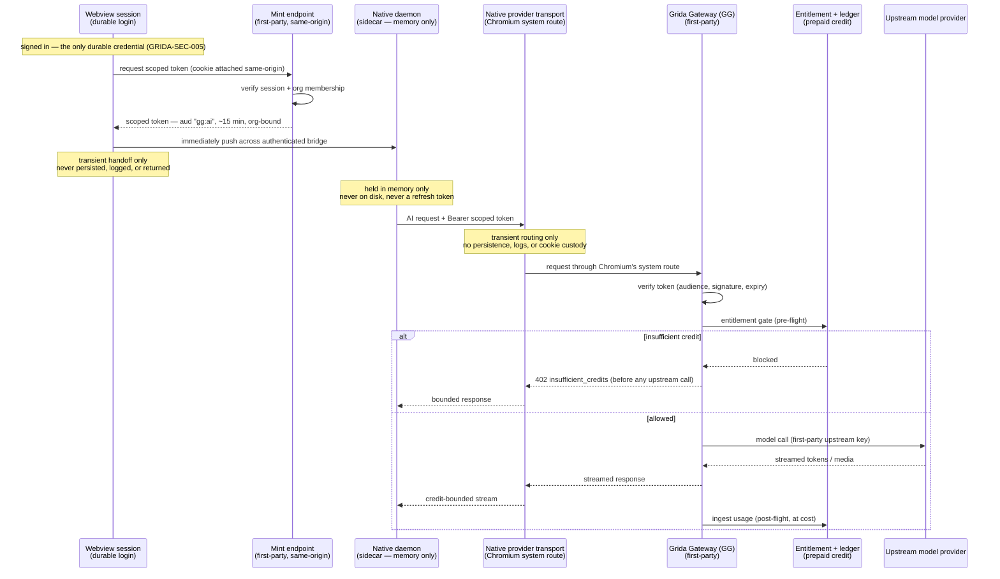

| feature id | status                 | description                                                                                               |
| ---------- | ---------------------- | --------------------------------------------------------------------------------------------------------- |
| `gg`       | implemented (text/i/v) | No-BYOK AI for the desktop app: scoped-token federation → first-party metered gateway → org-credit spend. |

# Grida Gateway (GG)

**Grida Gateway** — **GG** — is the path by which a signed-in user runs AI
— chat, image, and video — **without supplying their own model key** (no
"bring your own key"), billed to their organization's prepaid credit. This
doc is the canonical spec for _how an untrusted native client is allowed to
spend credits_ and _why the design is shaped the way it is_. It sits on top
of, and defers all money mechanics to,
[Billing / AI Credits](./billing/ai-credits.md).

**Name and lineage.** "Grida Gateway (GG)" is the branded name for this
one service, chosen so the term carries this exact context. It is designed
to **spin out** of the editor into a standalone gateway at a future host
`grida.gg`; that portability is a design constraint, not an aspiration (see
[Scope boundary](#scope-boundary-capacity-not-remote-execution) and the
dependency direction below). Throughout: **GG** / **Grida Gateway** names
the _service_; "hosted AI" is the generic capability it delivers.

> **Boundary & surface.** The scoped-token trust boundary is
> **`GRIDA-SEC-006`** in
> [SECURITY.md](https://github.com/gridaco/grida/blob/main/SECURITY.md);
> the code surface is marked `GRIDA-GG` and governed by the `gg` engineering
> skill. This doc explains the domain; SECURITY.md is the enforced
> invariant.

## The problem

Three forces have to be satisfied at once, and they pull against each
other:

1. **An untrusted client must be able to spend money.** The desktop app is
   a native process on a machine we don't control. It must be able to
   invoke paid models, yet it can never hold a credential that is worth
   more than the narrow thing it is allowed to do.
2. **Metering must be trustworthy.** Usage billed to a customer has to be
   counted by a party the customer trusts — us, on the server — not
   reported after the fact by the client or reconciled from a third party's
   ledger days later.
3. **BYOK must keep working, unchanged.** Users who bring their own key
   must still pay $0 to us and route around all of this. Hosted AI is an
   _additional_ path, never a replacement.

The durable login (the browser/webview session) is a full first-class
account credential. Handing _that_ to the native process would collapse
"can use AI" into "is the whole account." So the durable credential must
stay where it already lives, and the native process must receive something
strictly weaker.

## The design space (mental models)

Four industry-named paradigms can deliver no-BYOK AI. Naming them makes the
choice legible:

| Model | Industry name                                     | Who calls the model provider                                   | Where metering happens                        |
| ----- | ------------------------------------------------- | -------------------------------------------------------------- | --------------------------------------------- |
| **A** | **Token Vending Machine** (STS-style federation)  | The client, directly, with a minted _upstream_ credential      | After the fact, from provider usage exports   |
| **B** | **First-party AI Gateway** (LLM proxy / BFF)      | Our server, on the client's behalf                             | Inline, synchronous, server-side              |
| **C** | **Managed gateway with provisioned virtual keys** | A third-party gateway (per-customer virtual key with a budget) | The vendor's ledger, reconciled into ours     |
| **D** | **BYOK / client-direct**                          | The client, with the user's own key                            | Not metered by us (the carve-out we preserve) |

**A (Token Vending Machine)** — the pattern AWS STS coined: the server
mints a temporary _upstream_ credential and the client talks to the model
provider directly. The server is only in the control plane. Simple and
cheap, but a leaked minted key is spendable upstream until revoked, and
metering degrades to asynchronous reconciliation.

**B (First-party AI Gateway)** — every AI call flows through our own
endpoint; we terminate auth, gate entitlement, stream the response through,
and meter inline. This is what the shipping peers (Zed, Cursor, Copilot,
Cody Gateway) converged on. We become a streaming hop and own a wire
contract forever, but metering and credential blast-radius are both under
our control.

**C (Managed virtual keys)** — outsource B to a third party
(provisioning-API sub-keys, per-customer virtual keys with budgets). Least
infra, but double margin, hard catalog lock-in, and someone else's numbers
in our ledger.

### What we chose, and why

**B for the data plane, with a thin slice of A for auth only.**

The deciding fact is that the billing rail — entitlement gate and metered
usage ingest against a prepaid credit ledger — **already lives on the
server**, inside the AI seam that every first-party AI call passes through.
Only model B lets that rail run **synchronously and authoritatively**:
entitlement is checked _before_ the upstream stream opens (a hard,
pre-flight "insufficient credit," never a surprise post-paid bill), usage
is ingested from tokens _we_ counted, and the upstream provider key never
leaves the server. A and C both push metering into asynchronous
reconciliation and give up the pre-flight gate; C additionally adds margin
and catalog lock-in.

The "slice of A" is narrow and deliberate: the credential the native
client holds is **not** an upstream key — it is a purpose-scoped token that
is only good against _our own gateway_. So it is really the standard
**OAuth2 resource-server / short-lived access token** pattern, not a true
Token Vending Machine.

The trade we accepted, stated plainly: we bought the **worst operational
axis** (we are now in the hot path — if the gateway is down, hosted AI is
down; we pay streaming egress and live under serverless duration ceilings)
to buy the **best trust axes** (authoritative metering, minimal credential
blast radius, upstream keys never exposed). For a product that bills per
use, that is the correct trade, and it is the one every shipping peer made.

## Architecture

The flow reads top to bottom: the webview uses its durable, same-origin
session to mint a weak token, immediately hands that token to the native
process across the authenticated bridge, and retains no copy. The native
process holds it in memory only; every AI call crosses the bounded native
provider transport and Chromium's effective system route to the first-party
gateway. Electron main can observe the scoped bearer transiently in that
request, but does not persist, log, return, or place it in a cookie jar. The
gateway proves the token, gates the org's credit _before_
opening upstream, streams the model back, and meters what was actually used.
The durable session cookie never leaves the webview. **BYOK bypasses this
entire diagram** — a user-supplied key resolves to a client-direct provider
that never touches the gateway or the ledger.

## The contract

### 1. The scoped token (federation)

The credential handed to the native process is a **purpose-scoped,
short-lived, organization-bound token**:

- **Purpose-scoped** — an audience claim (`gg:ai`) binds it to Grida
  Gateway and nothing else. It is structurally useless at every other
  endpoint; the account's real session endpoints never even accept it.
- **Short-lived** — on the order of fifteen minutes. **Expiry is the unit
  of revocation**: abandoning a leaked token requires no server-side state.
- **Organization-bound** — it carries the org whose credit will be spent,
  resolved from a verified membership at mint time. The gateway never
  trusts a client-supplied organization id.
- **Minted only from the durable session, same-origin** — the sole place a
  token is created requires a live login and verified org membership. No
  other input can produce one.
- **Custody: memory only** — the renderer handles the token only long enough
  to push it across the authenticated bridge; it never persists, logs, or
  returns it. The native daemon then holds the token in memory and nowhere
  else: never on disk, never persisted, never a refresh token. Electron main
  observes it only while routing an in-flight provider request and has no
  durable credential custody. The webview session remains the _only_ durable
  credential; the renderer re-mints and re-pushes proactively before expiry and
  again on an expiry error.

This is the "thin slice of A": a minted credential, but scoped to our own
resource server, so its blast radius is "≤15 minutes of AI on one org's
credit" and nothing more.

### 2. The gateway (a first-party metered surface)

A first-party endpoint family authenticated by the scoped token **and
nothing else** — it never accepts a durable session token, a cookie, or an
API key. It presents two contract styles:

- **Text: an OpenAI-compatible surface** — chat completions (streaming and
  non-streaming, with tool-call passthrough and a usage report) plus a
  model list. OpenAI's chat-completions shape is the de-facto industry ABI;
  adopting it verbatim means any conformant client speaks it with no custom
  code, and it is a contract we can honor for years. It is pinned by
  contract tests so it cannot silently drift.
- **Image and video: Grida-native generation surfaces** — request/response
  shapes owned by our own protocol, returning inline results.

### 3. Metering (deferred to the billing rail)

Every hosted call runs the existing server-side AI seam, so the gateway
carries **no billing logic of its own**:

- **Pre-flight gate** — the org's entitlement is read before the upstream
  call opens. No credit ⇒ a hard, pre-stream refusal. There is never a
  post-paid surprise.
- **Post-flight ingest** — usage is metered from what the server counted,
  **sold at cost** (zero markup; see [AI Credits](./billing/ai-credits.md)),
  and written to the ledger idempotently.
- **Granularity** — one hosted request per model step, so per-request
  gating _is_ step-level gating for the agent.

### 4. Provider precedence

When more than one way to reach a model is available, resolution is:

1. **An explicit user choice always wins** — if the user selected a
   specific provider, honor it.
2. Otherwise **BYOK**, if a user key is present (the $0-to-us path).
3. Otherwise **hosted (Grida)**, if signed in with a live token.
4. Otherwise the remaining fallbacks.

Hosted AI is thus _just another provider_ in an existing precedence order —
adding it distorted neither BYOK nor the resolution model, and removing or
reordering it is trivial.

## Security boundary

The trust boundary is registered as **`GRIDA-SEC-006` — Hosted-AI
scoped-token boundary**. Its one-sentence invariant:

> The credential a native process holds for AI must be worth **at most
> fifteen minutes of AI calls billed to an org the user was a member of —
> and nothing more.**

It composes with the neighboring boundaries: the durable webview login is
`GRIDA-SEC-005`; the native daemon's trust perimeter is `GRIDA-SEC-004`;
the server-side org-id trust resolution that the mint reuses is
`GRIDA-SEC-003`. The doctrine amendment those records carry is: _the
sidecar may hold the short-lived scoped AI token (memory-only), and nothing
more durable._ The enforced details — signing, audience pinning,
fail-closed secret handling, rotation, rate limiting — live in
[SECURITY.md](https://github.com/gridaco/grida/blob/main/SECURITY.md).

## Scope boundary: capacity, not remote execution

Hosted AI provides **model capacity only**. The agent loop — prompt
composition, tool authority, session recording, workspace and filesystem
access, abort propagation — **stays local** to the native host. File
contents reach a hosted model only as ordinary model-call content produced
by the local loop.

Remote-running the agent itself (a true "cloud agent runtime," or a hosted
agent behind a CLI) is a **separate, still-deferred concern** and must not
be conflated with hosted model provision. Hosted AI moves the _model call_
off-device; it does not move the _agent_ off-device.

## Current state (honest)

**Implemented (local, end-to-end verified):** text, image, and video all
run keyless for a signed-in desktop user; the scoped token mints from the
session, crosses renderer memory only for the transient authenticated-bridge
handoff, is then retained only in the daemon's memory, and is re-minted on
expiry; each GG call uses the bounded native provider transport and Chromium
system route without giving Electron main durable token custody; the gateway
gates and meters through the live billing rail; BYOK
continues to bypass everything; precedence resolves explicit → BYOK → hosted
→ fallbacks.

**Deferred / accepted limitations** — the parts deliberately left for
later, and the honest risks:

- **Synchronous video is the weakest long-term contract.** Video
  generation is served request/response under a serverless duration
  ceiling. Long-form generation will likely force an asynchronous
  job-and-poll contract (v2) — and unlike a hosting change, that is a
  _wire_ change every client must mirror. The v1 model allowlist is scoped
  accordingly.
- **Text-to-image and text-to-video only.** Image-to-image / image-to-video
  need a hosted reference-upload story (blob custody, SSRF-safe intake)
  that v1 does not provide.
- **Mid-stream spend is not interrupted.** Gating is per-request; once a
  stream is open it runs to completion even if the balance crosses zero.
  Bounded by per-step request granularity; standard industry behavior.
- **Org-membership revocation lags by up to a token lifetime** (~15 min) —
  an accepted consequence of stateless, expiry-based revocation.
- **Plan-included credit grants are not wired** (billing Phase 5) — today
  only explicit top-ups create balance, so the revenue path for bundled
  AI is a prerequisite tracked in [AI Credits](./billing/ai-credits.md), not
  here.
- **Default-model UX** — a signed-in keyless user still defaults to a
  BYOK-oriented default model; steering the default to a hosted tier when a
  hosted session is active is a separate product decision.
- **Packaged egress smoke** — the native sandbox must be proven to reach
  the hosted host from a _packaged_ build; the dev loop cannot prove the
  packaged allowlist.
- **Hosted-deploy prerequisite** — the gateway fails closed without its
  dedicated signing secret configured in the hosted environment.

## Related

- [Billing / AI Credits](./billing/ai-credits.md) — the ledger, gate
  primitive, at-cost pricing, and top-up flows this spends against.
- [Metronome integration](./billing/metronome.md) — the metering substrate.
- [SECURITY.md](https://github.com/gridaco/grida/blob/main/SECURITY.md) —
  `GRIDA-SEC-003`/`004`/`005`/`006`, the enforced boundaries.
- [Deferred Grida Cloud Agent Provider](./_history/hosted-ai-deferred-provider-2026-06.md)
  — the superseded pre-build design, kept for lineage.
