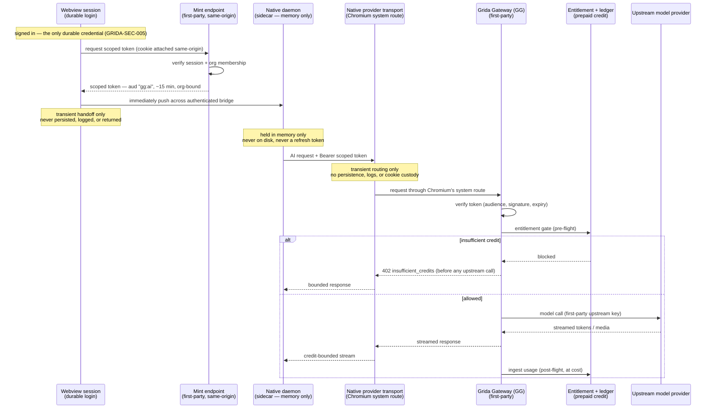

| feature id | status                 | description                                                                                               |
| ---------- | ---------------------- | --------------------------------------------------------------------------------------------------------- |
| `gg`       | implemented (text/i/v) | No-BYOK AI for the desktop app: scoped-token federation → first-party metered gateway → org-credit spend. |

# Grida Gateway (GG)

**Grida Gateway** — **GG** — is the path by which a signed-in user runs AI
— chat, image, and video — **without supplying their own model key** (no
"bring your own key"), billed to their organization's prepaid credit. This
doc is the canonical spec for _how an untrusted native client is allowed to
spend credits_ and _why the design is shaped the way it is_. It sits on top
of, and defers all money mechanics to,
[Billing / AI Credits](./billing/ai-credits.md).

**Name and lineage.** "Grida Gateway (GG)" is the branded name for this
one service, chosen so the term carries this exact context. It is designed
to **spin out** of the editor into a standalone gateway at a future host
`grida.gg`; that portability is a design constraint, not an aspiration (see
[Scope boundary](#scope-boundary-capacity-not-remote-execution) and the
dependency direction below). Throughout: **GG** / **Grida Gateway** names
the _service_; "hosted AI" is the generic capability it delivers.

> **Boundary & surface.** The scoped-token trust boundary is
> **`GRIDA-SEC-006`** in
> [SECURITY.md](https://github.com/gridaco/grida/blob/main/SECURITY.md);
> the code surface is marked `GRIDA-GG` and governed by the `gg` engineering
> skill. This doc explains the domain; SECURITY.md is the enforced
> invariant.

## The problem

Three forces have to be satisfied at once, and they pull against each
other:

1. **An untrusted client must be able to spend money.** The desktop app is
   a native process on a machine we don't control. It must be able to
   invoke paid models, yet it can never hold a credential that is worth
   more than the narrow thing it is allowed to do.
2. **Metering must be trustworthy.** Usage billed to a customer has to be
   counted by a party the customer trusts — us, on the server — not
   reported after the fact by the client or reconciled from a third party's
   ledger days later.
3. **BYOK must keep working, unchanged.** Users who bring their own key
   must still pay $0 to us and route around all of this. Hosted AI is an
   _additional_ path, never a replacement.

The durable login (the browser/webview session) is a full first-class
account credential. Handing _that_ to the native process would collapse
"can use AI" into "is the whole account." So the durable credential must
stay where it already lives, and the native process must receive something
strictly weaker.

## The design space (mental models)

Four industry-named paradigms can deliver no-BYOK AI. Naming them makes the
choice legible:

| Model | Industry name                                     | Who calls the model provider                                   | Where metering happens                        |
| ----- | ------------------------------------------------- | -------------------------------------------------------------- | --------------------------------------------- |
| **A** | **Token Vending Machine** (STS-style federation)  | The client, directly, with a minted _upstream_ credential      | After the fact, from provider usage exports   |
| **B** | **First-party AI Gateway** (LLM proxy / BFF)      | Our server, on the client's behalf                             | Inline, synchronous, server-side              |
| **C** | **Managed gateway with provisioned virtual keys** | A third-party gateway (per-customer virtual key with a budget) | The vendor's ledger, reconciled into ours     |
| **D** | **BYOK / client-direct**                          | The client, with the user's own key                            | Not metered by us (the carve-out we preserve) |

**A (Token Vending Machine)** — the pattern AWS STS coined: the server
mints a temporary _upstream_ credential and the client talks to the model
provider directly. The server is only in the control plane. Simple and
cheap, but a leaked minted key is spendable upstream until revoked, and
metering degrades to asynchronous reconciliation.

**B (First-party AI Gateway)** — every AI call flows through our own
endpoint; we terminate auth, gate entitlement, stream the response through,
and meter inline. This is what the shipping peers (Zed, Cursor, Copilot,
Cody Gateway) converged on. We become a streaming hop and own a wire
contract forever, but metering and credential blast-radius are both under
our control.

**C (Managed virtual keys)** — outsource B to a third party
(provisioning-API sub-keys, per-customer virtual keys with budgets). Least
infra, but double margin, hard catalog lock-in, and someone else's numbers
in our ledger.

### What we chose, and why

**B for the data plane, with a thin slice of A for auth only.**

The deciding fact is that the billing rail — entitlement gate and metered
usage ingest against a prepaid credit ledger — **already lives on the
server**, inside the AI seam that every first-party AI call passes through.
Only model B lets that rail run **synchronously and authoritatively**:
entitlement is checked _before_ the upstream stream opens (a hard,
pre-flight "insufficient credit," never a surprise post-paid bill), usage
is ingested from tokens _we_ counted, and the upstream provider key never
leaves the server. A and C both push metering into asynchronous
reconciliation and give up the pre-flight gate; C additionally adds margin
and catalog lock-in.

The "slice of A" is narrow and deliberate: the credential the native
client holds is **not** an upstream key — it is a purpose-scoped token that
is only good against _our own gateway_. So it is really the standard
**OAuth2 resource-server / short-lived access token** pattern, not a true
Token Vending Machine.

The trade we accepted, stated plainly: we bought the **worst operational
axis** (we are now in the hot path — if the gateway is down, hosted AI is
down; we pay streaming egress and live under serverless duration ceilings)
to buy the **best trust axes** (authoritative metering, minimal credential
blast radius, upstream keys never exposed). For a product that bills per
use, that is the correct trade, and it is the one every shipping peer made.

## Architecture

```mermaid
sequenceDiagram
    participant W as Webview session<br/>(durable login)
    participant M as Mint endpoint<br/>(first-party, same-origin)
    participant D as Native daemon<br/>(sidecar — memory only)
    participant H as Native provider transport<br/>(Chromium system route)
    participant G as Grida Gateway (GG)<br/>(first-party)
    participant B as Entitlement + ledger<br/>(prepaid credit)
    participant P as Upstream model provider

    Note over W: signed in — the only durable credential (GRIDA-SEC-005)
    W->>M: request scoped token (cookie attached same-origin)
    M->>M: verify session + org membership
    M-->>W: scoped token — aud "gg:ai", ~15 min, org-bound
    W->>D: immediately push across authenticated bridge
    Note over W: transient handoff only<br/>never persisted, logged, or returned
    Note over D: held in memory only<br/>never on disk, never a refresh token
    D->>H: AI request + Bearer scoped token
    Note over H: transient routing only<br/>no persistence, logs, or cookie custody
    H->>G: request through Chromium's system route
    G->>G: verify token (audience, signature, expiry)
    G->>B: entitlement gate (pre-flight)
    alt insufficient credit
        B-->>G: blocked
        G-->>H: 402 insufficient_credits (before any upstream call)
        H-->>D: bounded response
    else allowed
        G->>P: model call (first-party upstream key)
        P-->>G: streamed tokens / media
        G-->>H: streamed response
        H-->>D: credit-bounded stream
        G->>B: ingest usage (post-flight, at cost)
    end
```

The flow reads top to bottom: the webview uses its durable, same-origin
session to mint a weak token, immediately hands that token to the native
process across the authenticated bridge, and retains no copy. The native
process holds it in memory only; every AI call crosses the bounded native
provider transport and Chromium's effective system route to the first-party
gateway. Electron main can observe the scoped bearer transiently in that
request, but does not persist, log, return, or place it in a cookie jar. The
gateway proves the token, gates the org's credit _before_
opening upstream, streams the model back, and meters what was actually used.
The durable session cookie never leaves the webview. **BYOK bypasses this
entire diagram** — a user-supplied key resolves to a client-direct provider
that never touches the gateway or the ledger.

## The contract

### 1. The scoped token (federation)

The credential handed to the native process is a **purpose-scoped,
short-lived, organization-bound token**:

- **Purpose-scoped** — an audience claim (`gg:ai`) binds it to Grida
  Gateway and nothing else. It is structurally useless at every other
  endpoint; the account's real session endpoints never even accept it.
- **Short-lived** — on the order of fifteen minutes. **Expiry is the unit
  of revocation**: abandoning a leaked token requires no server-side state.
- **Organization-bound** — it carries the org whose credit will be spent,
  resolved from a verified membership at mint time. The gateway never
  trusts a client-supplied organization id.
- **Minted only from the durable session, same-origin** — the sole place a
  token is created requires a live login and verified org membership. No
  other input can produce one.
- **Custody: memory only** — the renderer handles the token only long enough
  to push it across the authenticated bridge; it never persists, logs, or
  returns it. The native daemon then holds the token in memory and nowhere
  else: never on disk, never persisted, never a refresh token. Electron main
  observes it only while routing an in-flight provider request and has no
  durable credential custody. The webview session remains the _only_ durable
  credential; the renderer re-mints and re-pushes proactively before expiry and
  again on an expiry error.

This is the "thin slice of A": a minted credential, but scoped to our own
resource server, so its blast radius is "≤15 minutes of AI on one org's
credit" and nothing more.

### 2. The gateway (a first-party metered surface)

A first-party endpoint family authenticated by the scoped token **and
nothing else** — it never accepts a durable session token, a cookie, or an
API key. It presents two contract styles:

- **Text: an OpenAI-compatible surface** — chat completions (streaming and
  non-streaming, with tool-call passthrough and a usage report) plus a
  model list. OpenAI's chat-completions shape is the de-facto industry ABI;
  adopting it verbatim means any conformant client speaks it with no custom
  code, and it is a contract we can honor for years. It is pinned by
  contract tests so it cannot silently drift.
- **Image and video: Grida-native generation surfaces** — request/response
  shapes owned by our own protocol, returning inline results.

### 3. Metering against prepaid organization credit

Every GG call is metered against the organization's prepaid AI credit. It runs
the existing server-side AI seam, so the gateway carries **no billing logic of
its own**:

- **Pre-flight gate** — the org's entitlement is read before the upstream
  call opens. No credit ⇒ a hard, pre-stream refusal. There is never a
  post-paid surprise.
- **Post-flight ingest** — usage is metered from what the server counted,
  **sold at cost** (zero markup; see [AI Credits](./billing/ai-credits.md)),
  and written to the ledger idempotently.
- **Granularity** — one hosted request per model step, so per-request
  gating _is_ step-level gating for the agent.

### 4. Catalogue distribution (credential-free)

The model catalogue is compiled into every client that consumes it, so a
shipped desktop binary can only ever see the catalogue it was built with.
Adding a model or retargeting a tier used to require a release — while the
renderer, served fresh from grida.co, would already be offering the new
model. The result was a client whose own picker offered a model its own
agent host rejected as unknown.

The catalogue is therefore **published, not shipped**: authored in-repo
(it is a curated product decision, not a scrape) and served at
`GET /api/v1/models/catalog`.

- **The published snapshot IS the deployed gate.** That endpoint's body
  and the server's own model allowlist are the same static import in the
  same deploy artifact, so they cannot disagree. This is why the published
  catalogue outranks a client's bundled one even when the binary is newer:
  converging on it is converging on the table that will actually be
  enforced.
- **The bundle is the seed, and the floor.** A host answers from its
  bundled catalogue immediately and forever if the network never comes
  back. A bad snapshot can make a host mis-list; it can never leave one
  with no catalogue at all.
- **Whole-or-reject, and wholesale.** A snapshot that fails validation is
  discarded entirely — a half-applied catalogue must not exist. A valid one
  REPLACES the catalogue rather than merging: removing a model is the kill
  switch, and a merge would defeat it on every installed client.
- **Credential-free, and outside the token-gated glob.** A desktop
  sidecar fetches this at boot, long before a renderer can push a
  signed-in session token, so the route must accept no credential — while
  `GRIDA-SEC-006` binds every `api/v1/ai` route to `verifyGgToken`
  exclusively. Accepting no credential is stronger than accepting the
  wrong one, but only while this route stays outside that family.
- **Pricing is included, deliberately.** The "no pricing" rule on
  `/api/v1/ai/models` guards the OpenAI-compatible surface against
  client-side cost math drifting from the billing rail. This payload is
  the source that FEEDS a host's local estimate and its compaction limits;
  withholding rates is what would cause drift. The same numbers are
  already public on the models page and in the pricing docs.

**Convergence.** A host refreshes at boot, on an interval, and once when a
lookup misses. The miss refresh is the load-bearing one: it is awaited
in-request, so the FIRST use of a newly published model succeeds instead of
failing until some later tick. It is deliberately modality-agnostic — an
image card the renderer just offered is exactly as publishable-since-boot
as a text model, and both are reached through a picker served fresh from
grida.co. A tier retarget produces no miss (the old target is still
valid), so it converges on the interval instead.

**Membership is asked exactly; identity is asked loosely.** A view answers
two different questions and a call site must not confuse them. `has` is
exact catalogue membership — the question a GATE asks, because whatever
passes a gate is forwarded to a provider verbatim and only an exact
catalogue id is one the provider recognizes. `modelSpecById` also matches
a bare name and a date suffix — right when asking for a model's LIMITS or
RATES, where a near-miss id is still that model. Using the loose one to
gate silently widens what the host admits and converts a clean
"unknown model" rejection into a provider-level failure mid-run.

**Schema.** Additive changes do not bump the schema major — clients ignore
fields they do not know, so a new optional field is safe to publish. A
breaking change publishes at a NEW path and bumps the major, leaving old
clients on the old path or falling back to their seed. One rule follows
from that: a model requiring new CLIENT CODE (a new provider kind) must
never be published into an existing schema, because old clients will
accept its data and then fail to drive it. Ordinary models are pure data
and need no accompanying release.

**Sections are independently fallible.** `text`, `image`, and `video` are
validated separately: an unusable media section is dropped on its own and
the consumer falls back to its bundled catalogue for that modality only.
Only `text` is load-bearing enough to reject the whole payload, because a
host with no text catalogue cannot run a turn at all. A broken image
catalogue must never cost a host its ability to answer.

**Not every modality is published yet.** `text`, `image`, and `video` are.
Music, sound effects, and 3D are still gated against the host's BUNDLED
catalogue (`v.oneOf(models.audio.music.model_ids)` and its siblings in
`packages/grida-ai-agent/src/http/routes/`), so adding a model in those
families still needs a desktop release. That is a known gap, not a
decision that they belong on a different mechanism: each one wants a
section, a validator, and a route reading through the view, exactly as
image and video got. Worth doing when one of those catalogues starts
moving; the schema is additive, so publishing a new section does not
disturb clients that ignore it.

**Closed vocabularies are validated as text on the wire.** Model vendor,
speed label, and the like are closed unions in TypeScript but are accepted
as plain strings when parsed, and an unknown _provider_ binding is dropped
rather than rejecting its card. Otherwise publishing a model from a new
vendor, or adding a provider, would be a breaking publish requiring a
client release — the exact failure this system exists to remove. (Vercel's
AI Gateway learned this in public: it validated its model-kind field as a
hard enum, so the day a new kind shipped the entire listing failed to
parse for every client. It now accepts loosely and filters unknown rows.)

### 5. Relationship to provider selection

GG is one native capacity source; it does not own the global provider order.
The golden selection rules live in the
[ChatGPT subscription provider specification](../ai/agent/chatgpt-subscription-provider.md#provider-selection):

- an explicit provider or explicitly changed model is an intentional switch;
- otherwise a persisted provider remains sticky while the model is omitted or
  unchanged;
- a fresh, unconfigured session uses a ready ChatGPT subscription connection
  first;
- otherwise the existing text fallback remains BYOK, then GG, then configured
  endpoint/local capacity;
- a provider failure never silently changes provider in the middle of a turn.

This preserves GG as the managed no-key route without overriding an existing
user's chosen BYOK, endpoint, local, or GG route.

## Security boundary

The trust boundary is registered as **`GRIDA-SEC-006` — Hosted-AI
scoped-token boundary**. Its one-sentence invariant:

> The credential a native process holds for AI must be worth **at most
> fifteen minutes of AI calls billed to an org the user was a member of —
> and nothing more.**

It composes with the neighboring boundaries: the durable webview login is
`GRIDA-SEC-005`; the native daemon's trust perimeter is `GRIDA-SEC-004`;
the server-side org-id trust resolution that the mint reuses is
`GRIDA-SEC-003`. The doctrine amendment those records carry is: _the
sidecar may hold the short-lived scoped AI token (memory-only), and nothing
more durable._ The enforced details — signing, audience pinning,
fail-closed secret handling, rotation, rate limiting — live in
[SECURITY.md](https://github.com/gridaco/grida/blob/main/SECURITY.md).

## Scope boundary: capacity, not remote execution

Hosted AI provides **model capacity only**. The agent loop — prompt
composition, tool authority, session recording, workspace and filesystem
access, abort propagation — **stays local** to the native host. File
contents reach a hosted model only as ordinary model-call content produced
by the local loop.

Remote-running the agent itself (a true "cloud agent runtime," or a hosted
agent behind a CLI) is a **separate, still-deferred concern** and must not
be conflated with hosted model provision. Hosted AI moves the _model call_
off-device; it does not move the _agent_ off-device.

## Current state (honest)

**Implemented (local, end-to-end verified):** text, image, and video all
run keyless for a signed-in desktop user; the scoped token mints from the
session, crosses renderer memory only for the transient authenticated-bridge
handoff, is then retained only in the daemon's memory, and is re-minted on
expiry; each GG call uses the bounded native provider transport and Chromium
system route without giving Electron main durable token custody; the gateway
gates and meters through the live billing rail; BYOK
continues to bypass everything. The model catalogue is published at
`/api/v1/models/catalog` and agent hosts resolve through it — seeded from
their bundled copy, refreshed at boot, on an interval, and once on a run-gate
miss — so a model added or a tier retargeted on the server reaches an
already-installed binary without a release. Text, image, and video are all
published and consumed; `audio`, `image_tools`, and `embedding` deliberately
are not (no agent-host reader, and the embedding card is a compile-time
consistency pin against a database column, not distributable data). The experimental ChatGPT subscription
provider now participates in the native resolver and provider-qualified
session persistence described above. That local implementation does not make
it a stable OpenAI-supported integration: its legal/support contract remains
an external release gate.

**Deferred / accepted limitations** — the parts deliberately left for
later, and the honest risks:

- **Synchronous video is the weakest long-term contract.** Video
  generation is served request/response under a serverless duration
  ceiling. Long-form generation will likely force an asynchronous
  job-and-poll contract (v2) — and unlike a hosting change, that is a
  _wire_ change every client must mirror. The v1 model allowlist is scoped
  accordingly.
- **Text-to-image and text-to-video only.** Image-to-image / image-to-video
  need a hosted reference-upload story (blob custody, SSRF-safe intake)
  that v1 does not provide.
- **Mid-stream spend is not interrupted.** Gating is per-request; once a
  stream is open it runs to completion even if the balance crosses zero.
  Bounded by per-step request granularity; standard industry behavior.
- **Org-membership revocation lags by up to a token lifetime** (~15 min) —
  an accepted consequence of stateless, expiry-based revocation.
- **No recurring plan-credit grant.** Free and Pro include no recurring AI
  credit; GG spends prepaid organization credit purchased separately. Adding
  a plan grant would require a new commercial decision before any product or
  implementation design. The earlier grant concept remains future research in
  [AI Credits](./billing/ai-credits.md), not a deferred shipping phase.
- **ChatGPT stable activation** — subscription-first onboarding and sticky
  provider-qualified sessions are implemented experimentally. A stable
  legal/support contract with OpenAI, including the native client and
  subscription-backend posture, remains an external release gate.
- **Packaged egress smoke** — the native sandbox must be proven to reach
  the hosted host from a _packaged_ build; the dev loop cannot prove the
  packaged allowlist. This now also covers the catalogue fetch, which
  rides the same provider lane.
- **A published catalogue is not persisted.** A host holds it in memory
  only, so an offline start falls back to the bundled seed rather than the
  last catalogue it saw. Accepted: it also means a bad-but-valid snapshot
  cannot outlive the process that fetched it.
- **Hosted-deploy prerequisite** — the gateway fails closed without its
  dedicated signing secret configured in the hosted environment.

## Related

- [Billing / AI Credits](./billing/ai-credits.md) — the ledger, gate
  primitive, at-cost pricing, and top-up flows this spends against.
- [Metronome integration](./billing/metronome.md) — the metering substrate.
- [SECURITY.md](https://github.com/gridaco/grida/blob/main/SECURITY.md) —
  `GRIDA-SEC-003`/`004`/`005`/`006`, the enforced boundaries.
- [Deferred Grida Cloud Agent Provider](https://github.com/gridaco/grida/blob/main/docs/wg/platform/_history/hosted-ai-deferred-provider-2026-06.md)
  — the unlisted superseded pre-build design, kept for lineage.
