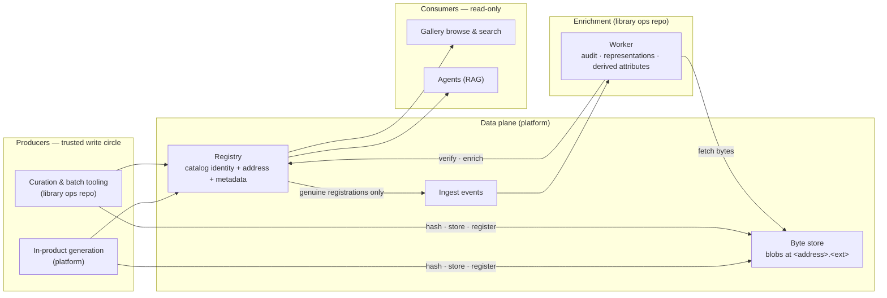
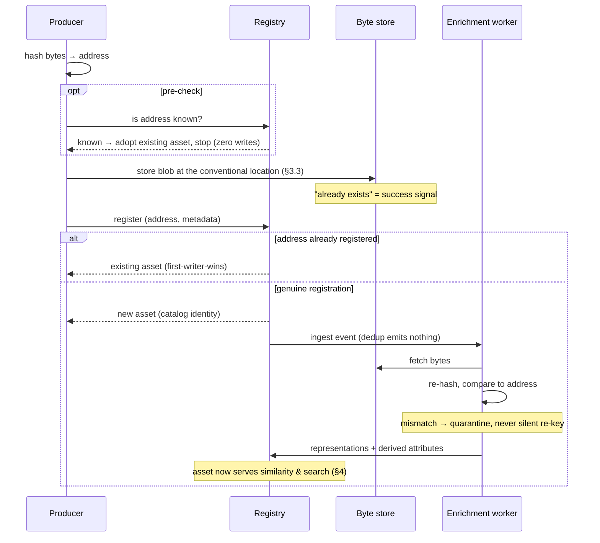

# Grida Library — `library`

> A curated corpus of openly-licensed visual assets, and the model by which
> assets are represented, related, and retrieved.

| feature id | status   | description                                                                      |
| ---------- | -------- | -------------------------------------------------------------------------------- |
| `library`  | evolving | The Grida Library corpus and its retrieval model (similarity & semantic search). |

This is an evolving RFC. It states what the Library **is** and **why** it is
shaped that way, in domain terms — not how any one implementation realizes it.
It is the canonical entry point for understanding the Library; it is not a plan
and not a record of changes. The key words **MUST**, **MUST NOT**, **SHOULD**,
and **MAY** are used as in RFC 2119.

**Non-goals.** A general-purpose asset DAM, user-uploaded private libraries,
rights management beyond licensing metadata, or a recommendation feed. The
Library is a _public, curated, openly-licensed_ corpus optimized for **finding
a visual asset to use**.

---

## 1. What the Library is

The Grida Library is a corpus of **visual assets** — photographs,
illustrations, icons, logos, shapes, wallpapers — each openly licensed (public
domain / CC0 by default) so it can be dropped directly into a design.

Each asset carries descriptive metadata: a title and optional human-readable
description, a primary category and finer-grained tags, authorship and
licensing, and derived visual attributes (dominant colors, orientation,
transparency). Assets may be gathered into named **collections**.

The corpus exists to be _searched and browsed_. Its value is not the storage of
images but the ability to **surface the right asset** for a need expressed
either visually ("something like this one") or in words ("a calm abstract
background").

## 2. Vocabulary

- **Asset** — a single licensed visual object in the corpus, with its image and
  its metadata.
- **Identity** — an asset's durable **catalog identity** and its
  content-derived **address** (a hash of its stored bytes). Specified in §3.
- **Description** — a meaningful, prose account of what an asset depicts and
  evokes. Distinct from the title or tags; it may be authored or **generated**
  (see §7).
- **Representation** — a learned, fixed-dimensional vector placing an asset in a
  shared semantic space so that proximity approximates relatedness. An asset has
  a **visual representation** and may have a **textual representation**.
- **Similarity** — retrieval whose query is an _existing asset_: "find assets
  related to this one."
- **Search** — retrieval whose query is _free text_: "find assets matching this
  description."
- **Modality** — the kind of a representation or query: visual or textual.

## 3. Identity and ingestion

The corpus is fed by multiple independent producers — curation tooling,
automation, in-product generation — that share no state, no transaction, and
no common code path. When identity is minted by the act of writing (an
identifier assigned at insert time, a randomly named location), the same bytes
ingested twice become two assets silently, and no producer can ask _"do you
already have this?"_. Content addressing inverts this: identity derives from
the **bytes**, so it is producer-independent and reproducible, ingestion is
idempotent by construction, and producers share a coordination key without
coordinating.

### 3.1 Two identities, deliberately

Every asset carries two identifiers, and the distinction is load-bearing:

- **Catalog identity** — a surrogate identifier assigned once, stable for the
  asset's lifetime. All references (collections, representations, links) point
  to it.
- **Content address** — the SHA-256 of the asset's **currently stored bytes**,
  encoded as 64 lowercase hexadecimal characters. A function of the bytes, and
  only of the bytes.

The catalog identity survives anything that happens to the bytes; the address
tracks them. If stored bytes are ever transformed (§3.6), the address re-keys
and every reference keeps working. This split makes format canonicalization,
backfill, and identity adoption **order-independent** of one another. The
address is deliberately _not_ the catalog's primary reference.

### 3.2 The address

- Every newly registered asset **MUST** carry its content address, computed by
  the producer over the exact bytes submitted, before registration. A
  registration without an address **MUST** be rejected.
- The address **MUST** be unique across the corpus. Registering bytes whose
  address already exists **MUST** resolve to the existing asset — no new
  entry, no new blob, no new enrichment.
- On a duplicate hit the existing asset's facts stand (**first-writer-wins**).
  Metadata corrections are a deliberate curation act on the existing asset;
  re-submission **MUST NOT** be used as a correction channel.
- **Self-verification invariant**: re-hashing an asset's stored bytes **MUST**
  equal its recorded address, so the corpus is auditable with no trusted
  index. A mismatch is a defect — quarantined and reported, never silently
  re-keyed. Continuous audit belongs naturally to enrichment, which already
  streams every asset's bytes.

_Rejected alternatives_: prefixed address values (`sha256:<hex>` — the field
carrying the address names its algorithm, so a future algorithm is a sibling
field and a migration; a prefix buys nothing); faster non-universal hashes (a
dependency in every producer runtime, where SHA-256 is universally built in);
non-cryptographic hashes (collision posture wrong for an _identity_ key).

### 3.3 Storage location

- A newly stored asset's location **SHOULD** be its address stem, flat, with an
  informative extension: `<address>.<ext>`. The extension derives from the
  media type via a single pinned mapping; it is informative only and **never
  identity-bearing**.
- Consumers **MUST** treat locations as opaque — identity never derives from
  location; location merely _advertises_ identity. Published asset URLs are
  permanent: once public, a location is never rewritten or reused.

This is **SHOULD**, not MUST, by honest necessity: a byte store cannot enforce
naming, and correctness already lives in address uniqueness (§3.2). The
convention buys self-describing placement — an object named by its own hash
can be verified in place — and a store a human can audit at a glance.

### 3.4 Ingestion contract

The order of operations is fixed: **hash** the exact bytes → optionally
**pre-check** whether the address is known (on a hit, adopt the existing asset
and stop with zero writes) → **store** the blob at the conventional location
(an "already exists" outcome is a _success signal_, not an error) →
**register** the asset with its address (a duplicate-address outcome resolves
to the existing asset). Every step is idempotent, so a crash anywhere is
healed by retrying the whole sequence; a failure between store and register
leaves an inert, unregistered blob, collected by a reconciliation sweep that
compares the store against the catalog.

Producers **MUST** compute the address themselves, register through the
sanctioned write surface, and adopt the canonical asset a registration
returns. Producers **MUST NOT** mint identities any other way, overwrite
existing blobs, or delete from the store. **Enrichment never mints identity**:
representations, derived visual attributes, and curation operate on the
catalog identity of assets that already exist.

Corpus writes are restricted to a small circle of trusted operators, so
addresses are producer-asserted; the self-verification invariant plus
continuous audit bounds what a defective producer can do, and a duplicate
address can never create a second asset regardless of producer behavior.

### 3.5 Regimes and adoption

Content addressing was adopted on **2026-07-19** over a live corpus, which
therefore permanently carries two regimes:

- **Legacy** (pre-adoption): identity was storage-assigned at write time;
  locations are a curated folder taxonomy or generator-minted random names;
  the address is absent until backfilled.
- **Content-addressed** (adoption →): the address is mandatory (§3.2); the
  location follows §3.3.

Both are queryable facts, not guesswork: an asset without an address predates
backfill; a location containing folder separators, or whose stem differs from
the address, is a legacy placement. **Legacy locations are permanent** —
published URLs are load-bearing — so backfill assigns addresses without
relocating bytes. After full backfill every asset has an address; only
content-addressed-regime assets also satisfy the location convention, and that
is acceptable forever.

Adoption path: address optional → mandatory for new assets → corpus backfill
(stored bytes must be re-read and hashed; store-layer metadata offers no
substitute for a true byte hash) → surfaced duplicates collapsed by hand
(expected rare) → address mandatory corpus-wide.

| date       | convention change                                                                                                                                                        |
| ---------- | ------------------------------------------------------------------------------------------------------------------------------------------------------------------------ |
| 2026-07-19 | Content addressing adopted: address **MUST** for new assets; flat address-stem locations **SHOULD**; efficient formats (WebP) **SHOULD**. Legacy corpus enters backfill. |
| (before)   | Identity storage-assigned at write time; locations curated-taxonomy or generator-minted random names.                                                                    |

### 3.6 Canonical format posture

Producers **SHOULD** prefer efficient delivery formats at creation time — WebP
for raster imagery. The identity layer itself does **not** canonicalize: the
address is the hash of the bytes _as stored_. Lossy re-encoding is not
byte-deterministic across encoders and versions, so canonicalization
distributed across producers would defeat deduplication — determinism demands
**exactly one canonicalizer**, placed _before_ registration. That is a
recognized evolution of this spec, not part of it: a **staged/final** shape in
which raw submissions land in a transient staging zone and a single
canonicalizer converts, addresses, places, and registers — collapsing
format-variant duplicates at the identity level. Its admission requirement is
a story for synchronous producers that need a published location at submission
time; if adopted, addresses re-key per asset while catalog identity persists
(§3.1). Until then, format-variant duplicates (the same picture as PNG and
WebP) are accepted as distinct identities; the retrieval model (§4) surfaces
them for discovery.

### 3.7 Topology

The Library spans two homes. The **data plane** — the registry (catalog), the
byte store, and the product retrieval surfaces — lives with the platform
([gridaco/grida](https://github.com/gridaco/grida)), because whoever owns the
database owns the schema and its single migration timeline. The **content
operations** — curation and batch producers, and the enrichment worker — live
in the library operations repo
([gridaco/library](https://github.com/gridaco/library)), the corpus's home as
a content factory. Producers and the worker form the trusted write circle
(§3.4); every consumer surface is read-only.

The ingestion steps (§3.4) and the enrichment lane, end to end:

## 4. The retrieval model

Retrieval is the heart of the Library, and it rests on one principle.

### 4.1 The modality-matching principle

Visual and textual representations, even when trained into a single shared
space, do not occupy the same region of it — there is a measurable **modality
gap** between them. Matching a query to a representation of the _same modality_
is reliably stronger than matching across modalities. Cross-modal matching
(text query against a visual representation) is a real and valuable capability,
but a weaker one: it should be used where it is the _only_ option, not as a
substitute for same-modality matching.

Two consequences follow, and they shape the entire design:

1. **Representations are kept per-modality and never fused.** An asset's visual
   and textual representations are separate vectors. A single fused vector would
   sit between the modality regions and serve _both_ query kinds worse than a
   matched representation serves _one_.
2. **Each retrieval mode matches its query's modality.** Similarity (asset
   query) matches against visual representations; search (text query) matches,
   wherever possible, against textual representations.

### 4.2 Similarity — visual ↔ visual

The query is an existing asset; the result is other assets that **look**
related. This is matched same-modality: the query asset's visual representation
is compared against the visual representations of the corpus, ranked by
proximity. Every asset has a visual representation, so similarity covers the
entire corpus.

### 4.3 Search — text ↔ text, with a visual floor

The query is free text. A library of visual assets receives two intents that
look identical as strings but resolve differently:

- **Appearance** — "blue gradient", "watercolor texture". The answer is in the
  pixels.
- **Concept / intent** — "calming", "suitable for a fintech landing page", a
  named subject. The answer is in _meaning_ that the pixels may not literally
  carry.

The strongest, most general answer to both is to match the text query against an
asset's **textual representation** — provided that representation exists and is
meaningful. A meaningful description verbalizes both what an asset depicts _and_
what it evokes, so a same-modality text-to-text match captures appearance and
concept together, without crossing the modality gap.

Because the textual representation is **optional** (§5), search must degrade
gracefully:

- Assets with a textual representation are matched same-modality against the
  query — the primary, highest-quality path.
- Assets without one remain reachable through **cross-modal** matching of the
  text query against their visual representation — a coverage floor, not the
  primary mechanism.

These two paths must be kept **distinct**, not blended into a single score:
same-modality and cross-modal proximities are drawn from different
distributions, and averaging them is a calibration error that degrades both.
Where both are surfaced, they are composed as ordered tiers (matched results
first, cross-modal coverage after), or selected explicitly — never summed.

### 4.4 Invariants

- **Every asset has a visual representation.** It is the floor for both
  similarity and search.
- **The textual representation is optional.** An asset may exist with image
  only; nothing in retrieval may assume its presence.
- **Representations within a comparison share one space and one metric.** A
  query and the representations it is ranked against must be produced by the
  same model and compared under the same proximity measure; mixing spaces or
  mixing a proximity measure with an index built for a different one yields
  silently wrong rankings.

## 5. Why the textual representation is optional

Not every asset is described. Description is an enrichment, applied over time
and unevenly across the corpus; ingestion of a new asset must never block on it.
Treating the textual representation as mandatory would either stall ingestion or
fabricate empty descriptions that pollute search. So the model admits assets
that carry image only, and search is defined to remain correct — merely less
precise for those assets — until a description arrives.

## 6. Use cases

The same retrieval surface serves two consumers with different query shapes:

- **Human gallery browsing.** Short, often one- or two-word queries; rapid
  visual scanning of results; exploration over exact lookup. Tolerant of fuzzy,
  semantically-ranked results — indeed it benefits from them.
- **Agentic reference discovery (RAG).** An assistant exploring ideas and
  proposing references issues longer, descriptive, sometimes abstract queries.
  Rich descriptive queries are the strongest case for same-modality text
  matching, and the most demanding of conceptual recall.

A single search contract serving both is a deliberate design goal: the agent and
the gallery query the same corpus by the same model, differing only in the text
they submit.

## 7. Description as verbalization

A description is what makes the strong (same-modality) search path possible for
an asset, so the corpus is enriched by a **verbalization** process: examining an
asset and producing a faithful, evocative account of it. Verbalization is the
bridge across the modality gap — it converts visual content into text that a
text query can match directly, and it can express concept and intent that a
purely visual representation does not encode.

Verbalization is asynchronous and best-effort by design (§5). Its output feeds
the textual representation; until it runs for a given asset, that asset is
served by the visual floor alone.

## 8. Design alternatives considered

- **One fused image-and-text representation per asset.** Rejected: it serves
  every query modality through a representation matched to none, and it couples
  ingestion to description. Separate per-modality representations dominate it on
  both retrieval modes (§4.1).
- **Text-only representation (verbalize everything, never embed pixels).**
  Rejected as the sole model: similarity is inherently visual, and a description
  is a lossy summary that discards fine visual detail. A visual representation
  is irreducible.
- **Lexical keyword search over metadata.** Rejected as the model for search:
  exact-term matching cannot capture appearance, synonymy, or intent, which is
  precisely what a visual-asset search must do. Search in the Library is
  **always semantic**; it trades guaranteed exact-keyword ordering (acceptable
  for a discovery surface) for meaning-based recall.

## 9. Open questions

As an evolving RFC, the following are deliberately unsettled:

- **Composing the two search paths.** When both described and undescribed assets
  are eligible, what tiering or selection policy best balances precision against
  coverage — and should the cross-modal floor be exposed at all for some
  surfaces?
- **Conceptual recall.** How well same-modality text matching serves abstract,
  intent-bearing queries depends on description quality and corpus composition;
  the threshold at which verbalization quality becomes the limiting factor is
  not yet established.
- **Representation evolution.** The corpus must tolerate the representation model
  changing over time. The general shape — represent under a new model alongside
  the old, then switch retrieval once coverage is complete — is understood; the
  invariants that make such a transition seamless for live retrieval deserve
  their own treatment.
- **Event provenance.** First-writer-wins (§3.2) drops a duplicate submission's
  own generation facts (its prompt, its generator). Does a per-event log
  deserve to exist alongside the per-asset entry?
- **Algorithm succession.** A successor hash algorithm is a sibling field by
  construction (§3.2), but the choreography of switching the uniqueness
  guarantee between algorithms over a live corpus is not yet specified.
- **Staged/final admission.** The synchronous-producer story (§3.6) — serve a
  provisional location and re-key, or make submission asynchronous — is
  unresolved, and is the gate on canonical-format identity.
