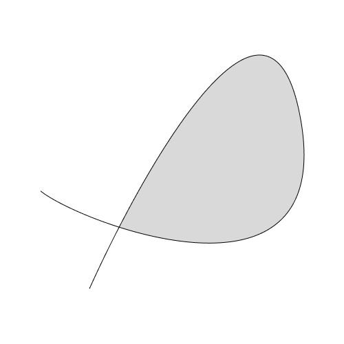

## Overview

This fixture contains a Figma REST API response for a **FRAME** node containing a single **VECTOR** node. The vector path has **self-intersection**, which ensures that both `fillGeometry` and `strokeGeometry` are present in the API response and contain different SVG path data.

## API Request

To obtain this response, the Figma REST API request must include the `geometry=paths` parameter:

```
GET /v1/files/{file_key}/nodes?ids={node_id}&geometry=paths
```

Without this parameter, the `fillGeometry` and `strokeGeometry` fields will not be present in the response.

## Structure

- **Root Node**: `FRAME` (500×500px, white background)
  - **Child Node**: `VECTOR` ("Vector 1")
    - Position: `(59, 80)` relative to frame
    - Size: `382.95 × 339.63` px
    - Fill: Light gray solid (`rgb(217, 217, 217)`)
    - Stroke: Black solid (`rgb(0, 0, 0)`, 1px weight, center aligned)

## Key Characteristics

### HasGeometryTrait Implementation

This fixture demonstrates the `HasGeometryTrait` pattern from the Figma REST API spec. Nodes with this trait (VECTOR, STAR, REGULAR_POLYGON, etc.) can have:

- `fillGeometry`: Array of SVG path strings representing fill regions
- `strokeGeometry`: Array of SVG path strings representing stroke outlines

### Self-Intersecting Path

The vector path self-intersects, which causes Figma to generate **different** SVG paths for fill and stroke:

- **Fill Geometry**: Single path representing the filled region

  ```svg
  M114.167 250.184C204.314 75.195 337.941 -115.992 377 88.1324C417.62 300.417 241.402 290.622 114.167 250.184Z
  ```

- **Stroke Geometry**: More complex path representing the stroked outline (accounts for stroke width)
  ```svg
  M377 88.1324L377.491 88.0384L377 88.1324ZM71 339.632L71.4559 339.838C83.9517 312.08...
  ```

### Original Vector Network Data

The original vector network data (vertices, segments, regions) is **not included** in the REST API response. This data is only available through:

- Figma Plugin API (`vectorNetwork` property)
- Figma `.fig` file format (Kiwi schema)

For reference, here is the original vector network structure that would be present in other Figma APIs:

```json
{
  "vertices": [
    {
      "x": 71,
      "y": 339.63238525390625,
      "strokeCap": "NONE",
      "strokeJoin": "MITER",
      "cornerRadius": 0,
      "handleMirroring": "NONE"
    },
    {
      "x": 377,
      "y": 88.13240051269531,
      "strokeCap": "NONE",
      "strokeJoin": "MITER",
      "cornerRadius": 0,
      "handleMirroring": "ANGLE"
    },
    {
      "x": 0,
      "y": 197.63232421875,
      "strokeCap": "NONE",
      "strokeJoin": "MITER",
      "cornerRadius": 0,
      "handleMirroring": "NONE"
    }
  ],
  "segments": [
    {
      "start": 0,
      "end": 1,
      "tangentStart": { "x": 82.83333587646484, "y": -184 },
      "tangentEnd": { "x": -46, "y": -240.39999389648438 }
    },
    {
      "start": 1,
      "end": 2,
      "tangentStart": { "x": 57.5, "y": 300.5 },
      "tangentEnd": { "x": 57.5, "y": 46.5 }
    }
  ],
  "regions": []
}
```

## Notes

- The REST API response does not include the original vector network data (vertices, segments, regions)
- Both `fillGeometry` and `strokeGeometry` are present due to the self-intersecting path
- The frame also implements `HasGeometryTrait` (has its own `fillGeometry` for the rectangular frame)
