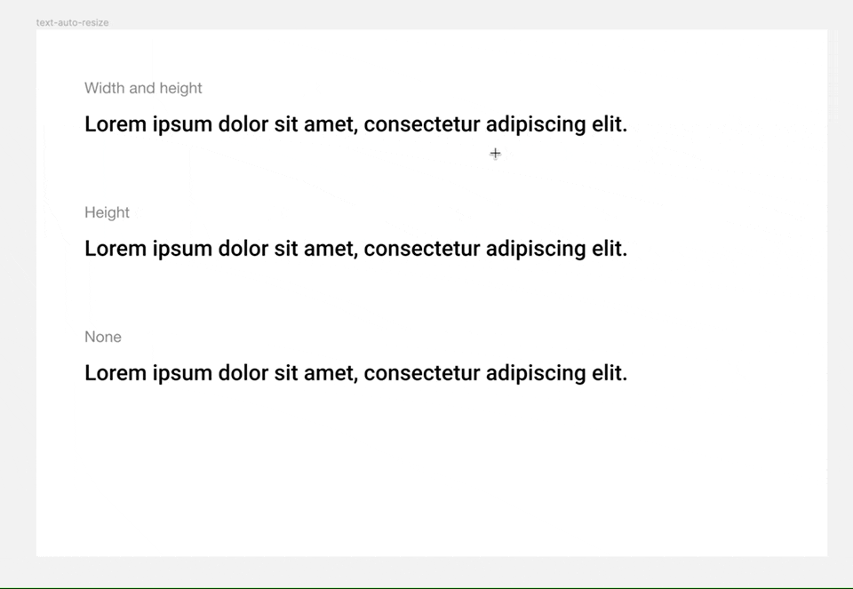

# Figma Text AutoResize



```ts
/**
 * [Figma#TextAutoResize](https://www.figma.com/plugin-docs/api/properties/TextNode-textautoresize/)
 */
export type TextAutoResize =
  /**
   * The size of the textbox is fixed and is independent of its content.
   *
   * e.g. css `overflow: visible;` - which will fix the size without scrolling or resizing, yet visible.
   *
   * Means: Fixed width, fixed height
   */
  | "NONE"
  /**
   * The width of the textbox is fixed. Characters wrap to fit in the textbox. The height of the textbox automatically adjusts to fit its content.
   *
   * Means: Fixed width, auto height
   */
  | "HEIGHT"
  /**
   * Both the width and height of the textbox automatically adjusts to fit its content. Characters do not wrap.
   *
   * Means: Auto width, auto height based on the text content
   * This can't be used with flex. when using autolayout & making the text to fill-width, the text will be wrapped and change the type to "HEIGHT"
   */
  | "WIDTH_AND_HEIGHT";
```

## Web - css

### Plain text with no layouted parent

**NONE**

```css
/* wip */
```

**HEIGHT**

```css
/* wip */
```

**WIDTH_AND_HEIGHT**

```css
/* wip */
```

### text inside layouted parent (flex)

**NONE**

```css
/* wip */
```

**HEIGHT**

```css
/* wip */
```

**WIDTH_AND_HEIGHT**

```css
/* wip */
```

## Flutter

**NONE**

```dart
/* wip */
```

**HEIGHT**

```dart
/* wip */
```

**WIDTH_AND_HEIGHT**

```dart
/* wip */
```
